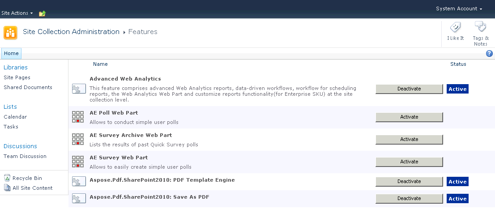

---
title: Aktivasi dan Deaktivasi setelah instalasi
linktitle: Aktivasi dan Deaktivasi setelah instalasi
type: docs
weight: 40
url: /id/sharepoint/activation-and-deactivation-after-installation/
lastmod: "2020-12-16"
description: Setelah instalasi PDF SharePoint API, Anda dapat menggunakan menu Tindakan Situs di situs web akar kumpulan situs untuk mengaktifkan dan menonaktifkannya.
---

{}

Selama instalasi, Aspose.PDF untuk SharePoint diaktifkan untuk semua kumpulan situs yang dipilih. Setelah instalasi, Anda dapat menggunakan menu Tindakan Situs di situs web akar kumpulan situs untuk mengaktifkan dan menonaktifkan Aspose.PDF untuk SharePoint.

{}

## Mengaktifkan Aspose.PDF untuk SharePoint di kumpulan situs 

