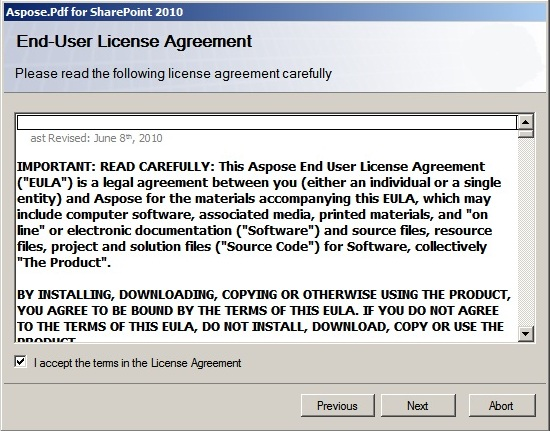
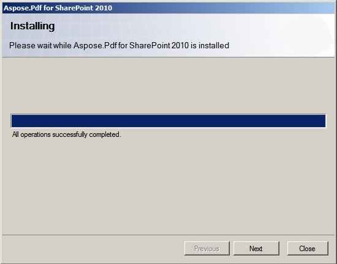

---
title: Menginstal Aspose.PDF untuk SharePoint
linktitle: Installing Aspose.PDF for SharePoint
type: docs
weight: 20
url: /id/sharepoint/installing-aspose-pdf-for-sharepoint/
lastmod: "2020-12-16"
description: PDF SharePoint API dikemas sebagai solusi SharePoint untuk menyederhanakan penerapan, pencabutan, aktivasi, dan penonaktifan server farm.
---

{}

Aspose.PDF untuk SharePoint dapat diunduh sebagai arsip Aspose.PDF.SharePoint.zip.

{}

Arsip ini berisi:

- Aspose.PDF.SharePoint.wsp
  File solusi SharePoint. Aspose.PDF untuk SharePoint dikemas sebagai solusi SharePoint untuk memfasilitasi penerapan/pencabutan dan aktivasi/penonaktifan fitur di seluruh server farm.
- Aspose_LicenseAgreement.rtf

**End user license agreement:**

- Aspose.PDF untuk SharePoint.pdf

**Dokumentasi pengguna:**

- Aspose.PDF untuk Dokumentasi SharePoint.chm

**User documentation with Public API reference:**

- setup.exe

**Setup program:**

- setup.exe.config

**Setup configuration file:**

Program pengaturan memeriksa kondisi berikut sebelum melanjutkan:

- SharePoint 2010 is installed.
- The user has permission to install SharePoint solutions.
- SharePoint database is online.
- Layanan Administrasi SharePoint dimulai.
- SharePoint Timer service is started. SharePoint Administration service and Timer service are needed because some setup actions rely on a timer job to propagate to all servers in the server farm.

**Untuk menginstal Aspose.PDF untuk SharePoint:**

- Unpack Aspose.PDF.SharePoint zip to the local drive.
- Run setup.exe and follow the instructions on the screen.

**The setup program performs the following actions:**

- Check installation prerequisites. Setup will not continue if any check fails.

- Display End User License Agreement. The user must accept the agreement in order to proceed.

- Tampilkan dialog pemilihan target penerapan. Pengguna memilih aplikasi web dan kumpulan situs di mana fitur tersebut akan diaktifkan. Lihat gambar di bawah ini.

- Deploy the feature to the server farm.

- Activate the feature for the selected site collections and configure their parent web applications.
- Menampilkan daftar aplikasi web dan kumpulan situs tempat fitur tersebut telah disebarkan dan diaktifkan.

