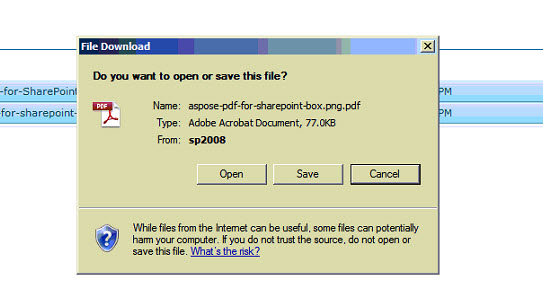

---
title: Konversikan beberapa file yang dipilih ke file PDF dengan satu Permintaan Konversi
linktitle: Konversikan beberapa file yang dipilih ke file PDF dengan satu Permintaan Konversi
type: docs
weight: 50
url: /id/sharepoint/convert-multiple-selected-files-to-pdf-files-with-single-conversion-request/
lastmod: "2020-12-16"
description: Perpustakaan PDF SharePoint memungkinkan Anda mengonversi beberapa file yang dipilih menjadi file PDF dengan satu operasi konversi.
---

{}

Artikel ini memperlihatkan cara mengonversi beberapa file yang dipilih ke file PDF dengan satu operasi konversi menggunakan Aspose.PDF untuk SharePoint.

{}

## Konversikan Beberapa File Terpilih ke PDF

{}

Untuk mengonversi beberapa file yang dipilih, lakukan langkah-langkah berikut:

1. Pilih file yang akan dikonversi

2. Klik tab Aspose Tools di Library Tools

3. Klik Konversi ke PDF untuk mengonversi semua file yang dipilih menjadi file PDF yang dihasilkan.

4. Prompt akan ditampilkan untuk mengunduh file yang dikonversi.

{}

