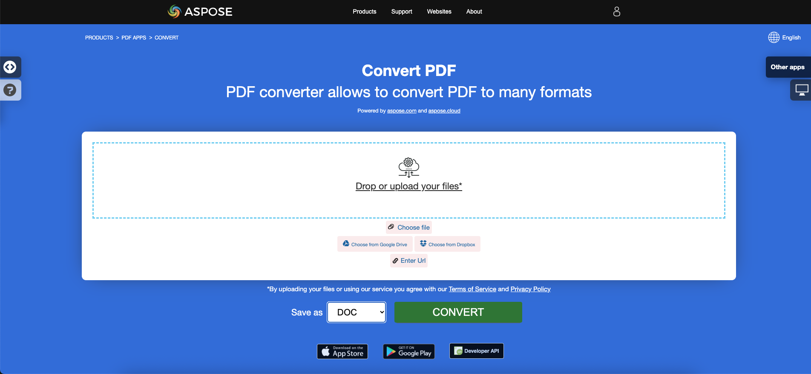

PDF文書を扱う際の最も人気があり、必要なタスクの1つは、これらのファイルをある形式から別の形式に保存すること、つまり変換することです。文書の変換は、ファイルタイプを必要に応じて別のファイル形式に変換することです。一度に多数の文書を変換することも、1つの文書を変換することもできます。

PDFファイルには、テキストだけでなく、画像、クリック可能なボタン、ハイパーリンク、埋め込まれたフォント、署名、スタンプなども含まれることがあります。PDFファイルを別の形式に変換するユーザーは、PDFコンテンツを編集できるようにするために変換を行いたいと考えています。
**私たちのAspose.PDF for .NET**ライブラリを使用すると、PDF文書を最も人気のある形式に迅速かつ簡単に変換できます。

## Aspose.PDFを使用した変換方法

次のセクションでは、PDF文書を変換するための最も人気のあるオプションについて説明します。
コード例を学ぶことで、Aspose.PDF for .NETライブラリが文書の変換タスクを解決するためのかなり普遍的なソリューションを提供していることが理解できるでしょう。
Aspose.PDFは、読み込みと保存の両方に対して、最も多くの人気のある文書形式をサポートしています。

現在のセクションでは、人気のある変換のみを説明していることに注意してください。
サポートされている形式の完全なリストについては、[Aspose.PDFサポートファイル形式](https://docs.aspose.com/pdf/net/supported-file-formats/)のセクションを参照してください。

Aspose.PDF for .NETは、PDF文書をさまざまな形式に変換することができ、他の形式からPDFへの変換も可能です。また、Aspose.PDF変換の品質を確認し、Aspose.PDFコンバーターアプリで結果をオンラインで表示できます。コードスニペットを使用して文書を変換するセクションを学びましょう。

Word文書は、最も汎用性があり、編集可能な形式です。PDFをWordに手動で変換するのは非常に時間のかかる作業です。この記事では、C#でプログラム的にPDFをWordに変換する方法を学びます。

- [PDFをMicrosoft Wordに変換する](/pdf/net/convert-pdf-to-word/) - C#を使用してPDF文書をWord形式に変換できます。

数値形式は、表内のデータを読みやすくするだけでなく、表を使いやすくするためにも必要です。もちろん、PDF文書からExcel形式にそのようなデータを変換する必要がある場合は、私たちのAspose.PDFライブラリを使用してください。

- [PDFをMicrosoft Excelに変換する](/pdf/net/convert-pdf-to-excel/) - このセクションでは、PDF文書をXLSX、ODS、CSV、SpreadSheetMLに変換する方法について説明します。

PowerPoint形式は、さまざまなプレゼンテーションを作成するために使用されます。PPTファイルには、さまざまな情報を含む多数のスライドやページが含まれています。

- [PDFをMicrosoft PowerPointに変換する](/pdf/net/convert-pdf-to-powerpoint/) - ここでは、変換プロセスを追跡しながらPDFをPowerPointに変換することについて説明します。

ハイパーテキストマークアップ言語は、ハイパーテキスト文書記述言語であり、ウェブページを作成するための標準言語です。Aspose.PDF for .NETを使用すると、HTML文書を簡単に変換できます。

- [HTML形式をPDFファイルに変換する](/pdf/net/convert-html-to-pdf/) - HTMLからPDFへの変換のさまざまな側面に関する記事です。
- [PDFファイルをHTML形式に変換する](/pdf/net/convert-pdf-to-html/) - PDF文書をHTMLファイルに、別々のページまたは単一のページとして変換します。

さまざまな目的のためにPDFに変換する必要がある多くの画像形式があります。Aspose.PDFは、最も人気のある画像形式をサポートし、逆も可能です。

- [画像形式をPDFファイルに変換する](/pdf/net/convert-images-format-to-pdf/) - Aspose.PDFを使用すると、さまざまな画像形式をPDFファイルに変換できます。
- [PDFをさまざまな画像形式に変換する](/pdf/net/convert-pdf-to-images-format/) - PDFページをJPEG、PNGなどの形式で画像として変換します。

このセクションには、EPUB、Markdown、PCL、XPS、LATex/TeX、テキスト、PostScriptなどの形式が含まれています。

- [他のファイル形式をPDFに変換する](/pdf/net/convert-other-files-to-pdf/) - このトピックでは、EPUB、XPS、Postscript、テキストなどのさまざまな形式との変換について説明します。
- [PDFファイルを他の形式に変換する](/pdf/net/convert-pdf-to-other-files/) - このトピックでは、PDF文書をさまざまな形式に変換する方法について説明します。

PDF/Aは、電子文書の長期保存のために設計されたPDFのバージョンです。
正直に言うと、外見上はPDFかPDF/Aかを判断するのは非常に難しいです。このファイルを確認するために、バリデーターが使用されます。PDFをPDF/Aに変換する品質を確認するために、次の記事を参照してください。

- [PDFをPDF/A形式に変換する](/pdf/net/convert-pdf-to-pdfa/) - Aspose.PDFの.NETライブラリは、PDFをPDF/Aに変換するための簡単な方法を提供します。
- [PDF/AをPDF形式に変換する](/pdf/net/convert-pdfa-to-pdf/) - C#でPDF/AをPDF形式に簡単、迅速、高品質で変換します。

PDF/Xは、グラフィックスの交換を促進し、標準のPDFファイルには適用されない一連の印刷関連の要件を持つPDF標準のサブセットです。

- [PDFをPDF/X交換形式に変換する](/pdf/net/convert-pdf-to-pdfx/) - Aspose.PDF for .NETは、さまざまなPDF/X標準バージョンへの変換を可能にします。

## PDFファイルをオンラインで変換してみる

{}
**PDFファイルをオンラインで変換してみてください**

私たちのAspose PDFアプリを使用して、変換機能を試すことができます：

{}