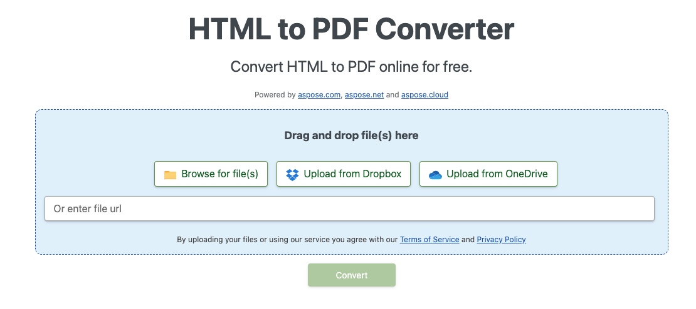

## 概要

この記事では、**C#を使用してHTMLをPDFに変換する方法**について説明します。以下のトピックをカバーしています。

以下のコードスニペットは、[Aspose.PDF.Drawing](/pdf/ja/net/drawing/) ライブラリでも動作します。

_フォーマット_: **HTML**
- [C# HTMLからPDFへ](#csharp-html-to-pdf)
- [C# HTMLをPDFに変換](#csharp-html-to-pdf)
- [C# HTMLをPDFに変換する方法](#csharp-html-to-pdf)

_フォーマット_: **MHTML**
- [C# MHTMLからPDFへ](#csharp-mhtml-to-pdf)
- [C# MHTMLをPDFに変換](#csharp-mhtml-to-pdf)
- [C# MHTMLをPDFに変換する方法](#csharp-mhtml-to-pdf)

_フォーマット_: **WebPage**
- [C# WebPageからPDFへ](#csharp-webpage-to-pdf)
- [C# WebPageをPDFに変換](#csharp-webpage-to-pdf)
- [C# WebPageをPDFに変換する方法](#csharp-webpage-to-pdf)

## C# HTMLからPDFへの変換
## C# HTMLからPDFへの変換

**Aspose.PDF for .NET** は、既存のHTMLドキュメントをシームレスにPDFに変換できるPDF操作APIです。HTMLをPDFに変換するプロセスは柔軟にカスタマイズが可能です。

## HTMLをPDFに変換

次のC#コードサンプルは、HTMLドキュメントをPDFに変換する方法を示しています。

<a name="csharp-html-to-pdf"><strong>手順: C#でHTMLをPDFに変換する</strong></a>

1. [HtmlLoadOptions](https://reference.aspose.com/pdf/net/aspose.pdf/htmlloadoptions/) クラスのインスタンスを作成します。
2. [Document](https://reference.aspose.com/pdf/net/aspose.pdf/document/) オブジェクトを初期化します。
3. **Document.Save()** メソッドを呼び出して出力PDFドキュメントを保存します。

```csharp
public static void ConvertHTMLtoPDF()
{
    HtmlLoadOptions options= new HtmlLoadOptions();
    Document pdfDocument= new Document(_dataDir + "test.html", options);
    pdfDocument.Save(_dataDir + "html_test.PDF");
}
```

{}
**オンラインでHTMLをPDFに変換してみる**

Asposeは無料のオンラインアプリケーション ["HTML to PDF"](https://products.aspose.app/html/en/conversion/html-to-pdf) を提供しており、ここで機能や品質を試すことができます。
Asposeは、無料のオンラインアプリケーション ["HTML to PDF"](https://products.aspose.app/html/en/conversion/html-to-pdf) を提供しており、その機能性と品質を試すことができます。
{}

[](https://products.aspose.app/html/en/conversion/html-to-pdf)

## HTMLからPDFへの高度な変換

HTML変換エンジンには、変換プロセスを制御するためのいくつかのオプションがあります。

### メディアクエリのサポート

メディアクエリは、異なるデバイスに合わせたスタイルシートを提供するための人気の技術です。[`HtmlMediaType`](https://reference.aspose.com/pdf/net/aspose.pdf/htmlloadoptions/properties/htmlmediatype) プロパティを使用してデバイスタイプを設定することができます。

```csharp
public static void ConvertHTMLtoPDFAdvanced_MediaType()
{
    HtmlLoadOptions options = new HtmlLoadOptions
    {
        // 印刷または画面モードを設定
        HtmlMediaType = HtmlMediaType.Print
    };
    Document pdfDocument= new Document(_dataDir + "test.html", options);
    pdfDocument.Save(_dataDir + "html_test.PDF");
}
```
### フォント埋め込みを有効にする（無効にする）

HTMLページはしばしばフォントを使用します（例えば、ローカルフォルダのフォント、Googleフォントなど）。[`IsEmbedFonts`](https://reference.aspose.com/pdf/net/aspose.pdf/htmlloadoptions/properties/isembedfonts)プロパティを使用して、ドキュメント内のフォントの埋め込みを制御することもできます。

```csharp
public static void ConvertHTMLtoPDFAdvanced_EmbedFonts()
{
    // フォント埋め込みを無効にする
    HtmlLoadOptions options = new HtmlLoadOptions {IsEmbedFonts = false};
    Document pdfDocument= new Document(_dataDir + "test_fonts.html", options);
    pdfDocument.Save(_dataDir + "html_test.PDF");
}
```

### 外部リソースのロードを管理する

変換エンジンは、HTMLドキュメントに関連する特定のリソースのロードを制御するメカニズムを提供します。
[`HtmlLoadOptions`](https://reference.aspose.com/pdf/net/aspose.pdf/htmlloadoptions)クラスには、リソースローダーの振る舞いを定義できるプロパティ[`CustomLoaderOfExternalResources`](https://reference.aspose.com/pdf/net/aspose.pdf/htmlloadoptions/fields/customloaderofexternalresources)があります。
[`HtmlLoadOptions`](https://reference.aspose.com/pdf/net/aspose.pdf/htmlloadoptions) クラスには [`CustomLoaderOfExternalResources`](https://reference.aspose.com/pdf/net/aspose.pdf/htmlloadoptions/fields/customloaderofexternalresources) プロパティがあり、リソースローダーの動作を定義できます。
すべてのPNG画像を単一の画像 `test.jpg` に置き換え、他のリソースの外部URLを内部URLに置き換える必要があると仮定します。
これを行うために、カスタムローダー `SamePictureLoader` を定義し、[`CustomLoaderOfExternalResources`](https://reference.aspose.com/pdf/net/aspose.pdf/htmlloadoptions/fields/customloaderofexternalresources) にこの名前を指定します。

```csharp
public static void ConvertHTMLtoPDFAdvanced_DummyImage()
{
    HtmlLoadOptions options = new HtmlLoadOptions
    {
        CustomLoaderOfExternalResources = SamePictureLoader
    };
    Document pdfDocument= new Document(_dataDir + "test.html", options);
    pdfDocument.Save(_dataDir + "html_test.PDF");
}

private static LoadOptions.ResourceLoadingResult SamePictureLoader(string resourceURI)
{
    LoadOptions.ResourceLoadingResult result;

    if (resourceURI.EndsWith(".png"))
    {
        byte[] resultBytes = File.ReadAllBytes(_dataDir + "test.jpg");
        result = new LoadOptions.ResourceLoadingResult(resultBytes)
        {
            // MIME タイプを設定
            MIMETypeIfKnown = "image/jpeg"
        };
    }
    else
    {
        result = new LoadOptions.ResourceLoadingResult(GetContentFromUrl(resourceURI));
    }
    return result;
}

private static byte[] GetContentFromUrl(string url)
{
    var httpClient = new HttpClient();
    return httpClient.GetByteArrayAsync(url).GetAwaiter().GetResult();
}
```
## WebページをPDFに変換

Webページを変換することは、ローカルのHTMLドキュメントを変換することとは少し異なります。Webページの内容をPDF形式に変換するために、まずHttpClientインスタンスを使用してHTMLページの内容を取得し、Streamオブジェクトを作成し、内容をDocumentオブジェクトに渡して、PDF形式で出力をレンダリングします。

Webサーバー上にホストされているWebページをPDFに変換する場合：

<a name="csharp-webpage-to-pdf"><strong>手順: C#でWebページをPDFに変換</strong></a>

1. HttpClientオブジェクトを使用してページの内容を読み取ります。
1. [HtmlLoadOptions](https://reference.aspose.com/pdf/net/aspose.pdf/htmlloadoptions) オブジェクトをインスタンス化し、基本URLを設定します。
1. Streamオブジェクトを渡しながらDocumentオブジェクトを初期化します。
1. 必要に応じて、ページサイズや向きを設定します。

```csharp
public static void ConvertHTMLtoPDFAdvanced_WebPage()
{
    const string url = "https://en.wikipedia.org/wiki/Aspose_API";
    // ページサイズA3とランドスケープ方向を設定;
    HtmlLoadOptions options = new HtmlLoadOptions(url)
    {
        PageInfo = {Width = 842, Height = 1191, IsLandscape = true}
    };
    Document pdfDocument= new Document(GetContentFromUrlAsStream(url), options);
    pdfDocument.Save(_dataDir + "html_test.PDF");
}

private static Stream GetContentFromUrlAsStream(string url, ICredentials credentials = null)
{
    using (var handler = new HttpClientHandler { Credentials = credentials })
    using (var httpClient = new HttpClient(handler))
    {
        return httpClient.GetStreamAsync(url).GetAwaiter().GetResult();
    }
}
```
### 資格情報を提供する Web ページから PDF への変換

認証とアクセス権限が必要な HTML ファイルの変換を行う必要がある場合があります。これにより、認証されたユーザーのみがページの内容を取得できます。また、HTML 内で参照される一部のリソース/データが認証を必要とする外部サーバーから取得されるシナリオも含まれます。この要件に対応するために、[`HtmlLoadOptions`](https://reference.aspose.com/pdf/net/aspose.pdf/htmlloadoptions) クラスに [`ExternalResourcesCredentials`](https://reference.aspose.com/pdf/net/aspose.pdf/htmlloadoptions/fields/externalresourcescredentials) プロパティが追加されました。次のコードスニペットは、HTML とそのリソースに資格情報を渡す手順を示しています。

```csharp
public static void ConvertHTMLtoPDFAdvanced_Authorized()
{
    const string url = "http://httpbin.org/basic-auth/user1/password1";
    var credentials = new NetworkCredential("user1", "password1");
    HtmlLoadOptions options = new HtmlLoadOptions(url)
    {
        ExternalResourcesCredentials = credentials
    };
    Document pdfDocument= new Document(GetContentFromUrlAsStream(url, credentials), options);
    pdfDocument.Save(_dataDir + "html_test.PDF");
}

private static Stream GetContentFromUrlAsStream(string url, ICredentials credentials = null)
{
    using (var handler = new HttpClientHandler { Credentials = credentials })
    using (var httpClient = new HttpClient(handler))
    {
        return httpClient.GetStreamAsync(url).GetAwaiter().GetResult();
    }
}
```
### HTMLの全内容を1ページにレンダリング

Aspose.PDF for .NETは、HTMLファイルをPDF形式に変換する際に、すべての内容を1ページにレンダリングする機能を提供します。たとえば、出力サイズが1ページを超えるHTMLコンテンツがある場合、出力データを1つのPDFページにレンダリングするオプションを使用できます。このオプションを使用するために、HtmlLoadOptionsクラスはIsRenderToSinglePageフラグで拡張されました。以下のコードスニペットは、この機能を使用する方法を示しています。

```csharp
// 完全な例やデータファイルについては、https://github.com/aspose-pdf/Aspose.PDF-for-.NET をご覧ください
// ドキュメントディレクトリへのパス。
string dataDir = RunExamples.GetDataDir_AsposePdf_DocumentConversion();
// HTMLLoadSave オプションを初期化
HtmlLoadOptions options = new HtmlLoadOptions();
// 単一ページにレンダリングするプロパティを設定
options.IsRenderToSinglePage = true;
// ドキュメントをロード
Document pdfDocument= new Document(dataDir + "HTMLToPDF.html", options);
// 保存
pdfDocument.Save(dataDir + "RenderContentToSamePage.pdf");
```

### HTMLをSVGデータでレンダリング
### HTMLをSVGデータでレンダリングする

Aspose.PDF for .NETは、HTMLページをPDFドキュメントに変換する機能を提供しています。HTMLでは、SVGグラフィック要素をページのタグとして追加できるため、Aspose.PDFはそのようなデータを結果のPDFファイルに変換することもサポートしています。次のコードスニペットは、SVGグラフィックタグを含むHTMLファイルをタグ付きPDFドキュメントに変換する方法を示しています。

```csharp
// 完全な例とデータファイルについては、https://github.com/aspose-pdf/Aspose.PDF-for-.NET をご覧ください。
// ドキュメントディレクトリへのパス。
string dataDir = RunExamples.GetDataDir_AsposePdf_DocumentConversion();
// 入力ファイルパスを設定
string inFile = dataDir + "HTMLSVG.html";
// 出力ファイルパスを設定
string outFile = dataDir + "RenderHTMLwithSVGData.pdf";
// HtmlLoadOptionsを初期化
HtmlLoadOptions options = new HtmlLoadOptions(Path.GetDirectoryName(inFile));
// Documentオブジェクトを初期化
Document pdfDocument = new Document(inFile, options);
// 保存
pdfDocument.Save(outFile);
```

## MHTMLをPDFに変換する

{}
**MHTMLをPDFにオンラインで変換してみましょう**
**MHTMLをオンラインでPDFに変換してみる**

Aspose.PDF for .NETは、無料で利用できるオンラインアプリケーション["MHTML to PDF"](https://products.aspose.app/pdf/conversion/mhtml-to-pdf)を提供しています。ここでは、その機能や品質を試してみることができます。
{}

[](https://products.aspose.app/pdf/conversion/mhtml-to-pdf)

<abbr title="MIME encapsulation of aggregate HTML documents">MHTML</abbr>は、MIME HTMLの略で、HTMLコードと通常は外部リンク（画像、フラッシュアニメーション、Javaアプレット、オーディオファイルなど）で表現されるリソースを単一のファイルに組み合わせるために使用されるWebページアーカイブ形式です。
<abbr title="MIME encapsulation of aggregate HTML documents">MHTML</abbr>、MIME HTMLの略称は、通常外部リンクによって表されるリソース（画像、フラッシュアニメーション、Javaアプレット、オーディオファイルなど）をHTMLコードと一つのファイルに組み合わせるために使用されるウェブページアーカイブ形式です。

<a name="csharp-mhtml-to-pdf"><strong>手順: C#でMHTMLをPDFに変換する</strong></a>

1. [MhtLoadOptions](https://reference.aspose.com/pdf/net/aspose.pdf/mhtloadoptions/) クラスのインスタンスを作成します。
2. [Document](https://reference.aspose.com/pdf/net/aspose.pdf/document/) オブジェクトを初期化します。
3. **Document.Save()** メソッドを呼び出して、出力PDFドキュメントを保存します。

```csharp
public static void ConvertMHTtoPDF()
{
    MhtLoadOptions options = new MhtLoadOptions()
    {
        PageInfo = { Width = 842, Height = 1191, IsLandscape = true}
    };
    Document pdfDocument= new Document(_dataDir + "fileformatinfo.mht", options);
    pdfDocument.Save(_dataDir + "mhtml_test.PDF");
}
```

## 関連項目

この記事では、これらのトピックについても取り上げています。
この記事は、以下のトピックもカバーしています。

_フォーマット_: **HTML**
- [C# HTMLからPDFへのコード](#csharp-html-to-pdf)
- [C# HTMLからPDFへのAPI](#csharp-html-to-pdf)
- [C# プログラムでHTMLからPDFへ](#csharp-html-to-pdf)
- [C# HTMLからPDFへのライブラリ](#csharp-html-to-pdf)
- [C# HTMLをPDFとして保存](#csharp-html-to-pdf)
- [C# HTMLからPDFを生成](#csharp-html-to-pdf)
- [C# HTMLからPDFを作成](#csharp-html-to-pdf)
- [C# HTMLからPDFへのコンバータ](#csharp-html-to-pdf)

_フォーマット_: **MHTML**
- [C# MHTMLからPDFへのコード](#csharp-mhtml-to-pdf)
- [C# MHTMLからPDFへのAPI](#csharp-mhtml-to-pdf)
- [C# プログラムでMHTMLからPDFへ](#csharp-mhtml-to-pdf)
- [C# MHTMLからPDFへのライブラリ](#csharp-mhtml-to-pdf)
- [C# MHTMLをPDFとして保存](#csharp-mhtml-to-pdf)
- [C# MHTMLからPDFを生成](#csharp-mhtml-to-pdf)
- [C# MHTMLからPDFを作成](#csharp-mhtml-to-pdf)
- [C# MHTMLからPDFへのコンバータ](#csharp-mhtml-to-pdf)

_フォーマット_: **WebPage**
- [C# WebページからPDFへのコード](#csharp-webpage-to-pdf)
- [C# WebページからPDFへのAPI](#csharp-webpage-to-pdf)
- [C# プログラムでWebページからPDFへ](#csharp-webpage-to-pdf)
- [C# WebPageをプログラムでPDFに変換する](#csharp-webpage-to-pdf)
- [C# WebPageをPDFに変換するライブラリ](#csharp-webpage-to-pdf)
- [C# WebPageをPDFとして保存する](#csharp-webpage-to-pdf)
- [C# WebPageからPDFを生成する](#csharp-webpage-to-pdf)
- [C# WebPageからPDFを作成する](#csharp-webpage-to-pdf)
- [C# WebPageをPDFに変換するコンバーター](#csharp-webpage-to-pdf)
