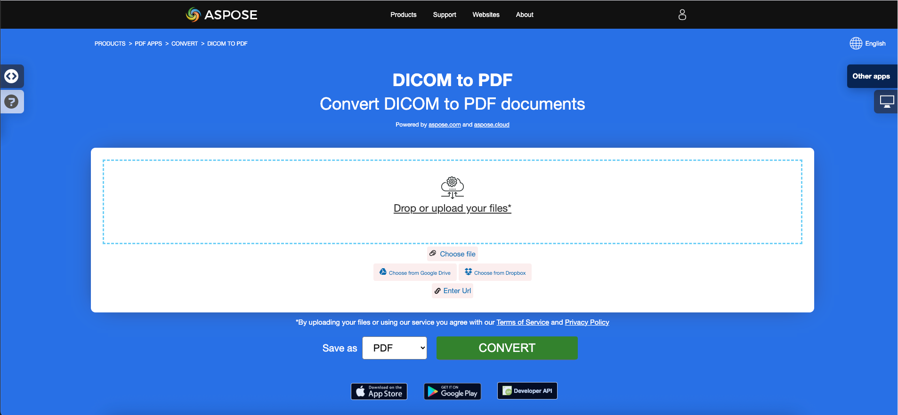
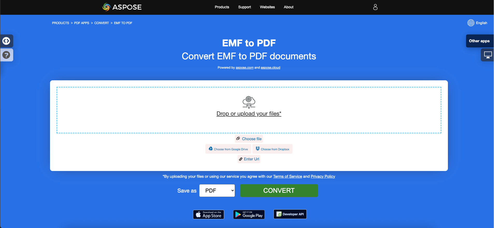
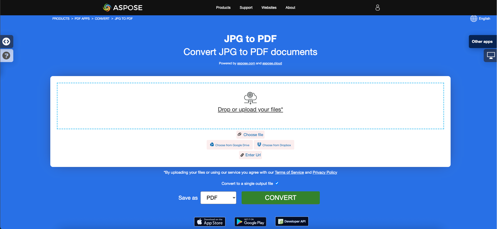

## 概要

この記事では、C#を使用してさまざまな画像形式をPDFに変換する方法について説明します。次のトピックをカバーしています。

以下のコードスニペットは、[Aspose.PDF.Drawing](/pdf/net/drawing/) ライブラリでも動作します。

_形式_: **BMP**
- [C# BMPをPDFに変換する](#csharp-bmp-to-pdf)
- [C# BMPをPDFに変換する](#csharp-bmp-to-pdf)
- [C# BMP画像をPDFに変換する方法](#csharp-bmp-to-pdf)

_形式_: **CGM**
- [C# CGMをPDFに変換する](#csharp-cgm-to-pdf)
- [C# CGMをPDFに変換する](#csharp-cgm-to-pdf)
- [C# CGM画像をPDFに変換する方法](#csharp-cgm-to-pdf)

_形式_: **DICOM**
- [C# DICOMをPDFに変換する](#csharp-dicom-to-pdf)
- [C# DICOMをPDFに変換する](#csharp-dicom-to-pdf)
- [C# DICOM画像をPDFに変換する方法](#csharp-dicom-to-pdf)
- [C# DICOM画像をPDFに変換する方法](#csharp-dicom-to-pdf)

_形式_: **EMF**
- [C# EMFをPDFに変換](#csharp-emf-to-pdf)
- [C# EMFをPDFに変換する](#csharp-emf-to-pdf)
- [C# EMF画像をPDFに変換する方法](#csharp-emf-to-pdf)

_形式_: **GIF**
- [C# GIFをPDFに変換](#csharp-gif-to-pdf)
- [C# GIFをPDFに変換する](#csharp-gif-to-pdf)
- [C# GIF画像をPDFに変換する方法](#csharp-gif-to-pdf)

_形式_: **JPG**
- [C# JPGをPDFに変換](#csharp-jpg-to-pdf)
- [C# JPGをPDFに変換する](#csharp-jpg-to-pdf)
- [C# JPG画像をPDFに変換する方法](#csharp-jpg-to-pdf)

_形式_: **PNG**
- [C# PNGをPDFに変換](#csharp-png-to-pdf)
- [C# PNGをPDFに変換する](#csharp-png-to-pdf)
- [C# PNG画像をPDFに変換する方法](#csharp-png-to-pdf)

_形式_: **SVG**
- [C# SVGをPDFに変換](#csharp-svg-to-pdf)
- [C# SVGをPDFに変換する](#csharp-svg-to-pdf)
- [C# SVG画像をPDFに変換する方法](#csharp-svg-to-pdf)

_形式_: **TIFF**
- [C# TIFFをPDFに変換](#csharp-tiff-to-pdf)
- [C# TIFFをPDFに変換する](#csharp-tiff-to-pdf)
- [C# TIFF画像をPDFに変換する方法](#csharp-tiff-to-pdf)
- [C#でTIFF画像をPDFに変換する方法](#csharp-tiff-to-pdf)

その他のこの記事で扱われているトピック
- [参照](#see-also)


## C# 画像からPDFへの変換

**Aspose.PDF for .NET** では、さまざまな形式の画像をPDFファイルに変換することができます。当社のライブラリでは、BMP、CGM、DICOM、EMF、JPG、PNG、SVG、TIFF形式など、最も人気のある画像形式の変換についてのコードスニペットを示しています。

## BMPをPDFに変換

**Aspose.PDF for .NET** ライブラリを使用して、BMPファイルをPDFドキュメントに変換します。

<abbr title="ビットマップ画像ファイル">BMP</abbr> 画像は、拡張子が.BMPのファイルです。BMPはビットマップ画像ファイルを表し、ビットマップデジタル画像を保存するために使用されます。これらの画像はグラフィックアダプターに依存せず、デバイス非依存ビットマップ（DIB）ファイル形式とも呼ばれます。
Aspose.PDF for .NET APIを使用して、BMPをPDFファイルに変換することができます。したがって、以下の手順に従ってBMP画像を変換できます：

<a name="csharp-bmp-to-pdf" id="csharp-bmp-to-pdf"><strong>手順: C#でBMPをPDFに変換する</strong></a>

1.
1.
2. 入力**BMP**画像を読み込む。
3. 最終的に出力PDFファイルを保存する。

以下のコードスニペットは、これらのステップに従ってBMPをPDFに変換する方法を示しています（C#使用）:

```csharp
//空のPDFドキュメントを初期化
using (Document pdfDocument = new Document())
{
    pdfDocument.Pages.Add();
    Aspose.Pdf.Image image = new Aspose.Pdf.Image();

    // サンプルBMP画像ファイルを読み込む
    image.File = dataDir + "Sample.bmp";
    pdfDocument.Pages[1].Paragraphs.Add(image);

    // 出力PDFドキュメントを保存
    pdfDocument.Save(dataDir + "BMPtoPDF.pdf");
}
```

{}
**BMPをPDFにオンラインで変換してみる**

Asposeが無料アプリ["BMP to PDF"](https://products.aspose.app/pdf/conversion/bmp-to-pdf/)を提供しています。ここで機能性や品質を試すことができます。

[](https://products.aspose.app/pdf/conversion/bmp-to-pdf/)
{}

## CGMをPDFに変換

<abbr title="Computer Graphics Metafile">CGM</abbr>は、CAD（コンピュータ支援設計）やプレゼンテーショングラフィックスアプリケーションで一般的に使用されるコンピュータグラフィックスメタファイル形式のファイル拡張子です。
<abbr title="Computer Graphics Metafile">CGM</abbr>は、CAD（コンピュータ支援設計）やプレゼンテーショングラフィックスアプリケーションで一般的に使用されるコンピュータグラフィックスメタファイル形式のファイル拡張子です。

次のコードスニペットは、CGMファイルをPDF形式に変換する方法を示しています。

<a name="csharp-cgm-to-pdf" id="csharp-cgm-to-pdf"><strong>手順: C#でCGMをPDFに変換</strong></a>

1. [CgmLoadOptions](https://reference.aspose.com/pdf/net/aspose.pdf/cgmloadoptions) クラスのインスタンスを作成します。
2. ソースファイル名とオプションを指定して [Document](https://reference.aspose.com/pdf/net/aspose.pdf/document) クラスのインスタンスを作成します。
3. 希望のファイル名でドキュメントを保存します。

```csharp
public static void ConvertCGMtoPDF()
{
    CgmLoadOptions option = new CgmLoadOptions();
    Document pdfDocument = new Document(_dataDir+"corvette.cgm", option);
    pdfDocument.Save(_dataDir+"CGMtoPDF.pdf");
}
```

## DICOMをPDFに変換

<abbr title="Digital Imaging and Communications in Medicine">DICOM</abbr>形式は、検査された患者のデジタル医療画像や文書の作成、保存、転送、および可視化のための医療業界標準です。
<abbr title="Digital Imaging and Communications in Medicine">DICOM</abbr>形式は、検査された患者のデジタル医療画像および文書の作成、保存、転送、および視覚化のための医療業界の標準です。

**Aspsoe.PDF for .NET** は DICOM および SVG 画像を変換することができますが、技術的な理由から画像をPDFに追加するためには、追加するファイルのタイプを指定する必要があります：

<a name="csharp-dicom-to-pdf" id="csharp-dicom-to-pdf"><strong>手順: C#でDICOMをPDFに変換</strong></a>

1. Image クラスのオブジェクトを作成します。
2. 画像をページの Paragraphs コレクションに追加します。
3. [FileType](https://reference.aspose.com/pdf/net/aspose.pdf/image/properties/filetype) プロパティを指定します。
4. ファイルのパスまたはソースを指定します。
    - 画像がハードドライブ上の場所にある場合は、Image.File プロパティを使用してパスの場所を指定します。
    - 画像がMemoryStreamに配置されている場合は、画像を保持するオブジェクトを Image.ImageStream プロパティに渡します。

次のコードスニペットは、Aspose.PDF を使用して DICOM ファイルを PDF 形式に変換する方法を示しています。
以下のコードスニペットは、DICOMファイルをPDF形式に変換する方法を示しています。

```csharp
private const string _dataDir = "..\\..\\..\\..\\Samples";
// DICOM画像をPDFに変換するためにImageクラスを使用
public static void ConvertDICOMtoPDF()
{
    // Documentオブジェクトのインスタンスを作成
    Document pdfDocument = new Document();

    // ドキュメントのページコレクションにページを追加
    Page page = pdfDocument.Pages.Add();

    Image image = new Image
    {
        FileType = ImageFileType.Dicom,
        File = System.IO.Path.Combine(_dataDir,"bmode.dcm")
    };
    pdfDocument.Pages[1].Paragraphs.Add(image);
    // 出力をPDF形式で保存
    pdfDocument.Save(System.IO.Path.Combine(_dataDir,"PDFWithDicomImage_out.pdf"));
}
```

{}
**DICOMをPDFにオンラインで変換してみましょう**

Asposeが無料のアプリケーション["DICOM to PDF"](https://products.aspose.app/pdf/conversion/dicom-to-pdf/)を提供しています。ここで機能の確認と品質を試すことができます。
{}

[](https://products.aspose.app/pdf/conversion/dicom-to-pdf/)
## EMFをPDFに変換する

<abbr title="拡張メタファイル形式">EMF</abbr>EMFはグラフィカルイメージをデバイスに依存しない形式で保存します。EMFのメタファイルは、任意の出力デバイスで解析後に保存された画像をレンダリングできる時系列順の可変長レコードで構成されています。さらに、以下の手順でEMFをPDFイメージに変換できます:

<a name="csharp-emf-to-pdf" id="csharp-emf-to-pdf"><strong>手順: C#でEMFをPDFに変換する</strong></a>

1. まず、[Document](https://reference.aspose.com/pdf/net/aspose.pdf/document) クラスオブジェクトを初期化します。
2. **EMF** イメージファイルを読み込みます。
3. 読み込んだEMFイメージをページに追加します。
4. PDFドキュメントを保存します。

さらに、以下のコードスニペットは、C#を使用して.NETのコードスニペットでEMFをPDFに変換する方法を示しています：

```csharp
// 新しいPDFドキュメントを初期化
var doc = new Document();

// 入力EMFイメージファイルのパスを指定
var imageFile = dataDir + "drawing.emf";
var page = doc.Pages.Add();
string file = imageFile;
FileStream filestream = new FileStream(file, FileMode.Open, FileAccess.Read);
BinaryReader reader = new BinaryReader(filestream);
long numBytes = new FileInfo(file).Length;
byte[] bytearray = reader.ReadBytes((int)numBytes);
Stream stream = new MemoryStream(bytearray);
var b = new Bitmap(stream);

// ページ寸法のプロパティを指定
page.PageInfo.Margin.Bottom = 0;
page.PageInfo.Margin.Top = 0;
page.PageInfo.Margin.Left = 0;
page.PageInfo.Margin.Right = 0;
page.PageInfo.Width = b.Width;
page.PageInfo.Height = b.Height;
var image = new Aspose.Pdf.Image();
image.File = imageFile;
page.Paragraphs.Add(image);

// 出力PDFドキュメントを保存
doc.Save(dataDir + "EMFtoPDF.pdf");
```
{}
**オンラインでEMFをPDFに変換してみよう**

Asposeが無料のオンラインアプリケーション ["EMF to PDF"](https://products.aspose.app/pdf/conversion/emf-to-pdf/) を提供します。ここで機能と品質を試してみることができます。

[](https://products.aspose.app/pdf/conversion/emf-to-pdf/)
{}

## GIFをPDFに変換

**Aspose.PDF for .NET** ライブラリを使用してGIFファイルをPDFドキュメントに変換します。

<abbr title="Graphics Interchange Format">GIF</abbr>は、256色以下のフォーマットで品質の損失なくデータを圧縮して保存できます。ハードウェアに依存しないGIF形式は、1987年（GIF87a）にCompuServeによってネットワーク上でビットマップ画像を送信するために開発されました。
Aspose.PDF for .NET APIを使用してGIFをPDFファイルに変換できます。したがって、以下の手順に従ってGIF画像を変換できます：

<a name="csharp-gif-to-pdf" id="csharp-gif-to-pdf"><strong>手順: C#でGIFをPDFに変換</strong></a>

1.
1.
2. **GIF** 画像を読み込む。
3. 最終的に、出力PDFファイルを保存する。

以下のコードスニペットは、これらのステップに従い、C#を使用してBMPをPDFに変換する方法を示しています：

```csharp
//空のPDFドキュメントを初期化
using (Document pdfDocument = new Document())
{
    pdfDocument.Pages.Add();
    Aspose.Pdf.Image image = new Aspose.Pdf.Image();

    // サンプルGIF画像ファイルを読み込む
    image.File = dataDir + "Sample.gif";
    pdfDocument.Pages[1].Paragraphs.Add(image);

    // 出力PDFドキュメントを保存
    pdfDocument.Save(dataDir + "GIFtoPDF.pdf");
}
```

{}
**オンラインでGIFをPDFに変換してみる**

Asposeは無料のオンラインアプリケーション["GIF to PDF"](https://products.aspose.app/pdf/conversion/gif-to-pdf/)を提供しており、その機能と品質を試すことができます。

[](https://products.aspose.app/pdf/conversion/gif-to-pdf/)
{}

## JPGをPDFに変換

JPGをPDFに変換する方法を知る必要はありません。なぜなら、**Apose.PDF for .NET** ライブラリが最良の解決策を提供しているからです。
JPGをPDFに変換する方法を考える必要はありません。なぜなら、**Apose.PDF for .NET** ライブラリが最適な解決策を持っているからです。

次の手順に従って、Aspose.PDF for .NETを使用してJPG画像をPDFに簡単に変換できます：

<a name="csharp-jpg-to-pdf" id="csharp-jpg-to-pdf"><strong>手順：C#でJPGをPDFに変換する</strong></a>

1. [Document](https://reference.aspose.com/page/net/aspose.page/document) クラスのオブジェクトを初期化します。
2. PDFドキュメントに新しいページを追加します。
3. **JPG** 画像を読み込んで段落に追加します。
4. 出力PDFを保存します。

以下のコードスニペットは、C#を使用してJPG画像をPDFに変換する方法を示しています：

```csharp
// Load input JPG file
String path = dataDir + "Aspose.jpg";

// Initialize new PDF document
Document doc = new Document();

// Add empty page in empty document
Page page = doc.Pages.Add();
Aspose.Pdf.Image image = new Aspose.Pdf.Image();
image.File = (path);

// Add image on a page
page.Paragraphs.Add(image);

// Save output PDF file
doc.Save(dataDir + "ImagetoPDF.pdf");
```

次に、**ページの同じ高さと幅で**画像をPDFに変換する方法を示します。
画像を**ページの同じ高さと幅**でPDFに変換する方法を以下に示します。

1. 入力画像ファイルを読み込む
1. 画像の高さと幅を取得する
1. ページの高さ、幅、マージンを設定する
1. 出力PDFファイルを保存する

以下のコードスニペットは、C#を使用して画像を同じページの高さと幅のPDFに変換する方法を示しています：

```csharp
// 入力JPG画像ファイルを読み込む
String path = dataDir + "Aspose.jpg";
System.Drawing.Image srcImage = System.Drawing.Image.FromFile(path);

// 入力画像の高さを読み取る
int h = srcImage.Height;

// 入力画像の幅を読み取る
int w = srcImage.Width;

// 新しいPDFドキュメントを初期化する
Document doc = new Document();

// 空のページを追加する
Page page = doc.Pages.Add();
Aspose.Pdf.Image image = new Aspose.Pdf.Image();
image.File = (path);

// ページの寸法とマージンを設定する
page.PageInfo.Height = (h);
page.PageInfo.Width = (w);
page.PageInfo.Margin.Bottom = (0);
page.PageInfo.Margin.Top = (0);
page.PageInfo.Margin.Right = (0);
page.PageInfo.Margin.Left = (0);
page.Paragraphs.Add(image);

// 出力PDFファイルを保存する
doc.Save(dataDir + "ImagetoPDF_HeightWidth.pdf");
```
{}
**オンラインでJPGをPDFに変換してみよう**

Asposeが無料のオンラインアプリケーション["JPG to PDF"](https://products.aspose.app/pdf/conversion/jpg-to-pdf/)を提供しています。ここで機能と品質を試すことができます。

[](https://products.aspose.app/pdf/conversion/jpg-to-pdf/)
{}

## PNGをPDFに変換

**Aspose.PDF for .NET**は、PNG画像をPDF形式に変換する機能をサポートしています。次のコードスニペットでタスクを実現する方法を確認してください。

<abbr title="Portable Network Graphics">PNG</abbr>は、ロスレス圧縮を使用するラスター画像ファイル形式の一種で、そのためユーザーに人気があります。

以下の手順でPNGをPDF画像に変換できます：

<a name="csharp-png-to-pdf" id="csharp-png-to-pdf"><strong>手順: C#でPNGをPDFに変換</strong></a>

1. 入力**PNG**画像を読み込む。
2. 高さと幅の値を読み取る。
3.
ページの寸法を設定します。
出力ファイルを保存します。

以下のコードスニペットは、C#を使用して.NETアプリケーションでPNGをPDFに変換する方法を示しています：

```csharp
// 入力PNGファイルをロード
String path = dataDir + "Aspose.png";
System.Drawing.Image srcImage = System.Drawing.Image.FromFile(path);
int h = srcImage.Height;
int w = srcImage.Width;

// 新しいドキュメントを初期化
Document doc = new Document();
Page page = doc.Pages.Add();
Aspose.Pdf.Image image = new Aspose.Pdf.Image();
image.File = (path);

// ページの寸法を設定
page.PageInfo.Height = (h);
page.PageInfo.Width = (w);
page.PageInfo.Margin.Bottom = (0);
page.PageInfo.Margin.Top = (0);
page.PageInfo.Margin.Right = (0);
page.PageInfo.Margin.Left = (0);
page.Paragraphs.Add(image);

// 出力PDFを保存
doc.Save(dataDir + "ImagetoPDF.pdf");
```

**オンラインでPNGをPDFに変換してみてください**

Asposeは無料のオンラインアプリケーション["PNG to PDF"](https://products.aspose.app/pdf/conversion/png-to-pdf/)を提供しています。ここで機能性と品質を試すことができます。

Asposeは、無料のオンラインアプリケーション ["PNG to PDF"](https://products.aspose.app/pdf/conversion/png-to-pdf/) を提供しています。ここで、機能と品質を調査することができます。

[](https://products.aspose.app/pdf/conversion/png-to-pdf/)

## SVGをPDFに変換する

**Aspose.PDF for .NET** は、SVG画像をPDF形式に変換する方法と、ソース<abbr title="Scalable Vector Graphics">SVG</abbr>ファイルの寸法を取得する方法を説明します。

Scalable Vector Graphics (SVG) は、二次元ベクターグラフィックスのためのXMLベースのファイル形式の仕様ファミリーです。これには静的なものも動的なもの（インタラクティブまたはアニメーション）も含まれます。SVG仕様は、1999年からWorld Wide Web Consortium (W3C) によって開発が進められているオープンスタンダードです。

SVG画像とその動作は、XMLテキストファイルで定義されています。
```
SVG画像とその挙動はXMLテキストファイルで定義されています。

{}
**オンラインでSVG形式をPDFに変換してみてください**

Aspose.PDF for .NETは、無料アプリケーション["SVG to PDF"](https://products.aspose.app/pdf/conversion/svg-to-pdf)を提供しています。ここで機能性と品質を試すことができます。

[](https://products.aspose.app/pdf/conversion/svg-to-pdf)
{}

SVGファイルをPDFに変換するには、[`LoadOptions`](https://reference.aspose.com/pdf/net/aspose.pdf/loadoptions)オブジェクトの初期化に使用される[SvgLoadOptions](https://reference.aspose.com/net/pdf/aspose.pdf/svgloadoptions)というクラスを使用します。その後、このオブジェクトはDocumentオブジェクトの初期化時に引数として渡され、PDFレンダリングエンジンがソースドキュメントの入力形式を判断するのに役立ちます。

<a name="csharp-svg-to-pdf" id="csharp-svg-to-pdf"><strong>手順: C#でSVGをPDFに変換する</strong></a>

1.
1.
2. [`Document`](https://reference.aspose.com/pdf/net/aspose.pdf/document) クラスのインスタンスを作成します。指定したファイル名とオプションを使用します。
3. 希望のファイル名でドキュメントを保存します。

以下のコードスニペットは、Aspose.PDF for .NETを使用してSVGファイルをPDF形式に変換するプロセスを示しています。

```csharp
public static void ConvertSVGtoPDF()
{
    SvgLoadOptions option = new SvgLoadOptions();
    Document pdfDocument= new Document(_dataDir + "car.svg", option);
    pdfDocument.Save(_dataDir + "svgtest.pdf");
}
```

## SVGの寸法を取得する

ソースSVGファイルの寸法を取得することも可能です。この情報は、出力PDFの全ページにSVGを表示させたい場合に役立ちます。ScgLoadOptionクラスのAdjustPageSizeプロパティがこの要件を満たします。このプロパティのデフォルト値はfalseです。値をtrueに設定すると、出力PDFはソースSVGと同じサイズ（寸法）になります。

以下のコードスニペットは、ソースSVGファイルの寸法を取得し、PDFファイルを生成するプロセスを示しています。
以下のコードスニペットは、ソースSVGファイルの寸法を取得し、PDFファイルを生成するプロセスを示しています。

```csharp
public static void ConvertSVGtoPDF_Advanced()
{
    // 完全な例とデータファイルについては、https://github.com/aspose-pdf/Aspose.PDF-for-.NET をご覧ください
    // ドキュメントディレクトリへのパスです。
    string dataDir = RunExamples.GetDataDir_AsposePdf_DocumentConversion();
    var loadopt = new SvgLoadOptions();
    loadopt.AdjustPageSize = true;
    var svgDoc = new Document(dataDir + "GetSVGDimensions.svg", loadopt);
    svgDoc.Pages[1].PageInfo.Margin.Top = 0;
    svgDoc.Pages[1].PageInfo.Margin.Left = 0;
    svgDoc.Pages[1].PageInfo.Margin.Bottom = 0;
    svgDoc.Pages[1].PageInfo.Margin.Right = 0;
    svgDoc.Save(dataDir + "GetSVGDimensions_out.pdf");
}
```

### SVG対応機能

<table>
    <thead>
        <tr>
            <th>
                <p>SVGタグ</p>
            </th>
            <th>
                <p>使用例</p>
            </th>
        </tr>
    </thead>
    <tbody>

<tbody>
   <tr>
       <td>
           <p>円</p>
       </td>
       <td>
           <code><pre>&lt;circle id="r2" cx="10" cy="10" r="10" stroke="blue" stroke-width="2"&gt;</pre></code>
       </td>
   </tr>
   <tr>
       <td>
           <p>定義</p>
       </td>
       <td>
           <code>&lt;defs&gt;&nbsp; <br> &lt;rect id="r1" width="15" height="15"
               stroke="blue" stroke-width="2" /&gt;&nbsp; <br> &lt;circle id="r2"
               cx="10" cy="10" r="10" stroke="blue" stroke-width="2"/&gt;&nbsp; <br>
               &lt;circle id="r3" cx="10" cy="10" r="10" stroke="blue" stroke-width="3"/&gt;&nbsp; <br> &lt;/defs&gt;&nbsp; <br> &lt;use
               x="25" y="40" xlink:href="#r1" fill="red"/&gt;&nbsp; <br> &lt;use
               x="35" y="15" xlink:href="#r2" fill="green"/&gt;&nbsp; <br> &lt;use
               x="58" y="50" xlink:href="#r3" fill="blue"/&gt;</code>
       </td>
   </tr>
</tbody>
```

         </tr>
        <tr>
            <td>
                <p>tref</p>
            </td>
            <td>
                <p>&lt;defs&gt;&nbsp; <br> &nbsp;&nbsp;&nbsp; &lt;text
                    id="ReferencedText"&gt;&nbsp; <br> &nbsp;&nbsp;&nbsp;&nbsp;&nbsp;
                    参照された文字データ&nbsp; <br> &nbsp;&nbsp;&nbsp;
                    &lt;/text&gt;&nbsp; <br> &lt;/defs&gt;&nbsp; <br
                        class="atl-forced-newline"> &lt;text x="10" y="100" font-size="15" fill="red" &gt;&nbsp; <br
                        class="atl-forced-newline"> &nbsp;&nbsp;&nbsp; &lt;tref
                    xlink:href="#ReferencedText"/&gt;&nbsp; <br> &lt;/text&gt;</p>
            </td>
        </tr>
        <tr>
            <td>
                <p>use</p>
            </td>
            <td>
                <p>&lt;defs&gt;&nbsp; <br> &nbsp;&nbsp;&nbsp; &lt;text id="Text" x="400"
                    y="200"&nbsp; <br>
                    &nbsp;&nbsp;&nbsp;&nbsp;&nbsp;&nbsp;&nbsp;&nbsp;&nbsp; font-family="Verdana" font-size="100"
```

                         font-family="Verdana" font-size="100"
                        text-anchor="middle" > <br> &nbsp;&nbsp;&nbsp;&nbsp;&nbsp;
                        マスクされたテキスト <br> &nbsp;&nbsp;&nbsp; </text> <br
                            class="atl-forced-newline"> <use xlink:href="#Text" fill="blue" /&gt;</p>
                </td>
            </tr>
            <tr>
                <td>
                    <p>楕円形&nbsp;</p>
                </td>
                <td>
                    <p>&lt;ellipse cx="2.5" cy="1.5" rx="2" ry="1" fill="red" /&gt;</p>
                </td>
            </tr>
            <tr>
                <td>
                    <p>g&nbsp;</p>
                </td>
                <td>
                    <p>&lt;g fill="none" stroke="dimgray" stroke-width="1.5" &gt; <br>
                        &nbsp;&nbsp; &nbsp;&nbsp;&nbsp; &nbsp;&nbsp;&nbsp; &nbsp;&nbsp;&nbsp; &nbsp;&lt;line x1="-7"
                        y1="-7" x2="-3" y2="-3"/&gt; <br> &nbsp;&nbsp;
                        &nbsp;&nbsp;&nbsp; &nbsp;&nbsp;&nbsp; &nbsp;&nbsp;&nbsp; &nbsp;&lt;line x1="7" y1="7" x2="3"
```

### ドキュメントの翻訳

以下は、ドキュメントの内容を日本語に翻訳したものです。

```html
<td>
    <p>&nbsp;&nbsp;&nbsp; &nbsp;&nbsp;&nbsp; &nbsp;&nbsp;&nbsp; &nbsp;&lt;line x1="7" y1="7" x2="3"
    y2="3"/&gt;&nbsp; <br> &nbsp;&nbsp; &nbsp;&nbsp;&nbsp;
    &nbsp;&nbsp;&nbsp; &nbsp;&nbsp;&nbsp; &nbsp;&lt;line x1="-7" y1="7" x2="-3" y2="3"/&gt;&nbsp;
    <br> &nbsp;&nbsp; &nbsp;&nbsp;&nbsp; &nbsp;&nbsp;&nbsp;
    &nbsp;&nbsp;&nbsp; &nbsp;&lt;line x1="7" y1="-7" x2="3" y2="-3"/&gt;&nbsp; <br
        class="atl-forced-newline"> &lt;/g&gt;&nbsp;</p>
</td>
<tr>
    <td>
        <p>画像</p>
    </td>
    <td>
        <p>&lt;image id="ShadedRelief" x="24" y="4" width="64" height="82" xlink:href="relief.jpg"
            /&gt;&nbsp;</p>
    </td>
</tr>
<tr>
    <td>
        <p>線</p>
    </td>
    <td>
        <p>&lt;line style="stroke:#eea;stroke-width:8" x1="10" y1="30" x2="260" y2="100"/&gt;&nbsp;</p>
    </td>
</tr>
```
```

<tr>
    <td>
        <p>線</p>
    </td>
    <td>
        <p>&lt;line style="stroke:#eea;stroke-width:8" x1="10" y1="30" x2="260" y2="100"/&gt;&nbsp;</p>
    </td>
</tr>
<tr>
    <td>
        <p>パス</p>
    </td>
    <td>
        <p>&lt;path style="fill:#daa;fill-rule:evenodd;stroke:red" d="M 230,150 C 290,30 10,255 110,140 z
            "/&gt;&nbsp;</p>
    </td>
</tr>
<tr>
    <td>
        <p>スタイル</p>
    </td>
    <td>
        <p>&lt;path style="fill:#daa;fill-rule:evenodd;stroke:red" d="M 230,150 C 290,30 10,255 110,140 z
            "/&gt;</p>
    </td>
</tr>
<tr>
    <td>
        <p>多角形</p>
    </td>
    <td>
        <p>&lt;polygon style="stroke:#24a;stroke-width:1.5;fill:#eefefe" points="10,10 180,10 10,250 10,10"
            /&gt;</p>
    </td>
</tr>
<tr>
    <td>
        <p>折れ線</p>
```


        <tr>
            <td>
                <p>ポリライン</p>
            </td>
            <td>
                <p>&lt;polyline fill="none" stroke="dimgray" stroke-width="1" points="-3,-6 3,-6 3,1 5,1 0,7 -5,1
                    -3,1 -3,-5"/&gt;</p>
            </td>
        </tr>
        <tr>
            <td>
                <p>矩形</p>
            </td>
            <td>
                <p>&lt;rect x="0" y="0" width="400" height="600" stroke="none" fill="aliceblue" /&gt;</p>
            </td>
        </tr>
        <tr>
            <td>
                <p>SVG</p>
            </td>
            <td>
                <p>&lt;svg xmlns="http://www.w3.org/2000/svg" version="1.1" width="10cm" height="5cm" &gt;</p>
            </td>
        </tr>
        <tr>
            <td>
                <p>テキスト</p>
            </td>
            <td>
                <p>&lt;text font-family="sans-serif" fill="dimgray" font-size="22px" font-weight="bold" x="58"
                    y="30" pointer-events="none"&gt;地図タイトル&lt;/text&gt;</p>
            </td>
        </tr>
```

## TIFFをPDFに変換

**Aspose.PDF** は、単一フレームまたは複数フレームの<abbr title="Tag Image File Format">TIFF</abbr>画像をサポートするファイル形式です。これは、.NETアプリケーションでTIFF画像をPDFに変換できることを意味します。

TIFFまたはTIF、タグ付き画像ファイル形式は、このファイル形式標準に準拠するさまざまなデバイスでの使用を目的としたラスター画像を表します。
```
TIFFまたはTIF、タグ付きイメージファイルフォーマットは、このファイルフォーマット標準に準拠したさまざまなデバイスで使用するためのラスター画像を表します。

他のラスターファイル形式のグラフィックと同様に、TIFFをPDFに変換できます。

<a name="csharp-tiff-to-pdf" id="csharp-tiff-to-pdf"><strong>手順: C#でTIFFをPDFに変換</strong></a>

1. 新しい[Document](https://reference.aspose.com/pdf/net/aspose.pdf/document)クラスオブジェクトを作成し、ページを追加します。
2. 入力**TIFF**画像を読み込みます。
3. PDFドキュメントを保存します。

```csharp
空のPDFドキュメントを初期化
using (Document pdfDocument = new Document())
{
    pdfDocument.Pages.Add();
    Aspose.Pdf.Image image = new Aspose.Pdf.Image();

    // サンプルTiff画像ファイルを読み込む
    image.File = dataDir + "sample.tiff";
    pdfDocument.Pages[1].Paragraphs.Add(image);

    // 出力PDFドキュメントを保存
    pdfDocument.Save(dataDir + "TIFFtoPDF.pdf");
}
```

複数ページのTIFF画像を複数ページのPDFドキュメントに変換し、いくつかのパラメータを制御する必要がある場合、たとえば
マルチページTIFF画像をマルチページPDFドキュメントに変換し、いくつかのパラメーターを制御する必要がある場合について説明します。

1. Documentクラスのインスタンスをインスタンス化する
1. 入力TIFF画像を読み込む
1. フレームのFrameDimensionを取得する
1. 各フレームに新しいページを追加する
1. 最終的に、画像をPDFページに保存する

以下のコードスニペットは、C#を使用してマルチページまたはマルチフレームのTIFF画像をPDFに変換する方法を示しています：

```csharp
public static void TiffToPDF2()
{
    // 新しいDocumentを初期化
    Document pdf = new Document();

    // TIFF画像をストリームに読み込む
    Bitmap bitmap = new Bitmap(File.OpenRead(_dataDir+"multipage.tif"));
    // マルチページまたはマルチフレームTIFFをPDFに変換
    FrameDimension dimension = new FrameDimension(bitmap.FrameDimensionsList[0]);
    int frameCount = bitmap.GetFrameCount(dimension);

    // 各フレームを反復処理
    for (int frameIdx = 0; frameIdx <= frameCount - 1; frameIdx++)
    {
        Page page = pdf.Pages.Add();

        bitmap.SelectActiveFrame(dimension, frameIdx);

        MemoryStream currentImage = new MemoryStream();
        bitmap.Save(currentImage, ImageFormat.Tiff);

        Aspose.Pdf.Image imageht = new Aspose.Pdf.Image
        {
            ImageStream = currentImage,
            //他のオプションを適用する
            //ImageScale = 0.5
        };
        page.Paragraphs.Add(imageht);
    }

    // 出力PDFファイルを保存
    pdf.Save(_dataDir + "TifftoPDF.pdf");
}
```
## 適用対象

|**プラットフォーム**|**サポート**|**コメント**|
| :- | :- |:- |
|Windows .NET Framework|2.0-4.6| |
|Windows .NET Core |2.0-3.1| |
|.NET 5 Windows| |
|Linux .NET Core|2.0-3.1 | |
|.NET 5 Linux | |

## 参照

この記事では、上記と同じコードを使用して、以下のトピックについても説明しています。

_形式_: **BMP**
- [C# BMP to PDF Code](#csharp-bmp-to-pdf)
- [C# BMP to PDF API](#csharp-bmp-to-pdf)
- [C# BMP to PDF Programmatically](#csharp-bmp-to-pdf)
- [C# BMP to PDF Library](#csharp-bmp-to-pdf)
- [C# Save BMP as PDF](#csharp-bmp-to-pdf)
- [C# Generate PDF from BMP](#csharp-bmp-to-pdf)
- [C# Create PDF from BMP](#csharp-bmp-to-pdf)
- [C# BMP to PDF Converter](#csharp-bmp-to-pdf)

_形式_: **CGM**
- [C# CGM to PDF Code](#csharp-cgm-to-pdf)
- [C# CGM to PDF API](#csharp-cgm-to-pdf)
- [C# CGM to PDF Programmatically](#csharp-cgm-to-pdf)
- [C# CGM to PDF Library](#csharp-cgm-to-pdf)
- [C# Save CGM as PDF](#csharp-cgm-to-pdf)
- [C# Generate PDF from CGM](#csharp-cgm-to-pdf)
- [C# Create PDF from CGM](#csharp-cgm-to-pdf)
- [C# CGM to PDF Converter](#csharp-cgm-to-pdf)
- [C# CGM to PDF Converter](#csharp-cgm-to-pdf)

_形式_: **DICOM**
- [C# DICOMからPDFへのコード](#csharp-dicom-to-pdf)
- [C# DICOMからPDFへのAPI](#csharp-dicom-to-pdf)
- [C# DICOMからPDFへプログラム的に](#csharp-dicom-to-pdf)
- [C# DICOMからPDFへのライブラリ](#csharp-dicom-to-pdf)
- [C# DICOMをPDFとして保存](#csharp-dicom-to-pdf)
- [C# DICOMからPDFを生成](#csharp-dicom-to-pdf)
- [C# DICOMからPDFを作成](#csharp-dicom-to-pdf)
- [C# DICOMからPDFへのコンバータ](#csharp-dicom-to-pdf)

_形式_: **EMF**
- [C# EMFからPDFへのコード](#csharp-emf-to-pdf)
- [C# EMFからPDFへのAPI](#csharp-emf-to-pdf)
- [C# EMFからPDFへプログラム的に](#csharp-emf-to-pdf)
- [C# EMFからPDFへのライブラリ](#csharp-emf-to-pdf)
- [C# EMFをPDFとして保存](#csharp-emf-to-pdf)
- [C# EMFからPDFを生成](#csharp-emf-to-pdf)
- [C# EMFからPDFを作成](#csharp-emf-to-pdf)
- [C# EMFからPDFへのコンバータ](#csharp-emf-to-pdf)
