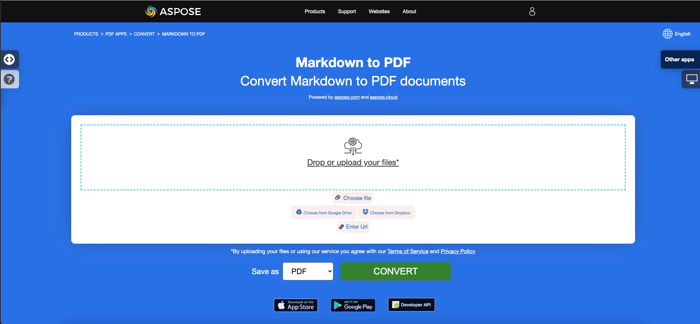
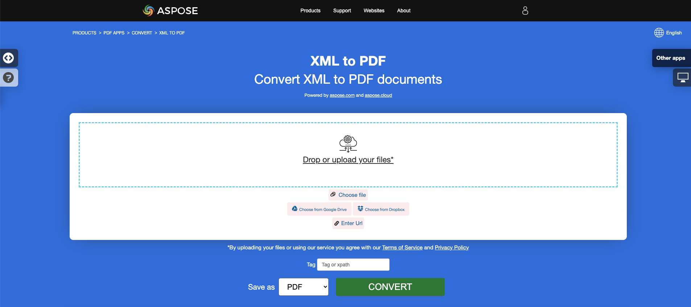

<script type="application/ld+json">
{
    "@context": "https://schema.org",
    "@type": "TechArticle",
    "headline": "Convert other file formats to PDF in .NET",
    "alternativeHeadline": "Convert Multiple File Formats to PDF in C#",
    "abstract": "Aspose.PDF for .NETは、ユーザーがEPUB、Markdown、PCL、XPS、PS、XML、LaTeXなどのさまざまなファイル形式を高品質のPDFドキュメントにシームレスに変換できる多目的機能を紹介します。この機能は、さまざまなプラットフォーム間での互換性とアクセシビリティを確保しながら、元のコンテンツの整合性を維持することで、ドキュメント管理を強化します。",
    "author": {
        "@type": "Person",
        "name": "Anastasiia Holub",
        "givenName": "Anastasiia",
        "familyName": "Holub",
        "url": "https://www.linkedin.com/in/anastasiia-holub-750430225/"
    },
    "genre": "pdf document generation",
    "wordcount": "4627",
    "proficiencyLevel": "Beginner",
    "publisher": {
        "@type": "Organization",
        "name": "Aspose.PDF for .NET",
        "url": "https://products.aspose.com/pdf",
        "logo": "https://www.aspose.cloud/templates/aspose/img/products/pdf/aspose_pdf-for-net.svg",
        "alternateName": "Aspose",
        "sameAs": [
            "https://facebook.com/aspose.pdf/",
            "https://twitter.com/asposepdf",
            "https://www.youtube.com/channel/UCmV9sEg_QWYPi6BJJs7ELOg/featured",
            "https://www.linkedin.com/company/aspose",
            "https://stackoverflow.com/questions/tagged/aspose",
            "https://aspose.quora.com/",
            "https://aspose.github.io/"
        ],
        "contactPoint": [
            {
                "@type": "ContactPoint",
                "telephone": "+1 903 306 1676",
                "contactType": "sales",
                "areaServed": "US",
                "availableLanguage": "en"
            },
            {
                "@type": "ContactPoint",
                "telephone": "+44 141 628 8900",
                "contactType": "sales",
                "areaServed": "GB",
                "availableLanguage": "en"
            },
            {
                "@type": "ContactPoint",
                "telephone": "+61 2 8006 6987",
                "contactType": "sales",
                "areaServed": "AU",
                "availableLanguage": "en"
            }
        ]
    },
    "url": "/net/convert-other-files-to-pdf/",
    "mainEntityOfPage": {
        "@type": "WebPage",
        "@id": "/net/convert-other-files-to-pdf/"
    },
    "dateModified": "2024-11-25",
    "description": "Aspose.PDFは、単純で簡単なタスクだけでなく、より複雑な目標にも対応できます。次のセクションでは、上級ユーザーと開発者向けの情報を確認してください。"
}
</script>

## 概要

この記事では、**C#を使用してさまざまな他のファイル形式をPDFに変換する方法**を説明します。以下のトピックをカバーしています。

以下のコードスニペットは、[Aspose.PDF.Drawing](/pdf/ja/net/drawing/)ライブラリでも動作します。

_形式_: **EPUB**
- [C# EPUBをPDFに変換](#csharp-convert-epub-to-pdf)
- [C# EPUBをPDFに変換](#csharp-convert-epub-to-pdf)
- [C# EPUBファイルをPDFに変換する方法](#csharp-convert-epub-to-pdf)

_形式_: **Markdown**
- [C# MarkdownをPDFに変換](#csharp-convert-markdown-to-pdf)
- [C# MarkdownをPDFに変換](#csharp-convert-markdown-to-pdf)
- [C# MarkdownファイルをPDFに変換する方法](#csharp-convert-markdown-to-pdf)

_形式_: **MD**
- [C# MDをPDFに変換](#csharp-convert-md-to-pdf)
- [C# MDをPDFに変換](#csharp-convert-md-to-pdf)
- [C# MDファイルをPDFに変換する方法](#csharp-convert-md-to-pdf)

_形式_: **PCL**
- [C# PCLをPDFに変換](#csharp-convert-pcl-to-pdf)
- [C# PCLをPDFに変換](#csharp-convert-pcl-to-pdf)
- [C# PCLファイルをPDFに変換する方法](#csharp-convert-pcl-to-pdf)

_形式_: **テキスト**
- [C# テキストをPDFに変換](#csharp-convert-text-to-pdf)
- [C# テキストをPDFに変換](#csharp-convert-text-to-pdf)
- [C# テキストファイルをPDFに変換する方法](#csharp-convert-text-to-pdf)

_形式_: **TXT**
- [C# TXTをPDFに変換](#csharp-convert-txt-to-pdf)
- [C# TXTをPDFに変換](#csharp-convert-txt-to-pdf)
- [C# TXTファイルをPDFに変換する方法](#csharp-convert-txt-to-pdf)

_形式_: **プレーンテキスト**
- [C# プレーンテキストをPDFに変換](#csharp-convert-plain-text-to-pdf)
- [C# プレーンテキストをPDFに変換](#csharp-convert-plain-text-to-pdf)
- [C# プレーンテキストファイルをPDFに変換する方法](#csharp-convert-plain-text-to-pdf)

_形式_: **プレフォーマットされたTXT**
- [C# プレフォーマットされたテキストをPDFに変換](#csharp-convert-pre-formatted-txt-to-pdf)
- [C# プレフォーマットされたテキストをPDFに変換](#csharp-convert-pre-formatted-txt-to-pdf)
- [C# プレフォーマットされたテキストファイルをPDFに変換する方法](#csharp-convert-pre-formatted-txt-to-pdf)

_形式_: **プレテキスト**
- [C# プレテキストをPDFに変換](#csharp-convert-pre-text-to-pdf)
- [C# プレテキストをPDFに変換](#csharp-convert-pre-text-to-pdf)
- [C# プレテキストファイルをPDFに変換する方法](#csharp-convert-pre-text-to-pdf)

_形式_: **XPS**
- [C# XPSをPDFに変換](#csharp-convert-xps-to-pdf)
- [C# XPSをPDFに変換](#csharp-convert-xps-to-pdf)
- [C# XPSファイルをPDFに変換する方法](#csharp-convert-xps-to-pdf)

## EPUBをPDFに変換

**Aspose.PDF for .NET**は、EPUBファイルをPDF形式に簡単に変換できます。

<abbr title="電子出版">EPUB</abbr>（電子出版の略）は、国際デジタル出版フォーラム（IDPF）からの無料でオープンな電子書籍標準です。ファイルの拡張子は.epubです。EPUBは、リフロー可能なコンテンツのために設計されており、EPUBリーダーは特定の表示デバイスに最適化されたテキストを表示できます。

EPUBは固定レイアウトのコンテンツもサポートしています。この形式は、出版社や変換業者が社内で使用するため、また配布や販売のための単一の形式として意図されています。これはOpen eBook標準を置き換えます。EPUB 3バージョンは、コンテンツのパッケージ化に関する標準的なベストプラクティス、研究、情報、イベントのための主要な書籍業界団体である書籍業界研究グループ（BISG）によっても支持されています。

{}
**EPUBをPDFにオンラインで変換してみてください**

Aspose.PDF for .NETは、オンラインの無料アプリケーション["EPUB to PDF"](https://products.aspose.app/pdf/conversion/epub-to-pdf)を提供しており、機能と品質を調査することができます。

[](https://products.aspose.app/pdf/conversion/epub-to-pdf)
{}

<a name="csharp-convert-epub-to-pdf" id="csharp-convert-epub-to-pdf"><strong><em>手順:</em> C#でEPUBをPDFに変換する</strong></a>

1. [EpubLoadOptions](https://reference.aspose.com/pdf/net/aspose.pdf/epubloadoptions)クラスのインスタンスを作成します。
2. 指定したソースファイル名とオプションを使用して[Document](https://reference.aspose.com/pdf/net/aspose.pdf/document)クラスのインスタンスを作成します。
3. 希望のファイル名でドキュメントを保存します。

次のコードスニペットは、C#を使用してEPUBファイルをPDF形式に変換する方法を示しています。

```csharp
// For complete examples and data files, visit https://github.com/aspose-pdf/Aspose.PDF-for-.NET
private static void ConvertEPUBtoPDF()
{
    // The path to the documents directory
    var dataDir = RunExamples.GetDataDir_AsposePdf_DocumentConversion();
    // Convert options
    var options = new Aspose.Pdf.EpubLoadOptions();

    // Open PDF document
    using (var document = new Aspose.Pdf.Document(dataDir + "EPUBToPDF.epub", options))
    {
        // Save PDF document
        document.Save(dataDir + "ConvertEPUBtoPDF_out.pdf");
    }
}
```

変換のためにページサイズを設定することもできます。新しいページサイズを定義するには、`SizeF`オブジェクトを作成し、それを[エプブロードオプション](https://reference.aspose.com/pdf/net/aspose.pdf/epubloadoptions/constructors/main)コンストラクタに渡します。

```csharp
// For complete examples and data files, visit https://github.com/aspose-pdf/Aspose.PDF-for-.NET
private static void ConvertEPUBtoPDFAdv()
{
    // The path to the documents directory
    var dataDir = RunExamples.GetDataDir_AsposePdf_DocumentConversion();
    // Convert options
    var options = new Aspose.Pdf.EpubLoadOptions(new SizeF(1190, 1684));

    // Open PDF document
    using (var document = new Aspose.Pdf.Document(dataDir + "EPUBToPDF.epub", options))
    {
        // Save PDF document
        document.Save(dataDir + "ConvertEPUBtoPDFAdv_out.pdf");
    }
}
```

## MarkdownをPDFに変換

**この機能はバージョン19.6以上でサポートされています。**

{}
**MarkdownをPDFにオンラインで変換してみてください**

Aspose.PDF for .NETは、オンラインの無料アプリケーション["Markdown to PDF"](https://products.aspose.app/pdf/conversion/md-to-pdf)を提供しており、機能と品質を調査することができます。

[](https://products.aspose.app/pdf/conversion/md-to-pdf)
{}

Aspose.PDF for .NETは、入力[Markdown](https://daringfireball.net/projects/markdown/syntax)データファイルに基づいてPDFドキュメントを作成する機能を提供します。MarkdownをPDFに変換するには、[MdLoadOptions](https://reference.aspose.com/pdf/net/aspose.pdf/mdloadoptions)を使用して[Document](https://reference.aspose.com/pdf/net/aspose.pdf/document)を初期化する必要があります。

以下のコードスニペットは、Aspose.PDFライブラリを使用してこの機能をどのように利用するかを示しています。

<a name="csharp-convert-markdown-to-pdf" id="csharp-convert-markdown-to-pdf"><strong><em>手順:</em> C#でMarkdownをPDFに変換する</strong></a> |
<a name="csharp-convert-md-to-pdf" id="csharp-convert-md-to-pdf"><strong><em>手順:</em> C#でMDをPDFに変換する</strong></a>

1. [MdLoadOptions](https://reference.aspose.com/pdf/net/aspose.pdf/mdloadoptions/)クラスのインスタンスを作成します。
2. 指定したソースファイル名とオプションを使用して[Document](https://reference.aspose.com/pdf/net/aspose.pdf/document)クラスのインスタンスを作成します。
3. 希望のファイル名でドキュメントを保存します。

```csharp
// For complete examples and data files, visit https://github.com/aspose-pdf/Aspose.PDF-for-.NET
private static void ConvertMarkdownToPDF()
{
    // The path to the documents directory
    var dataDir = RunExamples.GetDataDir_AsposePdf_DocumentConversion();
    // Convert options
    var options = new Aspose.Pdf.MdLoadOptions();

    // Open PDF document
    using (var document = new Aspose.Pdf.Document(dataDir + "sample.md", options))
    {
        // Save PDF document
        document.Save(dataDir + "ConvertMarkdownToPDF_out.pdf");
    }
}
```

## PCLをPDFに変換

<abbr title="プリンタコマンド言語">PCL</abbr>（プリンタコマンド言語）は、標準的なプリンタ機能にアクセスするために開発されたヒューレット・パッカードのプリンタ言語です。PCLレベル1から5e/5cは、受信した順序で処理され解釈される制御シーケンスを使用するコマンドベースの言語です。消費者レベルでは、PCLデータストリームはプリンタドライバによって生成されます。PCL出力は、カスタムアプリケーションによっても簡単に生成できます。

{}
**PCLをPDFにオンラインで変換してみてください**

Aspose.PDF for .NETは、オンラインの無料アプリケーション["PCL to PDF"](https://products.aspose.app/pdf/conversion/pcl-to-pdf)を提供しており、機能と品質を調査することができます。

[](https://products.aspose.app/pdf/conversion/pcl-to-pdf)
{}

**現在、PCL5およびそれ以前のバージョンのみがサポートされています**

<table>
    <thead>
        <tr>
            <th>
                コマンドのセット
            </th>
            <th>
                サポート
            </th>
            <th>
                例外
            </th>
            <th>
                説明
            </th>
        </tr>
    </thead>
    <tbody>
        <tr>
            <td>
                ジョブ制御コマンド
            </td>
            <td>
                +
            </td>
            <td>
                両面印刷モード
            </td>
            <td>
                印刷プロセスを制御します：コピー数、出力ビン、単面/両面印刷、左および上のオフセットなど。
            </td>
        </tr>
        <tr>
            <td>
                ページ制御コマンド
            </td>
            <td>
                +
            </td>
            <td>
                穴あけスキップコマンド
            </td>
            <td>
                ページのサイズ、余白、ページの向き、行間、文字間距離などを指定します。
            </td>
        </tr>
        <tr>
            <td>
                カーソル位置決定コマンド
            </td>
            <td>
                +
            </td>
            <td>
                &nbsp;
            </td>
            <td>
                カーソル位置を指定し、したがってテキスト、ラスタまたはベクター画像および詳細の起点を指定します。
            </td>
        </tr>
        <tr>
            <td>
                フォント選択コマンド
            </td>
            <td>
                +
            </td>
            <td>
                <ol>
                    <li>透明印刷データコマンド。</li>
                    <li>埋め込みソフトフォント。現在のバージョンでは、ソフトフォントを作成する代わりに、ライブラリはターゲットマシンにインストールされている既存の「ハード」TrueTypeフォントから適切なフォントを選択します。<br/>
                        適合性は幅/高さ比によって定義されます。<br/>
                        この機能はビットマップおよびTrueTypeフォントにのみ機能し、ソフトフォントで印刷されたテキストがソースファイルのものと一致することを保証しません。<br/>
                        ソフトフォントの文字コードがデフォルトのものと一致しない可能性があります。
                    </li>
                    <li>ユーザー定義シンボルセット。</li>
                </ol>
            </td>
            <td>
                PCLファイルからソフト（埋め込み）フォントを読み込み、メモリ内で管理することを許可します。
            </td>
        </tr>
        <tr>
            <td>
                ラスタグラフィックスコマンド
            </td>
            <td>
                +
            </td>
            <td>
                白黒のみ
            </td>
            <td>
                PCLファイルからラスタ画像をメモリに読み込み、ラスタパラメータを指定します。<br>
                幅、高さ、圧縮タイプ、解像度など。
            </td>
        </tr>
        <tr>
            <td>
                カラーコマンド
            </td>
            <td>
                +
            </td>
            <td>
                &nbsp;
            </td>
            <td>
                印刷可能なすべてのオブジェクトに色付けを許可します。
            </td>
        </tr>
        <tr>
            <td>
                印刷モデルコマンド
            </td>
            <td>
                +
            </td>
            <td>
                &nbsp;
            </td>
            <td>
                テキスト、ラスタ画像、および矩形領域をラスタの事前定義されたおよびユーザー定義のパターンで塗りつぶすことを許可し、パターンとソースラスタ画像の透明度モードを指定します。<br> 事前定義されたパターンはハッチング、クロスハッチ、シェーディングです。
            </td>
        </tr>
        <tr>
            <td>
                矩形領域塗りつぶしコマンド
            </td>
            <td>
                +
            </td>
            <td>
                &nbsp;
            </td>
            <td>
                パターンで矩形領域を作成し、塗りつぶすことを許可します。
            </td>
        </tr>
        <tr>
            <td>
                HP-GL/2ベクターグラフィックスコマンド
            </td>
            <td>
                +
            </td>
            <td>
                スクリーンベクターコマンド（SV）、透明モードコマンド（TR）、透明データコマンド（TD）、RO（座標系の回転）、スケーラブルまたはビットマップフォントコマンド（SB）、文字傾斜コマンド（SL）、および余分なスペース（ES）は実装されておらず、DV（定義変数テキストパス）コマンドはベータ版で実現されています。
            </td>
            <td>
                PCLファイルからHP-GL/2ベクター画像をメモリに読み込むことを許可します。ベクター画像は印刷可能エリアの左下隅に起点があり、スケーリング、移動、回転、クリッピングが可能です。<br>
                ベクター画像には、ラベルとしてのテキストや、矩形、円、楕円、線、弧、ベジエ曲線、単純なものから構成された複雑な図形などの幾何学的図形が含まれる場合があります。<br> ラベルの文字を含む閉じた図形は、ソリッドフィルまたはベクターパターンで塗りつぶすことができます。<br> パターンはハッチング、クロスハッチ、シェーディング、ラスタユーザー定義、PCLハッチングまたはクロスハッチ、PCLユーザー定義です。PCLパターンはラスタです。ラベルは個別に回転、スケーリング、四方向（上、下、左、右）に指向できます。左と右の方向は、文字を一つずつ配置します。上と下の方向は、文字を一つずつ配置します。
            </td>
        </tr>
        <tr>
            <td>
                マクロ
            </td>
            <td>
                ―
            </td>
            <td>
                &nbsp;
            </td>
            <td>
                PCLコマンドのシーケンスをメモリに読み込み、このシーケンスを何度も使用できるようにします。たとえば、ページヘッダーを印刷したり、一連のページに対して1つのフォーマットを設定したりするために使用します。
            </td>
        </tr>
        <tr>
            <td>
                Unicodeテキスト
            </td>
            <td>
                ―
            </td>
            <td>
                &nbsp;
            </td>
            <td>
                非ASCII文字を印刷することを許可します。Unicodeテキストのサンプルファイルが不足しているため、実装されていません。
            </td>
        </tr>
        <tr>
            <td>
                PCL6（PCL-XL）
            </td>
            <td>
                &nbsp;
            </td>
            <td>
                テストファイルが不足しているため、ベータ版でのみ実現されています。埋め込みフォントもサポートされていません。<br> JetReady拡張は、JetReady仕様が存在しないためサポートされていません。
            </td>
            <td>
                バイナリファイル形式。
            </td>
        </tr>
    </tbody>
</table>

### PCLファイルをPDF形式に変換する

PCLからPDFへの変換を可能にするために、Aspose.PDFには[`PclLoadOptions`](https://reference.aspose.com/pdf/net/aspose.pdf/pclloadoptions)クラスがあり、これを使用してLoadOptionsオブジェクトを初期化します。後で、このオブジェクトはDocumentオブジェクトの初期化時に引数として渡され、PDFレンダリングエンジンがソースドキュメントの入力形式を特定するのに役立ちます。

以下のコードスニペットは、PCLファイルをPDF形式に変換するプロセスを示しています。

<a name="csharp-convert-pcl-to-pdf" id="csharp-convert-pcl-to-pdf"><strong><em>手順:</em> C#でPCLをPDFに変換する</strong></a>

1. [PclLoadOptions](https://reference.aspose.com/pdf/net/aspose.pdf/pclloadoptions/)クラスのインスタンスを作成します。
2. 指定したソースファイル名とオプションを使用して[Document](https://reference.aspose.com/pdf/net/aspose.pdf/document/)クラスのインスタンスを作成します。
3. 希望のファイル名でドキュメントを保存します。

```csharp
// For complete examples and data files, visit https://github.com/aspose-pdf/Aspose.PDF-for-.NET
private static void ConvertPCLtoPDF()
{
    // The path to the documents directory
    var dataDir = RunExamples.GetDataDir_AsposePdf_DocumentConversion();
    // Convert options
    var options = new Aspose.Pdf.PclLoadOptions();

    // Open PDF document
    using (var document = new Aspose.Pdf.Document(dataDir + "ConvertPCLtoPDF.pcl", options))
    {
        // Save PDF document
        document.Save(dataDir + "ConvertPCLtoPDF_out.pdf");
    }
}
```

変換プロセス中のエラー検出を監視することもできます。これを行うには、PclLoadOptionsオブジェクトを構成する必要があります：SupressErrorsを設定または解除します。

```csharp
// For complete examples and data files, visit https://github.com/aspose-pdf/Aspose.PDF-for-.NET
private static void ConvertPCLtoPDFAdvanced()
{
    // The path to the documents directory
    var dataDir = RunExamples.GetDataDir_AsposePdf_DocumentConversion();
    // Convert options
    var options = new Aspose.Pdf.PclLoadOptions { SupressErrors = true };

    // Open PDF document
    using (var document = new Aspose.Pdf.Document(dataDir + "ConvertPCLtoPDFAdvanced.pcl", options))
    {
        if (options.Exceptions != null)
        {
            foreach (var ex in options.Exceptions)
            {
                Console.WriteLine(ex.Message);
            }
        }
        // Save PDF document
        document.Save(dataDir + "ConvertPCLtoPDFAdvanced_out.pdf");
    }
}
```

### 既知の問題

1. 印刷方向が0°でない場合、テキスト文字列と画像の起点がソースPCLファイルのものとわずかに異なる場合があります。ベクター画像についても同様です。
2. ベクター画像のラベルの起点がソースPCLファイルのものと異なる場合があります。ラベルがコマンドのシーケンス（ラベルの起点（LO）、変数テキストパスの定義（DV）、絶対方向（DI）、相対方向（DR））の影響を受けている場合。
3. テキストは、ビットマップまたはTrueTypeソフト（埋め込み）フォントでレンダリングされる必要がある場合、正しく読み取れない可能性があります。現在、これらのフォントは部分的にしかサポートされていません（「サポートされている機能テーブル」の例外を参照）。この状況では、ソフトフォントの文字コードがデフォルトのものと一致する場合にのみ、テキストが正しく読み取られます。読み取られたテキストのスタイルも、ソースPCLファイルのものと異なる可能性があります。ソフトフォントヘッダーでスタイルを設定する必要はありません。
4. 解析されたPCLファイルにIntellifontまたはUniversalソフトフォントが含まれている場合、例外がスローされます。IntellifontおよびUniversalフォントはまったくサポートされていません。
5. 解析されたPCLファイルにマクロコマンドが含まれている場合、解析の結果はソースファイルと大きく異なります。マクロコマンドはサポートされていません。

## テキストをPDFに変換

**Aspose.PDF for .NET**は、プレーンテキストおよびプレフォーマットされたテキストファイルをPDF形式に変換する機能をサポートしています。

テキストをPDFに変換することは、PDFページにテキストフラグメントを追加することを意味します。テキストファイルについては、プレフォーマット（たとえば、1行80文字の25行）と非フォーマットテキスト（プレーンテキスト）の2種類のテキストを扱います。ニーズに応じて、この追加を自分で制御することも、ライブラリのアルゴリズムに任せることもできます。

{}
**TEXTをPDFにオンラインで変換してみてください**

Aspose.PDF for .NETは、オンラインの無料アプリケーション["Text to PDF"](https://products.aspose.app/pdf/conversion/txt-to-pdf)を提供しており、機能と品質を調査することができます。

[](https://products.aspose.app/pdf/conversion/txt-to-pdf)
{}

### プレーンテキストファイルをPDFに変換

プレーンテキストファイルの場合、次の技術を使用できます。

<a name="csharp-convert-text-to-pdf" id="csharp-convert-text-to-pdf"><strong><em>手順:</em> C#でテキストをPDFに変換する</strong></a> |
<a name="csharp-convert-txt-to-pdf" id="csharp-convert-txt-to-pdf"><strong><em>手順:</em> C#でTXTをPDFに変換する</strong></a> |
<a name="csharp-convert-plain-text-to-pdf" id="csharp-convert-plain-text-to-pdf"><strong><em>手順:</em> C#でプレーンテキストをPDFに変換する</strong></a>

1. _TextReader_を使用して、全テキストを読み取ります。
2. [Document](https://reference.aspose.com/pdf/net/aspose.pdf/document/)オブジェクトをインスタンス化し、Pagesコレクションに新しいページを追加します。
3. [TextFragment](https://reference.aspose.com/pdf/net/aspose.pdf.text/textfragment/)の新しいオブジェクトを作成し、_TextReader_オブジェクトをそのコンストラクタに渡します。
4. _TextFragment_オブジェクトを_Paragraphs_コレクションの段落として追加します。テキストの量がページを超える場合、ライブラリアルゴリズムは自動的に追加ページを追加します。
5. [Document](https://reference.aspose.com/pdf/net/aspose.pdf/document/)クラスの**Save**メソッドを使用します。

```csharp
// For complete examples and data files, visit https://github.com/aspose-pdf/Aspose.PDF-for-.NET
private static void ConvertPlainTextFileToPDF()
{
    // The path to the documents directory
    var dataDir = RunExamples.GetDataDir_AsposePdf_DocumentConversion();

    // Read the source text file
    using (var streamReader = new StreamReader(dataDir + "TextToPDFInput.txt"))
    {
        // // Create PDF document
        using (var document = new Aspose.Pdf.Document())
        {
            // Add page
            var page = document.Pages.Add();
            // Create an instance of TextFragment and pass the text from reader object to its constructor as argument
            var text = new Aspose.Pdf.Text.TextFragment(streamReader.ReadToEnd());
            // Add a new text paragraph in paragraphs collection and pass the TextFragment object
            page.Paragraphs.Add(text);
            // Save PDF document
            document.Save(dataDir + "TextToPDF_out.pdf");
        }
    }
}
```

### プレフォーマットされたテキストファイルをPDFに変換

プレフォーマットされたテキストをPDFに変換することは、プレーンテキストと似ていますが、余白、フォントタイプ、サイズなどの追加のアクションを設定する必要があります。明らかに、フォントは等幅である必要があります（たとえば、Courier New）。

C#でプレフォーマットされたテキストをPDFに変換する手順は次のとおりです。

<a name="csharp-convert-pre-text-to-pdf" id="csharp-convert-pre-text-to-pdf"><strong><em>手順:</em> C#でプレテキストをPDFに変換する</strong></a> |
<a name="csharp-convert-pre-formatted-txt-to-pdf" id="csharp-convert-pre-formatted-txt-to-pdf"><strong><em>手順:</em> C#でプレフォーマットされたTXTをPDFに変換する</strong></a>

1. 全テキストを文字列の配列として読み取ります。
2. [Document](https://reference.aspose.com/pdf/net/aspose.pdf/document/)オブジェクトをインスタンス化し、[Pages](https://reference.aspose.com/pdf/net/aspose.pdf/document/pages/)コレクションに新しいページを追加します。
3. 文字列の配列をループして、各文字列を[Paragraphs](https://reference.aspose.com/pdf/net/aspose.pdf/paragraphs/)コレクションの段落として追加します。

この場合、ライブラリのアルゴリズムも追加ページを追加しますが、このプロセスを自分で制御することもできます。
以下の例は、プレフォーマットされたテキストファイルをPDFドキュメントに変換する方法を示しています。ページサイズはA4です。

```csharp
// For complete examples and data files, visit https://github.com/aspose-pdf/Aspose.PDF-for-.NET
private static void ConvertPreFormattedTextToPdf()
{
    // The path to the documents directory
    var dataDir = RunExamples.GetDataDir_AsposePdf_DocumentConversion();
    // Read the text file as array of string
    var lines = File.ReadAllLines(dataDir + "ConvertPreFormattedTextToPdf.txt");

    // Create PDF document
    using (var document = new Aspose.Pdf.Document())
    {
        // Add page
        var page = document.Pages.Add();
        // Set left and right margins for better presentation
        page.PageInfo.Margin.Left = 20;
        page.PageInfo.Margin.Right = 10;
        page.PageInfo.DefaultTextState.Font = Aspose.Pdf.Text.FontRepository.FindFont("Courier New");
        page.PageInfo.DefaultTextState.FontSize = 12;

        foreach (var line in lines)
        {
            // check if line contains "form feed" character
            // see https://en.wikipedia.org/wiki/Page_break
            if (line.StartsWith("\x0c"))
            {
                page = document.Pages.Add();
                page.PageInfo.Margin.Left = 20;
                page.PageInfo.Margin.Right = 10;
                page.PageInfo.DefaultTextState.Font = Aspose.Pdf.Text.FontRepository.FindFont("Courier New");
                page.PageInfo.DefaultTextState.FontSize = 12;
            }
            else
            {
                // Create an instance of TextFragment and pass the line to its constructor as argument
                var text = new Aspose.Pdf.Text.TextFragment(line);
                // Add a new text paragraph in paragraphs collection and pass the TextFragment object
                page.Paragraphs.Add(text);
            }
        }
        // Save PDF document
        document.Save(dataDir + "PreFormattedTextToPDF_out.pdf");
    }
}
```

## XPSをPDFに変換

**Aspose.PDF for .NET**は、<abbr title="XMLペーパー仕様">XPS</abbr>ファイルをPDF形式に変換する機能をサポートしています。この作業を解決するためにこの記事を確認してください。

XPSファイルタイプは、主にマイクロソフト社のXMLペーパー仕様に関連付けられています。XMLペーパー仕様（XPS）は、以前はMetroというコードネームで知られ、次世代印刷パス（NGPP）マーケティングコンセプトを包含するもので、マイクロソフトの文書作成と表示をWindowsオペレーティングシステムに統合するための取り組みです。

{}

このファイル形式は基本的に圧縮されたXMLファイルで、主に配布と保存に使用されます。編集が非常に難しく、主にマイクロソフトによって実装されています。

{}

XPSをPDFに変換するために、Aspose.PDF for .NETでは[XpsLoadOption](https://reference.aspose.com/pdf/net/aspose.pdf/xpsloadoptions)というクラスを導入しており、これを使用して[LoadOptions](https://reference.aspose.com/pdf/net/aspose.pdf/loadoptions)オブジェクトを初期化します。後で、このオブジェクトはDocumentオブジェクトの初期化時に引数として渡され、PDFレンダリングエンジンがソースドキュメントの入力形式を特定するのに役立ちます。

{}

XPおよびWindows 7では、コントロールパネルのプリンタを見て、XPSプリンタがプリインストールされていることを確認できます。これらのファイルを作成するには、そのプリンタを出力デバイスとして使用できます。Windows 7では、ファイルをダブルクリックするだけでXPSビューワーで開くことができるはずです。マイクロソフトのウェブサイトからXPSビューワーをダウンロードすることもできます。

{}

以下のコードスニペットは、C#を使用してXPSファイルをPDF形式に変換するプロセスを示しています。

<a name="csharp-convert-xps-to-pdf" id="csharp-convert-xps-to-pdf"><strong><em>手順:</em> C#でXPSをPDFに変換する</strong></a>

1. [XpsLoadOptions](https://reference.aspose.com/pdf/net/aspose.pdf/xpsloadoptions/)クラスのインスタンスを作成します。
2. 指定したソースファイル名とオプションを使用して[Document](https://reference.aspose.com/pdf/net/aspose.pdf/document/)クラスのインスタンスを作成します。
3. 希望のファイル名でドキュメントをPDF形式に保存します。

```csharp
// For complete examples and data files, visit https://github.com/aspose-pdf/Aspose.PDF-for-.NET
private static void ConvertXPSToPDF()
{
    // The path to the documents directory
    var dataDir = RunExamples.GetDataDir_AsposePdf_DocumentConversion();
    // Instantiate Options object
    var options = new Aspose.Pdf.XpsLoadOptions();

    // Open PDF document
    using (var document = new Aspose.Pdf.Document(dataDir + "XPSToPDF.xps", options))
    {
        // Save PDF document
        document.Save(dataDir + "ConvertXPSToPDF_out.pdf");
    }
}
```

{}
**XPS形式をPDFにオンラインで変換してみてください**

Aspose.PDF for .NETは、オンラインの無料アプリケーション["XPS to PDF"](https://products.aspose.app/pdf/conversion/xps-to-pdf/)を提供しており、機能と品質を調査することができます。

[](https://products.aspose.app/pdf/conversion/xps-to-pdf/)
{}

## PostScriptをPDFに変換

**Aspose.PDF for .NET**は、PostScriptファイルをPDF形式に変換する機能をサポートしています。Aspose.PDFの機能の1つは、変換中に使用されるフォントフォルダのセットを設定できることです。

PostScriptファイルをPDF形式に変換するために、Aspose.PDF for .NETは[PsLoadOptions](https://reference.aspose.com/pdf/net/aspose.pdf/psloadoptions)クラスを提供しており、これを使用してLoadOptionsオブジェクトを初期化します。後で、このオブジェクトはDocumentオブジェクトのコンストラクタに引数として渡され、PDFレンダリングエンジンがソースドキュメントの形式を特定するのに役立ちます。

以下のコードスニペットは、Aspose.PDF for .NETを使用してPostScriptファイルをPDF形式に変換するために使用できます。

```csharp
// For complete examples and data files, visit https://github.com/aspose-pdf/Aspose.PDF-for-.NET
private static void ConvertPostScriptToPDF()
{
    // The path to the documents directory
    var dataDir = RunExamples.GetDataDir_AsposePdf_DocumentConversion();
    // Convert options
    var options = new PsLoadOptions();

    // Open PDF document
    using (var document = new Aspose.Pdf.Document(dataDir + "ConvertPostscriptInput.ps", options))
    {
        // Save PDF document
        document.Save(dataDir + "PSToPDF_out.pdf");
    }
}
```

さらに、変換中に使用されるフォントフォルダのセットを設定できます。

```csharp
// For complete examples and data files, visit https://github.com/aspose-pdf/Aspose.PDF-for-.NET
private static void ConvertPostscriptToPDFAdvanced()
{
    // The path to the documents directory
    var dataDir = RunExamples.GetDataDir_AsposePdf_DocumentConversion();
    // Convert options with custom font folders
    var options = new Aspose.Pdf.PsLoadOptions
    {
        FontsFolders = new[] { dataDir + @"\fonts1", dataDir + @"\fonts2" }
    };

    // Open PDF document
    using (var document = new Aspose.Pdf.Document(dataDir + "ConvertPostscriptInput.ps", options))
    {
        // Save PDF document
        document.Save(dataDir + "ConvertPostscriptToPDFAdvanced_out.pdf");
    }
}
```

## XMLをPDFに変換

XML形式は、構造化データを保存するために使用されます。Aspose.PDFで<abbr title="拡張可能マークアップ言語">XML</abbr>をPDFに変換する方法はいくつかあります。

1. 任意のXMLデータをXSLTを使用してHTMLに変換し、以下に説明するようにHTMLをPDFに変換します。
2. Aspose.PDF XSDスキーマを使用してXMLドキュメントを生成します。
3. XSL-FO標準に基づくXMLドキュメントを使用します。

{}
**XMLをPDFにオンラインで変換してみてください**

Aspose.PDF for .NETは、オンラインの無料アプリケーション["XML to PDF"](https://products.aspose.app/pdf/conversion/xml-to-pdf)を提供しており、機能と品質を調査することができます。

[](https://products.aspose.app/pdf/conversion/xml-to-pdf)
{}

## XSL-FOをPDFに変換

XSL-FOファイルをPDFに変換することは、従来のAspose.PDF技術を使用して実装できます。すなわち、[Document](https://reference.aspose.com/page/net/aspose.page/document)オブジェクトを[XslFoLoadOptions](https://reference.aspose.com/pdf/net/aspose.pdf/xslfoloadoptions)でインスタンス化します。しかし、時には不正なファイル構造に遭遇することがあります。この場合、XSL-FOコンバータはエラーハンドリング戦略を設定することを許可します。`ThrowExceptionImmediately`、`TryIgnore`、または`InvokeCustomHandler`を選択できます。

```csharp
// For complete examples and data files, visit https://github.com/aspose-pdf/Aspose.PDF-for-.NET
private static void Convert_XSLFO_to_PDF()
{
    // The path to the documents directory
    var dataDir = RunExamples.GetDataDir_AsposePdf_DocumentConversion();
    // Convert options
    var options = new Aspose.Pdf.XslFoLoadOptions(dataDir + "XSLFOToPdfInput.xslt");
    // Set error handling strategy
    options.ParsingErrorsHandlingType = Aspose.Pdf.XslFoLoadOptions.ParsingErrorsHandlingTypes.ThrowExceptionImmediately;

    // Open PDF document
    using (var document = new Aspose.Pdf.Document(dataDir + "XSLFOToPdfInput.xml", options))
    {
        // Save PDF document
        document.Save(dataDir + "XSLFOToPdf_out.pdf");
    }
}
```

## LaTeX/TeXをPDFに変換

LaTeXファイル形式は、TeXファミリーの言語のLaTeX派生のマークアップを含むテキストファイル形式です。LaTeXはTeXシステムの派生形式です。LaTeX（ˈleɪtɛk/レイテックまたはラテック）は、文書作成システムおよび文書マークアップ言語です。数学、物理学、コンピュータサイエンスなどの多くの分野で科学文書の通信と出版に広く使用されています。また、サンスクリット語やアラビア語などの複雑な多言語資料を含む書籍や記事の準備と出版においても重要な役割を果たしています。LaTeXは、出力のフォーマットにTeX組版プログラムを使用し、TeXマクロ言語で記述されています。

{}
**LaTeX/TeXをPDFにオンラインで変換してみてください**

Aspose.PDF for .NETは、オンラインの無料アプリケーション["LaTex to PDF"](https://products.aspose.app/pdf/conversion/tex-to-pdf)を提供しており、機能と品質を調査することができます。

[](https://products.aspose.app/pdf/conversion/tex-to-pdf)
{}

Aspose.PDF for .NETは、TeXファイルをPDF形式に変換する機能をサポートしており、この要件を満たすために、Aspose.Pdf名前空間には[LatexLoadOptions](https://reference.aspose.com/pdf/net/aspose.pdf/latexloadoptions)というクラスがあり、LaTexファイルを読み込み、[Document class](https://reference.aspose.com/pdf/net/aspose.pdf/document)を使用してPDF形式で出力をレンダリングする機能を提供します。
以下のコードスニペットは、C#を使用してLaTexファイルをPDF形式に変換するプロセスを示しています。

```csharp
// For complete examples and data files, visit https://github.com/aspose-pdf/Aspose.PDF-for-.NET
private static void ConvertTeXtoPDF()
{
    // The path to the documents directory
    var dataDir = RunExamples.GetDataDir_AsposePdf_DocumentConversion();
    // Convert options
    var options = new Aspose.Pdf.TeXLoadOptions();
    // Open PDF document
    using (var document = new Aspose.Pdf.Document(dataDir + "samplefile.tex", options))
    {
        // Save PDF document
        document.Save(dataDir + "TeXToPDF_out.pdf");
    }
}
```

## OFDをPDFに変換

OFD形式は「Open Fixed-layout Document」を指し、中国の電子ファイルストレージの国家標準として確立されており、人気のあるPDF形式の代替として使用されます。固定レイアウトのドキュメントをサポートし、さまざまなプラットフォームでの一貫した表示を保証します。OFDファイルは、デジタルドキュメントやビジネスアプリケーションなど、さまざまな目的で利用されます。

Aspose.PDF for .NETは、OFDファイルをPDF形式に変換する機能をサポートしており、この要件を満たすために、Aspose.Pdf名前空間には[OfdLoadOptions](https://reference.aspose.com/pdf/net/aspose.pdf/ofdloadoptions/)というクラスがあり、OFDファイルを読み込み、[Document class](https://reference.aspose.com/pdf/net/aspose.pdf/document)を使用してPDF形式で出力をレンダリングする機能を提供します。

以下のコードスニペットは、C#を使用してOFDファイルをPDF形式に変換するプロセスを示しています。

```csharp
// For complete examples and data files, visit https://github.com/aspose-pdf/Aspose.PDF-for-.NET
private static void ConvertOFDToPDF()
{
    // The path to the documents directory
    var dataDir = RunExamples.GetDataDir_AsposePdf_DocumentConversion();
    // Convert options
    var options = new Aspose.Pdf.OfdLoadOptions();

    // Open PDF document
    using (var document = new Aspose.Pdf.Document(dataDir + "ConvertOFDToPDF.ofd", options))
    {
        // Save PDF document
        document.Save(dataDir + "ConvertOFDToPDF_out.pdf");
    }
}
```