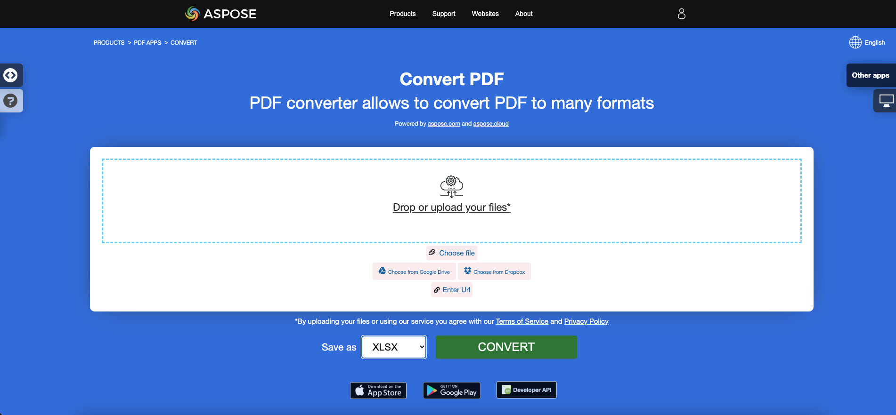

<script type="application/ld+json">
{
    "@context": "https://schema.org",
    "@type": "TechArticle",
    "headline": "Convert PDF to Excel in .NET",
    "alternativeHeadline": "Convert PDF Files to Excel Formats with C#",
    "abstract": "Aspose.PDF for .NETの強力な機能を発見し、PDF文書をXLS、XLSX、CSV、ODSなどのさまざまなExcel形式に簡単に変換します。この機能により、個々のPDFページを別々のExcelワークシートに変換するだけでなく、結合シートのオプションも提供され、ユーザーがPDFデータを効率的に管理できる柔軟性が得られます。",
    "author": {
        "@type": "Person",
        "name": "Anastasiia Holub",
        "givenName": "Anastasiia",
        "familyName": "Holub",
        "url": "https://www.linkedin.com/in/anastasiia-holub-750430225/"
    },
    "genre": "pdf document generation",
    "wordcount": "1780",
    "proficiencyLevel": "Beginner",
    "publisher": {
        "@type": "Organization",
        "name": "Aspose.PDF for .NET",
        "url": "https://products.aspose.com/pdf",
        "logo": "https://www.aspose.cloud/templates/aspose/img/products/pdf/aspose_pdf-for-net.svg",
        "alternateName": "Aspose",
        "sameAs": [
            "https://facebook.com/aspose.pdf/",
            "https://twitter.com/asposepdf",
            "https://www.youtube.com/channel/UCmV9sEg_QWYPi6BJJs7ELOg/featured",
            "https://www.linkedin.com/company/aspose",
            "https://stackoverflow.com/questions/tagged/aspose",
            "https://aspose.quora.com/",
            "https://aspose.github.io/"
        ],
        "contactPoint": [
            {
                "@type": "ContactPoint",
                "telephone": "+1 903 306 1676",
                "contactType": "sales",
                "areaServed": "US",
                "availableLanguage": "en"
            },
            {
                "@type": "ContactPoint",
                "telephone": "+44 141 628 8900",
                "contactType": "sales",
                "areaServed": "GB",
                "availableLanguage": "en"
            },
            {
                "@type": "ContactPoint",
                "telephone": "+61 2 8006 6987",
                "contactType": "sales",
                "areaServed": "AU",
                "availableLanguage": "en"
            }
        ]
    },
    "url": "/net/convert-pdf-to-excel/",
    "mainEntityOfPage": {
        "@type": "WebPage",
        "@id": "/net/convert-pdf-to-excel/"
    },
    "dateModified": "2024-11-25",
    "description": "Aspose.PDFは、単純で簡単なタスクだけでなく、より複雑な目標にも対応できます。次のセクションでは、上級ユーザーと開発者向けの情報を確認してください。"
}
</script>

## 概要

この記事では、**C#を使用してPDFをExcel形式に変換する方法**について説明します。以下のトピックをカバーしています。

次のコードスニペットは、[Aspose.PDF.Drawing](/pdf/ja/net/drawing/)ライブラリでも動作します。

_形式_: **XLS**

- [C# PDFをXLSに変換](#csharp-pdf-to-xls)
- [C# PDFをXLSに変換する](#csharp-pdf-to-xls)
- [C# PDFファイルをXLSに変換する方法](#csharp-pdf-to-xls)

_形式_: **XLSX**

- [C# PDFをXLSXに変換](#csharp-pdf-to-xlsx)
- [C# PDFをXLSXに変換する](#csharp-pdf-to-xlsx)
- [C# PDFファイルをXLSXに変換する方法](#csharp-pdf-to-xlsx)

_形式_: **Excel**

- [C# PDFをExcelに変換](#csharp-pdf-to-xlsx)
- [C# PDFをExcel XLSに変換](#csharp-pdf-to-xls)
- [C# PDFをExcel XLSXに変換](#csharp-pdf-to-xlsx)

_形式_: **単一Excelワークシート**

- [C# 単一ワークシートを持つPDFをXLSに変換](#csharp-pdf-to-excel-single)
- [C# 単一ワークシートを持つPDFをXLSXに変換](#csharp-pdf-to-excel-single)

_形式_: **XMLスプレッドシート2003形式**

- [C# PDFをXML Excelに変換](#csharp-pdf-to-excel-xml-2003)
- [C# PDFをXML Excelスプレッドシートに変換](#csharp-pdf-to-excel-xml-2003)

_形式_: **CSV**

- [C# PDFをCSVに変換](#csharp-pdf-to-csv)
- [C# PDFをCSVに変換する](#csharp-pdf-to-csv)
- [C# PDFファイルをCSVに変換する方法](#csharp-pdf-to-csv)

_形式_: **ODS**

- [C# PDFをODSに変換](#csharp-pdf-to-ods)
- [C# PDFをODSに変換する](#csharp-pdf-to-ods)
- [C# PDFファイルをODSに変換する方法](#csharp-pdf-to-ods)

## C# PDFからExcelへの変換

**Aspose.PDF for .NET**は、PDFファイルをExcel 2007、CSV、SpreadsheetML形式に変換する機能をサポートしています。

Aspose.PDF for .NETはPDF操作コンポーネントであり、PDFファイルをExcelワークブック（XLSXファイル）にレンダリングする機能を導入しました。この変換中に、PDFファイルの個々のページがExcelワークシートに変換されます。

{}
**PDFをExcelにオンラインで変換してみてください**

Aspose.PDF for .NETは、オンラインの無料アプリケーション["PDF to XLSX"](https://products.aspose.app/pdf/conversion/pdf-to-xlsx)を提供しており、機能と品質を調査することができます。

[](https://products.aspose.app/pdf/conversion/pdf-to-xlsx)
{}

PDFファイルを<abbr title="Microsoft Excel Open XML Spreadsheet">XLSX</abbr>形式に変換するために、Aspose.PDFには[ExcelSaveOptions](https://reference.aspose.com/pdf/ja/net/aspose.pdf/excelsaveoptions)というクラスがあります。ExcelSaveOptionsクラスのオブジェクトは、Document.Save(..)コンストラクタの第二引数として渡されます。

次のコードスニペットは、Aspose.PDF for .NETを使用してPDFファイルをXLSまたはXLSX形式に変換するプロセスを示しています。

<a name="csharp-pdf-to-xls"><strong>手順: C#でPDFをXLSに変換する</strong></a>

1. ソースPDF文書を使用して**Document**オブジェクトのインスタンスを作成します。
2. **ExcelSaveOptions**のインスタンスを作成します。
3. **Document.Save()**メソッドを呼び出し、**ExcelSaveOptions**を渡して、**.xls拡張子**を指定して**XLS**形式で保存します。

<a name="csharp-pdf-to-xlsx"><strong>手順: C#でPDFをXLSXに変換する</strong></a>

1. ソースPDF文書を使用して**Document**オブジェクトのインスタンスを作成します。
2. **ExcelSaveOptions**のインスタンスを作成します。
3. **Document.Save()**メソッドを呼び出し、**ExcelSaveOptions**を渡して、**.xlsx拡張子**を指定して**XLSX**形式で保存します。

```csharp
  // For complete examples and data files, visit https://github.com/aspose-pdf/Aspose.PDF-for-.NET
 private static void ConvertPDFtoExcel()
 {
     // The path to the documents directory
     var dataDir = RunExamples.GetDataDir_AsposePdf();

     // Open PDF document
     using (var document = new Aspose.Pdf.Document(dataDir + "input.pdf"))
     {
         // Instantiate ExcelSaveOptions object
         var saveOptions = new Aspose.Pdf.ExcelSaveOptions();

         // Save the file in XLSX format
         document.Save(dataDir + "PDFToXLS_out.xlsx", saveOptions);
     }
 }
```

## コントロール列を持つPDFをXLSに変換

PDFをXLS形式に変換する際、出力ファイルの最初の列に空白の列が追加されます。この列を制御するために、ExcelSaveOptionsクラスのInsertBlankColumnAtFirstオプションが使用されます。デフォルト値は`false`であり、空白の列は挿入されません。

```csharp
// For complete examples and data files, visit https://github.com/aspose-pdf/Aspose.PDF-for-.NET
private static void ConvertPDFtoExcelAdvanced_InsertBlankColumnAtFirst()
{
    // The path to the documents directory
    var dataDir = RunExamples.GetDataDir_AsposePdf();

    // Open PDF document
    using (var document = new Aspose.Pdf.Document(dataDir + "input.pdf"))
    {
        // Instantiate ExcelSaveOptions object
        var saveOptions = new Aspose.Pdf.ExcelSaveOptions
        {
            InsertBlankColumnAtFirst = false
        };

        // Save the file in XLSX format
        document.Save(dataDir + "PDFToXLS_out.xlsx", saveOptions);
    }
}
```

## PDFを単一Excelワークシートに変換

多くのページを持つPDFファイルをXLSにエクスポートする場合、各ページはExcelファイルの異なるシートにエクスポートされます。これは、MinimizeTheNumberOfWorksheetsプロパティがデフォルトでfalseに設定されているためです。出力Excelファイルの1つのシートにすべてのページをエクスポートするには、MinimizeTheNumberOfWorksheetsプロパティをtrueに設定します。

<a name="csharp-pdf-to-excel-single"><strong>手順: C#でPDFをXLSまたはXLSXの単一ワークシートに変換する</strong></a>

1. ソースPDF文書を使用して**Document**オブジェクトのインスタンスを作成します。
2. **MinimizeTheNumberOfWorksheets = true**を指定して**ExcelSaveOptions**のインスタンスを作成します。
3. **Document.Save()**メソッドを呼び出し、**ExcelSaveOptions**を渡して、単一ワークシートを持つ**XLS**または**XLSX**形式で保存します。

```csharp
 // For complete examples and data files, visit https://github.com/aspose-pdf/Aspose.PDF-for-.NET
private static void ConvertPDFtoExcelAdvanced_MinimizeTheNumberOfWorksheets()
{
    // The path to the documents directory
    var dataDir = RunExamples.GetDataDir_AsposePdf();

    // Open PDF document
    using (var document = new Aspose.Pdf.Document(dataDir + "input.pdf"))
    {
        // Instantiate ExcelSaveOptions object
        var saveOptions = new Aspose.Pdf.ExcelSaveOptions
        {
            MinimizeTheNumberOfWorksheets = true
        };

        // Save the file in XLSX format
        document.Save(dataDir + "PDFToXLS_out.xlsx", saveOptions);
    }
}
```

## 他のスプレッドシート形式に変換

### XMLスプレッドシート2003形式に変換

バージョン20.8以降、Aspose.PDFはデフォルトでMicrosoft Excel Open XMLスプレッドシート2007ファイル形式を使用してデータを保存します。PDFファイルをXMLスプレッドシート2003形式に変換するために、Aspose.PDFには[ExcelSaveOptions](https://reference.aspose.com/pdf/ja/net/aspose.pdf/excelsaveoptions)というクラスがあり、[Format](https://reference.aspose.com/pdf/ja/net/aspose.pdf/excelsaveoptions/properties/format)があります。[ExcelSaveOptions](https://reference.aspose.com/pdf/ja/net/aspose.pdf/excelsaveoptions)クラスのオブジェクトは、[Document.Save(..)](https://reference.aspose.com/pdf/ja/net/aspose.pdf/document/methods/save/index)メソッドの第二引数として渡されます。

次のコードスニペットは、PDFファイルをXLS Excel 2003 XML形式に変換するプロセスを示しています。

<a name="csharp-pdf-to-excel-xml-2003"><strong>手順: C#でPDFをExcel 2003 XML形式に変換する</strong></a>

1. ソースPDF文書を使用して**Document**オブジェクトのインスタンスを作成します。
2. **Format = ExcelSaveOptions.ExcelFormat.XMLSpreadSheet2003**を指定して**ExcelSaveOptions**のインスタンスを作成します。
3. **Document.Save()**メソッドを呼び出し、**ExcelSaveOptions**を渡して**XLS - Excel 2003 XML形式**で保存します。

```csharp
  // For complete examples and data files, visit https://github.com/aspose-pdf/Aspose.PDF-for-.NET
 private static void ConvertPDFtoExcelAdvanced_SaveXLS2003()
 {
     // The path to the documents directory
     var dataDir = RunExamples.GetDataDir_AsposePdf();

     // Open PDF document
     using (var document = new Aspose.Pdf.Document(dataDir + "input.pdf"))
     {
         // Instantiate ExcelSaveOptions object
         var saveOptions = new Aspose.Pdf.ExcelSaveOptions
         {
             Format = Aspose.Pdf.ExcelSaveOptions.ExcelFormat.XMLSpreadSheet2003
         };

         // Save the file in XLS format
         document.Save(dataDir + "PDFToXLS_out.xls", saveOptions);
     }
 }
```

### CSVに変換

CSV形式への変換は、上記と同様に行われます。必要なことは、適切な形式を設定することだけです。

<a name="csharp-pdf-to-csv"><strong>手順: C#でPDFをCSVに変換する</strong></a>

1. ソースPDF文書を使用して**Document**オブジェクトのインスタンスを作成します。
2. **Format = ExcelSaveOptions.ExcelFormat.CSV**を指定して**ExcelSaveOptions**のインスタンスを作成します。
3. **Document.Save()**メソッドを呼び出し、**ExcelSaveOptions**を渡して**CSV**形式で保存します。

```csharp
// For complete examples and data files, visit https://github.com/aspose-pdf/Aspose.PDF-for-.NET
private static void ConvertPDFToCSV()
{
    // The path to the documents directory
    var dataDir = RunExamples.GetDataDir_AsposePdf();

    // Open PDF document
    using (var document = new Aspose.Pdf.Document(dataDir + "input.pdf"))
    {
        // Instantiate ExcelSaveOptions object
        var saveOptions = new Aspose.Pdf.ExcelSaveOptions
        {
            Format = Aspose.Pdf.ExcelSaveOptions.ExcelFormat.CSV
        };
        
        // Save the file in CSV format
        document.Save(dataDir + "PDFToXLS_out.csv", saveOptions);
    }
}
```

### ODSに変換

<a name="csharp-pdf-to-ods"><strong>手順: C#でPDFをODSに変換する</strong></a>

1. ソースPDF文書を使用して**Document**オブジェクトのインスタンスを作成します。
2. **Format = ExcelSaveOptions.ExcelFormat.ODS**を指定して**ExcelSaveOptions**のインスタンスを作成します。
3. **Document.Save()**メソッドを呼び出し、**ExcelSaveOptions**を渡して**ODS**形式で保存します。

ODS形式への変換は、他のすべての形式と同様に行われます。

```csharp
// For complete examples and data files, visit https://github.com/aspose-pdf/Aspose.PDF-for-.NET
private static void ConvertPDFToODS()
{
    // The path to the documents directory
    var dataDir = RunExamples.GetDataDir_AsposePdf();
    
    // Open PDF document
    using (var document = new Aspose.Pdf.Document(dataDir + "input.pdf"))
    {
        // Instantiate ExcelSaveOptions object
        var saveOptions = new Aspose.Pdf.ExcelSaveOptions
        {
            Format = Aspose.Pdf.ExcelSaveOptions.ExcelFormat.ODS
        };

        // Save the file in ODS format
        document.Save(dataDir + "PDFToODS_out.ods", saveOptions);
    }
}
```

## 参照

この記事では、これらのトピックもカバーしています。コードは上記と同じです。

_形式_: **Excel**
- [C# PDFをExcelに変換するコード](#csharp-pdf-to-xlsx)
- [C# PDFをExcelに変換するAPI](#csharp-pdf-to-xlsx)
- [C# PDFをExcelにプログラムで変換する](#csharp-pdf-to-xlsx)
- [C# PDFをExcelに変換するライブラリ](#csharp-pdf-to-xlsx)
- [C# PDFをExcelとして保存する](#csharp-pdf-to-xlsx)
- [C# PDFからExcelを生成する](#csharp-pdf-to-xlsx)
- [C# PDFからExcelを作成する](#csharp-pdf-to-xlsx)
- [C# PDFをExcelに変換するコンバータ](#csharp-pdf-to-xlsx)

_形式_: **XLS**
- [C# PDFをXLSに変換するコード](#csharp-pdf-to-xls)
- [C# PDFをXLSに変換するAPI](#csharp-pdf-to-xls)
- [C# PDFをXLSにプログラムで変換する](#csharp-pdf-to-xls)
- [C# PDFをXLSに変換するライブラリ](#csharp-pdf-to-xls)
- [C# PDFをXLSとして保存する](#csharp-pdf-to-xls)
- [C# PDFからXLSを生成する](#csharp-pdf-to-xls)
- [C# PDFからXLSを作成する](#csharp-pdf-to-xls)
- [C# PDFをXLSに変換するコンバータ](#csharp-pdf-to-xls)

_形式_: **XLSX**
- [C# PDFをXLSXに変換するコード](#csharp-pdf-to-xlsx)
- [C# PDFをXLSXに変換するAPI](#csharp-pdf-to-xlsx)
- [C# PDFをXLSXにプログラムで変換する](#csharp-pdf-to-xlsx)
- [C# PDFをXLSXに変換するライブラリ](#csharp-pdf-to-xlsx)
- [C# PDFをXLSXとして保存する](#csharp-pdf-to-xlsx)
- [C# PDFからXLSXを生成する](#csharp-pdf-to-xlsx)
- [C# PDFからXLSXを作成する](#csharp-pdf-to-xlsx)
- [C# PDFをXLSXに変換するコンバータ](#csharp-pdf-to-xlsx)

_形式_: **CSV**
- [C# PDFをCSVに変換するコード](#csharp-pdf-to-csv)
- [C# PDFをCSVに変換するAPI](#csharp-pdf-to-csv)
- [C# PDFをCSVにプログラムで変換する](#csharp-pdf-to-csv)
- [C# PDFをCSVに変換するライブラリ](#csharp-pdf-to-csv)
- [C# PDFをCSVとして保存する](#csharp-pdf-to-csv)
- [C# PDFからCSVを生成する](#csharp-pdf-to-csv)
- [C# PDFからCSVを作成する](#csharp-pdf-to-csv)
- [C# PDFをCSVに変換するコンバータ](#csharp-pdf-to-csv)

_形式_: **ODS**
- [C# PDFをODSに変換するコード](#csharp-pdf-to-ods)
- [C# PDFをODSに変換するAPI](#csharp-pdf-to-ods)
- [C# PDFをODSにプログラムで変換する](#csharp-pdf-to-ods)
- [C# PDFをODSに変換するライブラリ](#csharp-pdf-to-ods)
- [C# PDFをODSとして保存する](#csharp-pdf-to-ods)
- [C# PDFからODSを生成する](#csharp-pdf-to-ods)
- [C# PDFからODSを作成する](#csharp-pdf-to-ods)
- [C# PDFをODSに変換するコンバータ](#csharp-pdf-to-ods)