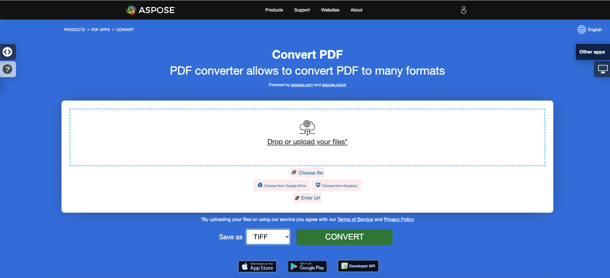
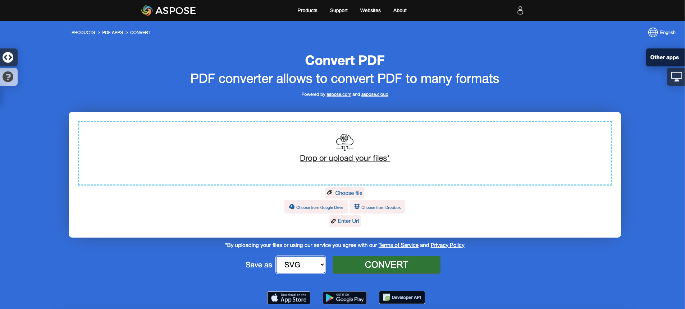

<script type="application/ld+json">
{
    "@context": "https://schema.org",
    "@type": "TechArticle",
    "headline": "Convert PDF to Different Image Formats in C#",
    "alternativeHeadline": "Convert PDF Files to Multiple Image Formats in C#",
    "abstract": "Aspose.PDF for .NETの機能により、ユーザーはPDFファイルをTIFF、BMP、EMF、JPEG、PNG、GIF、SVGなどの複数の画像形式にシームレスに変換できます。この機能は、C#の数行のコードで変換を可能にすることで文書処理を簡素化し、汎用的なPDF処理機能をアプリケーションに追加したい開発者にとって不可欠なツールとなります。",
    "author": {
        "@type": "Person",
        "name": "Anastasiia Holub",
        "givenName": "Anastasiia",
        "familyName": "Holub",
        "url": "https://www.linkedin.com/in/anastasiia-holub-750430225/"
    },
    "genre": "pdf document generation",
    "wordcount": "2012",
    "proficiencyLevel": "Beginner",
    "publisher": {
        "@type": "Organization",
        "name": "Aspose.PDF for .NET",
        "url": "https://products.aspose.com/pdf",
        "logo": "https://www.aspose.cloud/templates/aspose/img/products/pdf/aspose_pdf-for-net.svg",
        "alternateName": "Aspose",
        "sameAs": [
            "https://facebook.com/aspose.pdf/",
            "https://twitter.com/asposepdf",
            "https://www.youtube.com/channel/UCmV9sEg_QWYPi6BJJs7ELOg/featured",
            "https://www.linkedin.com/company/aspose",
            "https://stackoverflow.com/questions/tagged/aspose",
            "https://aspose.quora.com/",
            "https://aspose.github.io/"
        ],
        "contactPoint": [
            {
                "@type": "ContactPoint",
                "telephone": "+1 903 306 1676",
                "contactType": "sales",
                "areaServed": "US",
                "availableLanguage": "en"
            },
            {
                "@type": "ContactPoint",
                "telephone": "+44 141 628 8900",
                "contactType": "sales",
                "areaServed": "GB",
                "availableLanguage": "en"
            },
            {
                "@type": "ContactPoint",
                "telephone": "+61 2 8006 6987",
                "contactType": "sales",
                "areaServed": "AU",
                "availableLanguage": "en"
            }
        ]
    },
    "url": "/net/convert-pdf-to-images-format/",
    "mainEntityOfPage": {
        "@type": "WebPage",
        "@id": "/net/convert-pdf-to-images-format/"
    },
    "dateModified": "2024-11-25",
    "description": "Aspose.PDFは、単純で簡単なタスクだけでなく、より複雑な目標にも対応できます。次のセクションでは、上級ユーザーや開発者向けの情報を確認してください。"
}
</script>

## 概要

この記事では、C#を使用してPDFを異なる画像形式に変換する方法を説明します。以下のトピックをカバーしています。

_画像形式_: **TIFF**
- [C# PDFをTIFFに変換](#csharp-pdf-to-tiff)
- [C# PDFをTIFFに変換する](#csharp-pdf-to-tiff)
- [C# PDFの特定のページをTIFFに変換する](#csharp-pdf-to-tiff-pages)

_画像形式_: **BMP**
- [C# PDFをBMPに変換](#csharp-pdf-to-bmp)
- [C# PDFをBMPに変換する](#csharp-pdf-to-bmp)
- [C# PDFをBMPに変換するコンバータ](#csharp-pdf-to-bmp)

_画像形式_: **EMF**
- [C# PDFをEMFに変換](#csharp-pdf-to-emf)
- [C# PDFをEMFに変換する](#csharp-pdf-to-emf)
- [C# PDFをEMFに変換するコンバータ](#csharp-pdf-to-emf)

_画像形式_: **JPG**
- [C# PDFをJPGに変換](#csharp-pdf-to-jpg)
- [C# PDFをJPGに変換する](#csharp-pdf-to-jpg)
- [C# PDFをJPGに変換するコンバータ](#csharp-pdf-to-jpg)

_画像形式_: **PNG**
- [C# PDFをPNGに変換](#csharp-pdf-to-png)
- [C# PDFをPNGに変換する](#csharp-pdf-to-png)
- [C# PDFをPNGに変換するコンバータ](#csharp-pdf-to-png)

_画像形式_: **GIF**
- [C# PDFをGIFに変換](#csharp-pdf-to-gif)
- [C# PDFをGIFに変換する](#csharp-pdf-to-gif)
- [C# PDFをGIFに変換するコンバータ](#csharp-pdf-to-gif)

_画像形式_: **SVG**
- [C# PDFをSVGに変換](#csharp-pdf-to-svg)
- [C# PDFをSVGに変換する](#csharp-pdf-to-svg)
- [C# PDFをSVGに変換するコンバータ](#csharp-pdf-to-svg)

## C# PDFを画像に変換する

以下のコードスニペットは、[Aspose.PDF.Drawing](/pdf/ja/net/drawing/)ライブラリでも動作します。

**Aspose.PDF for .NET**は、PDFを画像に変換するためのいくつかのアプローチを使用します。一般的に、デバイスアプローチを使用した変換と、SaveOptionを使用した変換の2つのアプローチを使用します。このセクションでは、これらのアプローチのいずれかを使用して、PDF文書をBMP、JPEG、GIF、PNG、EMF、TIFF、SVG形式の画像に変換する方法を示します。

ライブラリには、画像を変換するための仮想デバイスを使用できるいくつかのクラスがあります。DocumentDeviceは文書全体の変換に向いていますが、ImageDeviceは特定のページの変換に向いています。

## DocumentDeviceクラスを使用してPDFを変換する

**Aspose.PDF for .NET**は、PDFページをTIFF画像に変換することを可能にします。

TiffDevice（DocumentDeviceに基づく）クラスは、PDFページをTIFF画像に変換することを可能にします。このクラスは、PDFファイル内のすべてのページを単一のTIFF画像に変換するための`Process`というメソッドを提供します。

{}
**PDFをTIFFにオンラインで変換してみてください**

Aspose.PDF for .NETは、機能と品質を調査するために試すことができるオンライン無料アプリケーション["PDF to TIFF"](https://products.aspose.app/pdf/conversion/pdf-to-tiff)を提供します。

[](https://products.aspose.app/pdf/conversion/pdf-to-tiff)
{}

### PDFページを1つのTIFF画像に変換する

Aspose.PDF for .NETは、PDFファイル内のすべてのページを単一のTIFF画像に変換する方法を説明します：

<a name="csharp-pdf-to-tiff"><strong>手順: C#でPDFをTIFFに変換する</strong></a>

1. **Document**クラスのオブジェクトを作成します。
2. **TiffSettings**および**TiffDevice**オブジェクトを作成します。
3. **TiffDevice.Process()**メソッドを呼び出して、PDF文書をTIFFに変換します。
4. 出力ファイルのプロパティを設定するには、**TiffSettings**クラスを使用します。

以下のコードスニペットは、すべてのPDFページを単一のTIFF画像に変換する方法を示しています。

```csharp
// For complete examples and data files, visit https://github.com/aspose-pdf/Aspose.PDF-for-.NET
private static void ConvertPDFtoTIFF()
{
    // The path to the documents directory
    var dataDir = RunExamples.GetDataDir_AsposePdf_WorkingDocuments();

    // Open PDF document
    using (var document = new Aspose.Pdf.Document(dataDir + "PDFtoTIFF.pdf"))
    {
        // Create Resolution object
        var resolution = new Aspose.Pdf.Devices.Resolution(300);

        // Create TiffSettings object
        var tiffSettings = new Aspose.Pdf.Devices.TiffSettings
        {
            Compression = Aspose.Pdf.Devices.CompressionType.None,
            Depth = Aspose.Pdf.Devices.ColorDepth.Default,
            Shape = Aspose.Pdf.Devices.ShapeType.Landscape,
            SkipBlankPages = false
        };

        // Create TIFF device
        var tiffDevice = new Aspose.Pdf.Devices.TiffDevice(resolution, tiffSettings);

        // Convert a particular page and save the image to stream
        tiffDevice.Process(document, dataDir + "PDFtoTIFF_out.tif");
    }
}
```

### 1ページをTIFF画像に変換する

Aspose.PDF for .NETは、PDFファイル内の特定のページをTIFF画像に変換することを可能にします。変換のためにページ番号を引数として受け取るProcess(..)メソッドのオーバーロード版を使用します。以下のコードスニペットは、PDFの最初のページをTIFF形式に変換する方法を示しています。

<a name="csharp-pdf-to-tiff-pages"><strong>手順: C#でPDFの単一または特定のページをTIFFに変換する</strong></a>

1. **Document**クラスのオブジェクトを作成します。
2. **TiffSettings**および**TiffDevice**オブジェクトを作成します。
3. **fromPage**および**toPage**パラメータを使用してオーバーロードされた**TiffDevice.Process()**メソッドを呼び出し、PDF文書のページをTIFFに変換します。

```csharp
// For complete examples and data files, visit https://github.com/aspose-pdf/Aspose.PDF-for-.NET
private static void ConvertPDFtoTiffSinglePage()
{
    // The path to the documents directory
    var dataDir = RunExamples.GetDataDir_AsposePdf_WorkingDocuments();

    // Open PDF document
    using (var document = new Aspose.Pdf.Document(dataDir + "PDFtoTiffSinglePage.pdf"))
    {
        // Create Resolution object
        var resolution = new Aspose.Pdf.Devices.Resolution(300);

        // Create TiffSettings object
        var tiffSettings = new Aspose.Pdf.Devices.TiffSettings
        {
            Compression = Aspose.Pdf.Devices.CompressionType.None,
            Depth = Aspose.Pdf.Devices.ColorDepth.Default,
            Shape = Aspose.Pdf.Devices.ShapeType.Landscape,
        };

        // Create TIFF device
        var tiffDevice = new Aspose.Pdf.Devices.TiffDevice(resolution, tiffSettings);

        // Convert a particular page and save the image to stream
        tiffDevice.Process(document, 1, 1, dataDir + "PDFtoTiffSinglePage_out.tif");
    }
}
```

### 変換中にブラッドリーアルゴリズムを使用する

Aspose.PDF for .NETは、LZW圧縮を使用してPDFをTIFに変換し、その後AForgeを使用して二値化を適用する機能をサポートしています。ただし、顧客の1人が、特定の画像についてはOtsuを使用してしきい値を取得する必要があるため、ブラッドリーも使用したいとリクエストしました。

```csharp
// For complete examples and data files, visit https://github.com/aspose-pdf/Aspose.PDF-for-.NET
private static void ConvertPDFtoTiffBradleyBinarization()
{
    // The path to the documents directory
    var dataDir = RunExamples.GetDataDir_AsposePdf_WorkingDocuments();

    // Open PDF document
    using (var document = new Aspose.Pdf.Document(dataDir + "PDFtoTiffBradleyBinarization.pdf"))
    {
        string outputImageFile = dataDir + "PDFtoTiffBradleyBinarization_out.tif";
        string outputBinImageFile = dataDir + "PDFtoTiffBradleyBinarization-bin_out.tif";

        // Create Resolution object
        var resolution = new Aspose.Pdf.Devices.Resolution(300);

        // Create TiffSettings object
        var tiffSettings = new Aspose.Pdf.Devices.TiffSettings
        {
            Compression = Aspose.Pdf.Devices.CompressionType.LZW,
            Depth = Aspose.Pdf.Devices.ColorDepth.Format1bpp
        };

        // Create TIFF device
        var tiffDevice = new Aspose.Pdf.Devices.TiffDevice(resolution, tiffSettings);

        // Convert a particular page and save the image to stream
        tiffDevice.Process(document, outputImageFile);

        // Binarize the image using Bradley method
        using (var inStream = new FileStream(outputImageFile, FileMode.Open))
        {
            using (var outStream = new FileStream(outputBinImageFile, FileMode.Create))
            {
                tiffDevice.BinarizeBradley(inStream, outStream, 0.1);
            }
        }
    }
}
```

## ImageDeviceクラスを使用してPDFを変換する

`ImageDevice`は`BmpDevice`、`JpegDevice`、`GifDevice`、`PngDevice`、`EmfDevice`の祖先です。

- [BmpDevice](https://reference.aspose.com/pdf/net/aspose.pdf.devices/bmpdevice)クラスは、PDFページを<abbr title="Bitmap Image File">BMP</abbr>画像に変換することを可能にします。
- [EmfDevice](https://reference.aspose.com/pdf/net/aspose.pdf.devices/emfdevice)クラスは、PDFページを<abbr title="Enhanced Meta File">EMF</abbr>画像に変換することを可能にします。
- [JpegDevice](https://reference.aspose.com/pdf/net/aspose.pdf.devices/jpegdevice)クラスは、PDFページをJPEG画像に変換することを可能にします。
- [PngDevice](https://reference.aspose.com/pdf/net/aspose.pdf.devices/pngdevice)クラスは、PDFページを<abbr title="Portable Network Graphics">PNG</abbr>画像に変換することを可能にします。
- [GifDevice](https://reference.aspose.com/pdf/net/aspose.pdf.devices/gifdevice)クラスは、PDFページを<abbr title="Graphics Interchange Format">GIF</abbr>画像に変換することを可能にします。

PDFページを画像に変換する方法を見てみましょう。

`BmpDevice`クラスは、PDFファイルの特定のページをBMP画像形式に変換するための[Process](https://reference.aspose.com/pdf/net/aspose.pdf.devices/bmpdevice/methods/process)というメソッドを提供します。他のクラスも同じメソッドを持っています。したがって、PDFページを画像に変換する必要がある場合は、必要なクラスをインスタンス化するだけです。

<a name="csharp-pdf-to-bmp"></a>
<a name="csharp-pdf-to-emf"></a>
<a name="csharp-pdf-to-jpg"></a>
<a name="csharp-pdf-to-png"></a>
<a name="csharp-pdf-to-gif"></a>
    
以下の手順とC#のコードスニペットは、この可能性を示しています
 
 - [C#でPDFをBMPに変換する](#csharp-pdf-to-image)
 - [C#でPDFをEMFに変換する](#csharp-pdf-to-image)
 - [C#でPDFをJPGに変換する](#csharp-pdf-to-image)
 - [C#でPDFをPNGに変換する](#csharp-pdf-to-image)
 - [C#でPDFをGIFに変換する](#csharp-pdf-to-image)

<a name="csharp-pdf-to-image"><strong>手順: PDFを画像に変換する（BMP、EMF、JPG、PNG、GIF）</strong></a>

1. **Document**クラスを使用してPDFファイルを読み込みます。
2. **ImageDevice**のサブクラスのインスタンスを作成します。
   * **BmpDevice**（PDFをBMPに変換するため）。
   * **EmfDevice**（PDFをEmfに変換するため）。
   * **JpegDevice**（PDFをJPGに変換するため）。
   * **PngDevice**（PDFをPNGに変換するため）。
   * **GifDevice**（PDFをGIFに変換するため）。
3. **ImageDevice.Process()**メソッドを呼び出してPDFから画像への変換を実行します。

```csharp
// For complete examples and data files, visit https://github.com/aspose-pdf/Aspose.PDF-for-.NET
private static void ConvertPDFusingImageDevice()
{
    // The path to the documents directory
    var dataDir = RunExamples.GetDataDir_AsposePdf_WorkingDocuments();

    // Create Resolution object            
    var resolution = new Aspose.Pdf.Devices.Resolution(300);
    var bmpDevice = new Aspose.Pdf.Devices.BmpDevice(resolution);
    var jpegDevice = new Aspose.Pdf.Devices.JpegDevice(resolution);
    var gifDevice = new Aspose.Pdf.Devices.GifDevice(resolution);
    var pngDevice = new Aspose.Pdf.Devices.PngDevice(resolution);
    var emfDevice = new Aspose.Pdf.Devices.EmfDevice(resolution);

    // Open PDF document
    using (var document = new Aspose.Pdf.Document(dataDir + "ConvertAllPagesToBmp.pdf"))
    {
        ConvertPDFtoImage(bmpDevice, "bmp", document, dataDir);
        ConvertPDFtoImage(jpegDevice, "jpeg", document, dataDir);
        ConvertPDFtoImage(gifDevice, "gif", document, dataDir);
        ConvertPDFtoImage(pngDevice, "png", document, dataDir);
        ConvertPDFtoImage(emfDevice, "emf", document, dataDir);
    }
}

private static void ConvertPDFtoImage(ImageDevice imageDevice,
        string ext, Document document, var dataDir)
{
    for (int pageCount = 1; pageCount <= document.Pages.Count; pageCount++)
    {
        using (FileStream imageStream =
            new FileStream($"{dataDir}image{pageCount}_out.{ext}",
            FileMode.Create))
        {
            // Convert a particular page and save the image to stream
            imageDevice.Process(document.Pages[pageCount], imageStream);
        }
    }
}
```

{}
**PDFをPNGにオンラインで変換してみてください**

私たちの無料アプリケーションがどのように機能するかの例として、次の機能を確認してください。

Aspose.PDF for .NETは、機能と品質を調査するために試すことができるオンライン無料アプリケーション["PDF to PNG"](https://products.aspose.app/pdf/conversion/pdf-to-png)を提供します。

[](https://products.aspose.app/pdf/conversion/pdf-to-png)
{}

## SaveOptionsクラスを使用してPDFを変換する

この記事のこの部分では、C#とSaveOptionsクラスを使用してPDFを<abbr title="Scalable Vector Graphics">SVG</abbr>に変換する方法を示します。

{}
**PDFをSVGにオンラインで変換してみてください**

Aspose.PDF for .NETは、機能と品質を調査するために試すことができるオンライン無料アプリケーション["PDF to SVG"](https://products.aspose.app/pdf/conversion/pdf-to-svg)を提供します。

[](https://products.aspose.app/pdf/conversion/pdf-to-svg)
{}

**スケーラブルベクターグラフィックス（SVG）**は、静的および動的（インタラクティブまたはアニメーション）の2次元ベクターグラフィックス用のXMLベースのファイル形式の仕様のファミリーです。SVG仕様は、1999年からWorld Wide Web Consortium（W3C）によって開発されているオープンスタンダードです。

SVG画像とその動作はXMLテキストファイルで定義されています。これは、検索、インデックス作成、スクリプト化、必要に応じて圧縮できることを意味します。XMLファイルとして、SVG画像は任意のテキストエディタで作成および編集できますが、Inkscapeなどの描画プログラムを使用して作成する方が便利です。

Aspose.PDF for .NETは、SVG画像をPDF形式に変換する機能をサポートしており、PDFファイルをSVG形式に変換する機能も提供しています。この要件を達成するために、[`SvgSaveOptions`](https://reference.aspose.com/pdf/net/aspose.pdf/svgsaveoptions/methods/index)クラスがAspose.PDF名前空間に導入されました。SvgSaveOptionsのオブジェクトをインスタンス化し、[`Document.Save(..)`](https://reference.aspose.com/pdf/net/aspose.pdf/document/methods/save/index)メソッドの第2引数として渡します。

以下のコードスニペットは、.NETを使用してPDFファイルをSVG形式に変換する手順を示しています。

<a name="csharp-pdf-to-svg"><strong>手順: C#でPDFをSVGに変換する</strong></a>

1. **Document**クラスのオブジェクトを作成します。
2. 必要な設定で**SvgSaveOptions**オブジェクトを作成します。
3. **Document.Save()**メソッドを呼び出し、**SvgSaveOptions**オブジェクトを渡してPDF文書をSVGに変換します。

```csharp
// For complete examples and data files, visit https://github.com/aspose-pdf/Aspose.PDF-for-.NET
private static void ConvertPDFtoSVG()
{
    // The path to the documents directory
    var dataDir = RunExamples.GetDataDir_AsposePdf_WorkingDocuments();

    // Open PDF document
    using (var document = new Aspose.Pdf.Document(dataDir + "PDFtoSVG.pdf"))
    {
        // Instantiate an object of SvgSaveOptions
        var saveOptions = new Aspose.Pdf.SvgSaveOptions
        {
            // Do not compress SVG image to Zip archive
            CompressOutputToZipArchive = false,
            TreatTargetFileNameAsDirectory = true                
        };

        // Save SVG file
        document.Save(dataDir + "PDFToSVG_out.svg", saveOptions);
    }
}
```