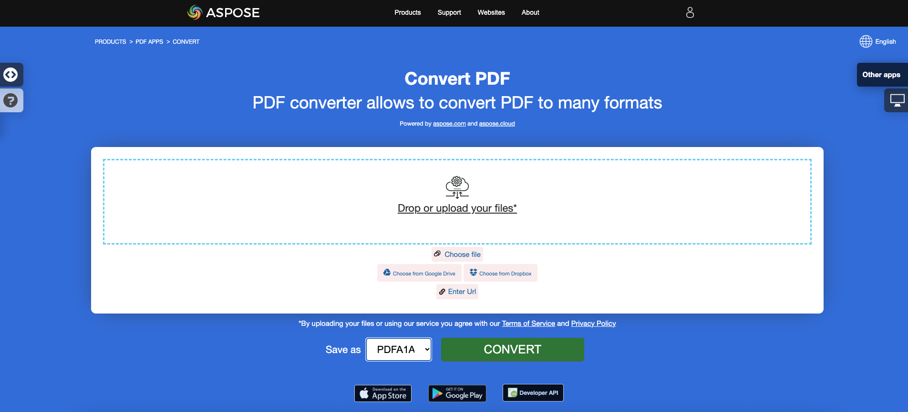

<script type="application/ld+json">
{
    "@context": "https://schema.org",
    "@type": "TechArticle",
    "headline": "Convert PDF to PDF/A formats",
    "alternativeHeadline": "Effortless PDF to PDF/A Conversion with Validation in C#",
    "abstract": "Aspose.PDF for .NETの機能により、標準PDFファイルをPDF/A-1b、PDF/A-2u、PDF/A-3aなどのさまざまなPDF/A準拠形式にシームレスに変換できます。この機能は、包括的な検証を通じてPDF/A標準への準拠を保証するだけでなく、追加ファイルの添付や欠落フォントの置き換えを可能にし、文書の整合性とアクセシビリティを向上させます。効率的で信頼性の高いPDF/A変換のためのAspose.PDFの強力な機能を探求してください。",
    "author": {
        "@type": "Person",
        "name": "Anastasiia Holub",
        "givenName": "Anastasiia",
        "familyName": "Holub",
        "url": "https://www.linkedin.com/in/anastasiia-holub-750430225/"
    },
    "genre": "pdf document generation",
    "wordcount": "1064",
    "proficiencyLevel": "Beginner",
    "publisher": {
        "@type": "Organization",
        "name": "Aspose.PDF for .NET",
        "url": "https://products.aspose.com/pdf",
        "logo": "https://www.aspose.cloud/templates/aspose/img/products/pdf/aspose_pdf-for-net.svg",
        "alternateName": "Aspose",
        "sameAs": [
            "https://facebook.com/aspose.pdf/",
            "https://twitter.com/asposepdf",
            "https://www.youtube.com/channel/UCmV9sEg_QWYPi6BJJs7ELOg/featured",
            "https://www.linkedin.com/company/aspose",
            "https://stackoverflow.com/questions/tagged/aspose",
            "https://aspose.quora.com/",
            "https://aspose.github.io/"
        ],
        "contactPoint": [
            {
                "@type": "ContactPoint",
                "telephone": "+1 903 306 1676",
                "contactType": "sales",
                "areaServed": "US",
                "availableLanguage": "en"
            },
            {
                "@type": "ContactPoint",
                "telephone": "+44 141 628 8900",
                "contactType": "sales",
                "areaServed": "GB",
                "availableLanguage": "en"
            },
            {
                "@type": "ContactPoint",
                "telephone": "+61 2 8006 6987",
                "contactType": "sales",
                "areaServed": "AU",
                "availableLanguage": "en"
            }
        ]
    },
    "url": "/net/convert-pdf-to-pdfa/",
    "mainEntityOfPage": {
        "@type": "WebPage",
        "@id": "/net/convert-pdf-to-pdfa/"
    },
    "dateModified": "2024-11-25",
    "description": "Aspose.PDFは、単純で簡単なタスクだけでなく、より複雑な目標にも対応できます。次のセクションでは、上級ユーザーと開発者向けの情報を確認してください。"
}
</script>

**Aspose.PDF for .NET**は、PDFファイルを<abbr title="Portable Document Format / A">PDF/A</abbr>準拠のPDFファイルに変換することを可能にします。その前に、ファイルを検証する必要があります。このトピックでは、その方法を説明します。

{}

Adobe PreflightとveraPDFに従ってPDF/A準拠を検証していることに注意してください。市場に出回っているすべてのツールには、PDF/A準拠の「表現」があります。参考のためにPDF/A検証ツールに関するこの記事を確認してください。Aspose.PDFがPDFファイルを生成する方法を検証するためにAdobe製品を選択しました。なぜなら、AdobeはPDFに関連するすべての中心にいるからです。

{}

DocumentクラスのConvertメソッドを使用してファイルを変換します。PDFをPDF/A準拠のファイルに変換する前に、Validateメソッドを使用してPDFを検証します。検証結果はXMLファイルに保存され、その結果もConvertメソッドに渡されます。また、ConvertErrorAction列挙体を使用して変換できない要素のアクションを指定することもできます。

{}
**PDFをPDF/Aにオンラインで変換してみてください**

Aspose.PDF for .NETは、機能と品質を調査するために試すことができるオンライン無料アプリケーション["PDF to PDF/A-1A"](https://products.aspose.app/pdf/conversion/pdf-to-pdfa1a)を提供します。

[](https://products.aspose.app/pdf/conversion/pdf-to-pdfa1a)
{}

次のコードスニペットは、[Aspose.PDF.Drawing](/pdf/net/drawing/)ライブラリでも動作します。

## サポートされている標準
次の標準をサポートしています：PDF/A-1b、PDF/A-1a、PDF/A-2b、PDF/A-2u、PDF/A-2a、PDF/A-3b、PDF/A-3u、PDF/A-3a、PDF/A-4、PDF/A-4e、PDF/A-4f。

## PDFファイルをPDF/A-1bに変換

次のコードスニペットは、PDFファイルをPDF/A-1b準拠のPDFに変換する方法を示しています。



```csharp
// For complete examples and data files, visit https://github.com/aspose-pdf/Aspose.PDF-for-.NET
private static void ConvertPdfToPdfA()
{
    // The path to the documents directory
    var dataDir = RunExamples.GetDataDir_AsposePdf_DocumentConversion();
    
    // Open PDF document
    using (var document = new Aspose.Pdf.Document(dataDir + "PDFToPDFA.pdf"))
    {
        // Convert to PDF/A compliant document
        // During conversion process, the validation is also performed
        document.Convert(dataDir + "PDFA1bConversionLog.xml", Aspose.Pdf.PdfFormat.PDF_A_1B, Aspose.Pdf.ConvertErrorAction.Delete);
        
        // Save PDF document
        document.Save(dataDir + "PDFToPDFA_out.pdf");
    }
}
```



```csharp
// For complete examples and data files, visit https://github.com/aspose-pdf/Aspose.PDF-for-.NET
private static void ConvertPdfToPdfA()
{
    // The path to the documents directory
    var dataDir = RunExamples.GetDataDir_AsposePdf_DocumentConversion();
    
    // Open PDF document
    using var document = new Aspose.Pdf.Document(dataDir + "PDFToPDFA.pdf");

    // Convert to PDF/A compliant document
    // During conversion process, the validation is also performed
    document.Convert(dataDir + "PDFA1bConversionLog.xml", Aspose.Pdf.PdfFormat.PDF_A_1B, Aspose.Pdf.ConvertErrorAction.Delete);
    
    // Save PDF document
    document.Save(dataDir + "PDFToPDFA_out.pdf");
}
```



検証のみを行うには、次の行のコードを使用します：



```csharp
// For complete examples and data files, visit https://github.com/aspose-pdf/Aspose.PDF-for-.NET
private static void ValidatePdfAStandard()
{
    // The path to the documents directory
    var dataDir = RunExamples.GetDataDir_AsposePdf_WorkingDocuments();
    
    // Open PDF document
    using (var document = new Aspose.Pdf.Document(dataDir + "ValidatePDFAStandard.pdf"))
    {
        // Validate PDF for PDF/A-1a
        document.Validate(dataDir + "ValidationResultA1b.xml", Aspose.Pdf.PdfFormat.PDF_A_1B);
    }
}
```



```csharp
// For complete examples and data files, visit https://github.com/aspose-pdf/Aspose.PDF-for-.NET
private static void ValidatePdfAStandard()
{
    // The path to the documents directory
    var dataDir = RunExamples.GetDataDir_AsposePdf_WorkingDocuments();

    // Open PDF document
    using var document = new Aspose.Pdf.Document(dataDir + "ValidatePDFAStandard.pdf");

    // Validate PDF for PDF/A-1a
    document.Validate(dataDir + "ValidationResultA1b.xml", Aspose.Pdf.PdfFormat.PDF_A_1B);
}
```



## PDFファイルをPDF/A-3bに変換

Aspose.PDF for .NETは、PDFファイルをPDF/A-3b形式に変換する機能もサポートしています。



```csharp
// For complete examples and data files, visit https://github.com/aspose-pdf/Aspose.PDF-for-.NET
private static void ConvertPdfToPdfA3b()
{
    // The path to the documents directory
    var dataDir = RunExamples.GetDataDir_AsposePdf_DocumentConversion();
    
    // Open PDF document
    using (var document = new Aspose.Pdf.Document(dataDir + "PDFToPDFA.pdf"))
    {
        // Convert to PDF/A compliant document, log file is omitted
        document.Convert(Stream.Null, Aspose.Pdf.PdfFormat.PDF_A_3B, Aspose.Pdf.ConvertErrorAction.Delete);
        
        // Save PDF document
        document.Save(dataDir + "PDFToPDFA3b_out.pdf");
    }
}
```



```csharp
// For complete examples and data files, visit https://github.com/aspose-pdf/Aspose.PDF-for-.NET
private static void ConvertPdfToPdfA3b()
{
    // The path to the documents directory
    var dataDir = RunExamples.GetDataDir_AsposePdf_DocumentConversion();

    // Open PDF document
    using var document = new Aspose.Pdf.Document(dataDir + "PDFToPDFA.pdf");

    // Convert to PDF/A compliant document, log file is omitted
    document.Convert(Stream.Null, Aspose.Pdf.PdfFormat.PDF_A_3B, Aspose.Pdf.ConvertErrorAction.Delete);

    // Save PDF document
    document.Save(dataDir + "PDFToPDFA3b_out.pdf");
}
```



## PDFファイルをPDF/A-4に変換

Aspose.PDF for .NETは、PDFファイルをPDF/A-4形式に変換する機能もサポートしています。



```csharp
// For complete examples and data files, visit https://github.com/aspose-pdf/Aspose.PDF-for-.NET
private static void ConvertPdfToPdfA4()
{
    // The path to the documents directory
    var dataDir = RunExamples.GetDataDir_AsposePdf_DocumentConversion();
    
    // Open PDF document
    using (var document = new Aspose.Pdf.Document(dataDir + "PDFToPDFA.pdf"))
    {
        // If the document version is less than PDF-2.0, it must be converted to PDF-2.0
        document.Convert(Stream.Null, Aspose.Pdf.PdfFormat.v_2_0, Aspose.Pdf.ConvertErrorAction.Delete);
    
        // Convert to the PDF/A-4 format
        document.Convert(dataDir + "PDFA4ConversionLog.xml", Aspose.Pdf.PdfFormat.PDF_A_4, Aspose.Pdf.ConvertErrorAction.Delete);

        // Save PDF document
        document.Save(dataDir + "PDFToPDFA4_out.pdf");
    }
}
```



```csharp
// For complete examples and data files, visit https://github.com/aspose-pdf/Aspose.PDF-for-.NET
private static void ConvertPdfToPdfA4()
{
    // The path to the documents directory
    var dataDir = RunExamples.GetDataDir_AsposePdf_DocumentConversion();

    // Open PDF document
    using var document = new Aspose.Pdf.Document(dataDir + "PDFToPDFA.pdf");

    // If the document version is less than PDF-2.0, it must be converted to PDF-2.0
    document.Convert(Stream.Null, Aspose.Pdf.PdfFormat.v_2_0, Aspose.Pdf.ConvertErrorAction.Delete);

    // Convert to the PDF/A-4 format
    document.Convert(dataDir + "PDFA4ConversionLog.xml", Aspose.Pdf.PdfFormat.PDF_A_4, Aspose.Pdf.ConvertErrorAction.Delete);

    // Save PDF document
    document.Save(dataDir + "PDFToPDFA4_out.pdf");
}
```



## PDF/Aファイルに添付ファイルを追加

PDF/A準拠の文書にファイルを添付する必要がある場合は、Aspose.PDF.PdfFormat列挙体からPDF_A_3A値を使用することをお勧めします。
PDF/A-3aは、PDF/A準拠のファイルに任意のファイル形式を添付ファイルとして添付する機能を提供する形式です。



```csharp
// For complete examples and data files, visit https://github.com/aspose-pdf/Aspose.PDF-for-.NET
private static void AddAttachmentToPdfA()
{
    // The path to the documents directory
    var dataDir = RunExamples.GetDataDir_AsposePdf_DocumentConversion();
    
    // Open PDF document
    using (var document = new Aspose.Pdf.Document(dataDir + "PDFToPDFA.pdf"))
    {
        // Setup new file to be added as attachment
        using (var fileSpecification = new Aspose.Pdf.FileSpecification(dataDir + "aspose-logo.jpg", "Large Image file"))
        {
            // Add attachment to document's attachment collection
            document.EmbeddedFiles.Add(fileSpecification);

            // Perform conversion to PDF/A-3a, so that the attachment is included in the resultant file
            document.Convert(dataDir + "PDFA3aConversionLog.xml", Aspose.Pdf.PdfFormat.PDF_A_3A, Aspose.Pdf.ConvertErrorAction.Delete);

            // Save PDF document
            document.Save(dataDir + "AddAttachmentToPDFA_out.pdf");
        }
    }
}
```



```csharp
// For complete examples and data files, visit https://github.com/aspose-pdf/Aspose.PDF-for-.NET
private static void AddAttachmentToPdfA()
{
    // The path to the documents directory
    var dataDir = RunExamples.GetDataDir_AsposePdf_DocumentConversion();

    // Open PDF document
    using var document = new Aspose.Pdf.Document(dataDir + "PDFToPDFA.pdf");

    // Setup new file to be added as attachment
    using var fileSpecification = new Aspose.Pdf.FileSpecification(dataDir + "aspose-logo.jpg", "Large Image file");

    // Add attachment to document's attachment collection
    document.EmbeddedFiles.Add(fileSpecification);

    // Perform conversion to PDF/A-3a, so that the attachment is included in the resultant file
    document.Convert(dataDir + "PDFA3aConversionLog.xml", Aspose.Pdf.PdfFormat.PDF_A_3A, Aspose.Pdf.ConvertErrorAction.Delete);

    // Save PDF document
    document.Save(dataDir + "AddAttachmentToPDFA_out.pdf");
}
```



## 欠落フォントを代替フォントで置き換える

PDF/A標準に従って、フォントはPDF/A文書に埋め込む必要があります。ただし、ソース文書にフォントが埋め込まれておらず、マシンに存在しない場合、PDF/A変換は失敗します。この場合、欠落フォントをマシンに存在する代替フォントで置き換える必要があります。欠落フォントは、PDFからPDF/Aへの変換中にSimpleFontSubsitutionクラスを使用して置き換えることができます。



```csharp
// For complete examples and data files, visit https://github.com/aspose-pdf/Aspose.PDF-for-.NET
private static void ReplaceMissingFonts()
{
    // The path to the documents directory
    var dataDir = RunExamples.GetDataDir_AsposePdf_DocumentConversion();

    try
    {
        // Check whether a font, used in the source document, is installed in the system
        Aspose.Pdf.Text.FontRepository.FindFont("AgencyFB");
    }
    catch (Aspose.Pdf.FontNotFoundException)
    {
        // Font is missing on the destination machine. Replace it with the Arial font installed in the system
        var fontSubstitution = new Aspose.Pdf.Text.SimpleFontSubstitution("AgencyFB", "Arial");
        Aspose.Pdf.Text.FontRepository.Substitutions.Add(fontSubstitution);
    }

    // Open PDF document
    using (var document = new Aspose.Pdf.Document(dataDir + "PDFToPDFA.pdf"))
    {
        // During the conversion, the missing font will be replaced with the substitution one
        document.Convert(dataDir + "ReplaceMissingFonts.xml", PdfFormat.PDF_A_1B, ConvertErrorAction.Delete);

        // Save PDF document
        document.Save(dataDir + "ReplaceMissingFonts_out.pdf");
    }
}
```



```csharp
// For complete examples and data files, visit https://github.com/aspose-pdf/Aspose.PDF-for-.NET
private static void ReplaceMissingFonts()
{
    // The path to the documents directory
    var dataDir = RunExamples.GetDataDir_AsposePdf_DocumentConversion();

    try
    {
        // Check whether a font, used in the source document, is installed in the system
        Aspose.Pdf.Text.FontRepository.FindFont("AgencyFB");
    }
    catch (Aspose.Pdf.FontNotFoundException)
    {
        // Font is missing on the destination machine. Replace it with the Arial font installed in the system
        var fontSubstitution = new Aspose.Pdf.Text.SimpleFontSubstitution("AgencyFB", "Arial");
        Aspose.Pdf.Text.FontRepository.Substitutions.Add(fontSubstitution);
    }

    // Open PDF document
    using var document = new Aspose.Pdf.Document(dataDir + "PDFToPDFA.pdf");

    // During the conversion, the missing font will be replaced with the substitution one
    document.Convert(dataDir + "ReplaceMissingFonts.xml", PdfFormat.PDF_A_1B, ConvertErrorAction.Delete);

    // Save PDF document
    document.Save(dataDir + "ReplaceMissingFonts_out.pdf");
}
```

