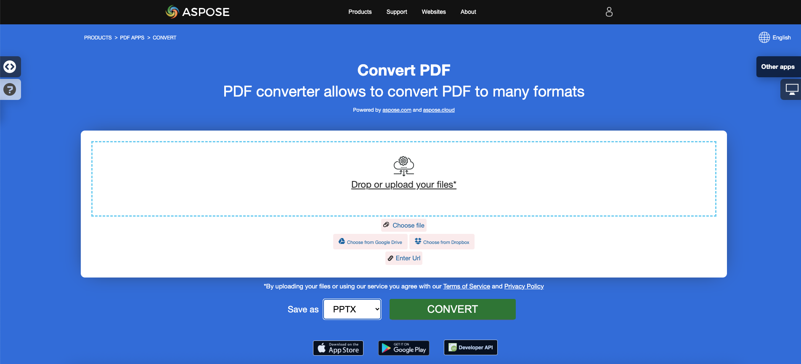

<script type="application/ld+json">
{
    "@context": "https://schema.org",
    "@type": "TechArticle",
    "headline": "Convert PDF to PowerPoint in .NET",
    "alternativeHeadline": "Convert PDF Documents to PowerPoint Presentations Efficiently in C#",
    "abstract": "Aspose.PDF for .NETは、PDFドキュメントをPowerPoint（PPTX）形式にシームレスに変換する強力な機能を紹介し、各PDFページを個別のスライドに変換します。テキストを選択可能または画像としてレンダリングするオプションがあり、ユーザーは変換進捗を効率的に追跡しながらプレゼンテーションを簡単にカスタマイズできます。この革新的な機能を活用して、文書ワークフローを最適化し、生産性を向上させましょう。",
    "author": {
        "@type": "Person",
        "name": "Anastasiia Holub",
        "givenName": "Anastasiia",
        "familyName": "Holub",
        "url": "https://www.linkedin.com/in/anastasiia-holub-750430225/"
    },
    "genre": "pdf document generation",
    "wordcount": "1174",
    "proficiencyLevel": "Beginner",
    "publisher": {
        "@type": "Organization",
        "name": "Aspose.PDF for .NET",
        "url": "https://products.aspose.com/pdf",
        "logo": "https://www.aspose.cloud/templates/aspose/img/products/pdf/aspose_pdf-for-net.svg",
        "alternateName": "Aspose",
        "sameAs": [
            "https://facebook.com/aspose.pdf/",
            "https://twitter.com/asposepdf",
            "https://www.youtube.com/channel/UCmV9sEg_QWYPi6BJJs7ELOg/featured",
            "https://www.linkedin.com/company/aspose",
            "https://stackoverflow.com/questions/tagged/aspose",
            "https://aspose.quora.com/",
            "https://aspose.github.io/"
        ],
        "contactPoint": [
            {
                "@type": "ContactPoint",
                "telephone": "+1 903 306 1676",
                "contactType": "sales",
                "areaServed": "US",
                "availableLanguage": "en"
            },
            {
                "@type": "ContactPoint",
                "telephone": "+44 141 628 8900",
                "contactType": "sales",
                "areaServed": "GB",
                "availableLanguage": "en"
            },
            {
                "@type": "ContactPoint",
                "telephone": "+61 2 8006 6987",
                "contactType": "sales",
                "areaServed": "AU",
                "availableLanguage": "en"
            }
        ]
    },
    "url": "/net/convert-pdf-to-powerpoint/",
    "mainEntityOfPage": {
        "@type": "WebPage",
        "@id": "/net/convert-pdf-to-powerpoint/"
    },
    "dateModified": "2024-11-25",
    "description": "Aspose.PDFは、単純で簡単なタスクだけでなく、より複雑な目標にも対応できます。次のセクションでは、上級ユーザーと開発者向けの情報を確認してください。"
}
</script>

## 概要

この記事では、**C#を使用してPDFをPowerPointに変換する方法**を説明します。以下のトピックをカバーしています。

_形式_: **PPTX**
- [C# PDFをPPTXに変換](#csharp-pdf-to-pptx)
- [C# PDFをPPTXに変換する](#csharp-pdf-to-pptx)
- [C# PDFファイルをPPTXに変換する方法](#csharp-pdf-to-pptx)

_形式_: **PowerPoint**
- [C# PDFをPowerPointに変換](#csharp-pdf-to-powerpoint)
- [C# PDFをPowerPointに変換する](#csharp-pdf-to-powerpoint)
- [C# PDFファイルをPowerPointに変換する方法](#csharp-pdf-to-powerpoint)

以下のコードスニペットは、[Aspose.PDF.Drawing](/pdf/net/drawing/)ライブラリでも動作します。

## C# PDFからPowerPointおよびPPTXへの変換

**Aspose.PDF for .NET**を使用すると、PDFからPPTXへの変換の進捗を追跡できます。

私たちには、PPT/PPTXプレゼンテーションを作成および操作する機能を提供するAPIであるAspose.Slidesがあります。このAPIは、PPT/PPTXファイルをPDF形式に変換する機能も提供します。最近、多くの顧客からPDFをPPTX形式に変換する機能をサポートする要求を受けました。Aspose.PDF for .NETのリリース10.3.0から、PDFドキュメントをPPTX形式に変換する機能を導入しました。この変換中に、PDFファイルの各ページがPPTXファイルの個別のスライドに変換されます。

PDFから<abbr title="Microsoft PowerPoint 2007 XML Presentation">PPTX</abbr>への変換中に、テキストは選択/更新可能なテキストとしてレンダリングされます。PDFファイルをPPTX形式に変換するには、Aspose.PDFが[`PptxSaveOptions`](https://reference.aspose.com/pdf/net/aspose.pdf/pptxsaveoptions)というクラスを提供しています。PptxSaveOptionsクラスのオブジェクトは、[`Document.Save(..) method`](https://reference.aspose.com/pdf/net/aspose.pdf/document/methods/save)の第2引数として渡されます。以下のコードスニペットは、PDFファイルをPPTX形式に変換するプロセスを示しています。

## C#とAspose.PDF .NETを使用したPDFからPowerPointへの簡単な変換

PDFをPPTXに変換するには、Aspose.PDF for .NETは以下のコードステップを使用することをお勧めします。

<a name="csharp-pdf-to-powerpoint"><strong>手順: C#でPDFをPowerPointに変換する</strong></a> | <a name="csharp-pdf-to-pptx"><strong>手順: C#でPDFをPPTXに変換する</strong></a>

1. [Document](https://reference.aspose.com/pdf/net/aspose.pdf/document)クラスのインスタンスを作成します。
2. [PptxSaveOptions](https://reference.aspose.com/pdf/net/aspose.pdf/pptxsaveoptions)クラスのインスタンスを作成します。
3. **Document**オブジェクトの**Save**メソッドを使用して、PDFをPPTXとして保存します。

```csharp
// For complete examples and data files, visit https://github.com/aspose-pdf/Aspose.PDF-for-.NET
private static void ConvertPDFToPPTX()
{
    // The path to the documents directory
    var dataDir = RunExamples.GetDataDir_AsposePdf();

    // Open PDF document
    using (var document = new Aspose.Pdf.Document(dataDir + "input.pdf"))
    {
        // Instantiate PptxSaveOptions object
        var saveOptions = new Aspose.Pdf.PptxSaveOptions();

        // Save the file in PPTX format
        document.Save(dataDir + "PDFToPPT_out.pptx", saveOptions);
    }
}
```

## スライドを画像として持つPDFからPPTXへの変換

{}
**PDFをPowerPointにオンラインで変換してみてください**

Aspose.PDF for .NETは、オンラインの無料アプリケーション["PDF to PPTX"](https://products.aspose.app/pdf/conversion/pdf-to-pptx)を提供しており、機能と品質を調査することができます。

[](https://products.aspose.app/pdf/conversion/pdf-to-pptx)
{}

検索可能なPDFを選択可能なテキストの代わりに画像としてPPTXに変換する必要がある場合、Aspose.PDFはその機能を[Aspose.Pdf.PptxSaveOptions](https://reference.aspose.com/pdf/net/aspose.pdf/pptxsaveoptions)クラスを介して提供します。これを実現するには、[PptxSaveOptions](https://reference.aspose.com/pdf/net/aspose.pdf/pptxsaveoptions)クラスのプロパティ[SlidesAsImages](https://reference.aspose.com/pdf/net/aspose.pdf/pptxsaveoptions/properties/slidesasimages)を'true'に設定します。以下のコードサンプルに示すように。

```csharp
// For complete examples and data files, visit https://github.com/aspose-pdf/Aspose.PDF-for-.NET
private static void ConvertPDFToPPTWithSlidesAsImages()
{
    // The path to the documents directory
    var dataDir = RunExamples.GetDataDir_AsposePdf();

    // Open PDF document
    using (var document = new Aspose.Pdf.Document(dataDir + "input.pdf"))
    {
        // Instantiate PptxSaveOptions object
        var saveOptions = new Aspose.Pdf.PptxSaveOptions
        {
            SlidesAsImages = true
        };

        // Save the file in PPTX format with slides as images
        document.Save(dataDir + "PDFToPPT_out.pptx", saveOptions);
    }
}
```

## PPTX変換の進捗詳細

Aspose.PDF for .NETは、PDFからPPTXへの変換の進捗を追跡できます。[Aspose.Pdf.PptxSaveOptions](https://reference.aspose.com/pdf/net/aspose.pdf/pptxsaveoptions)クラスは、変換の進捗を追跡するためにカスタムメソッドを指定できる[CustomProgressHandler](https://reference.aspose.com/pdf/net/aspose.pdf/pptxsaveoptions/properties/customprogresshandler)プロパティを提供します。以下のコードサンプルに示すように。

```csharp
 // For complete examples and data files, visit https://github.com/aspose-pdf/Aspose.PDF-for-.NET
private static void ConvertPDFToPPTWithCustomProgressHandler()
{
    // The path to the documents directory
    var dataDir = RunExamples.GetDataDir_AsposePdf();

    // Open PDF document
    using (var document = new Aspose.Pdf.Document(dataDir + "input.pdf"))
    {

        // Instantiate PptxSaveOptions object
        var saveOptions = new Aspose.Pdf.PptxSaveOptions();

        // Specify custom progress handler
        saveOptions.CustomProgressHandler = ShowProgressOnConsole;

        // Save the file in PPTX format with progress tracking
        document.Save(dataDir + "PDFToPPTWithProgressTracking_out.pptx", saveOptions);
    }
}

 // Define the method to handle progress events and display them on the console
private static void ShowProgressOnConsole(Aspose.Pdf.UnifiedSaveOptions.ProgressEventHandlerInfo eventInfo)
{
    switch (eventInfo.EventType)
    {
        case Aspose.Pdf.ProgressEventType.TotalProgress:
            // Display overall progress of the conversion
            Console.WriteLine($"{DateTime.Now.TimeOfDay}  - Conversion progress: {eventInfo.Value}%.");
            break;

        case Aspose.Pdf.ProgressEventType.ResultPageCreated:
            // Display progress of the page layout creation
            Console.WriteLine($"{DateTime.Now.TimeOfDay}  - Result page {eventInfo.Value} of {eventInfo.MaxValue} layout created.");
            break;

        case Aspose.Pdf.ProgressEventType.ResultPageSaved:
            // Display progress of the page being exported
            Console.WriteLine($"{DateTime.Now.TimeOfDay}  - Result page {eventInfo.Value} of {eventInfo.MaxValue} exported.");
            break;

        case Aspose.Pdf.ProgressEventType.SourcePageAnalysed:
            // Display progress of the source page analysis
            Console.WriteLine($"{DateTime.Now.TimeOfDay}  - Source page {eventInfo.Value} of {eventInfo.MaxValue} analyzed.");
            break;

        default:
            break;
    }
}
```

## 参照

この記事では、以下のトピックもカバーしています。コードは上記と同じです。

_形式_: **PowerPoint**
- [C# PDFをPowerPointに変換するコード](#csharp-pdf-to-powerpoint)
- [C# PDFをPowerPointに変換するAPI](#csharp-pdf-to-powerpoint)
- [C# PDFをPowerPointにプログラムで変換する](#csharp-pdf-to-powerpoint)
- [C# PDFをPowerPointライブラリ](#csharp-pdf-to-powerpoint)
- [C# PDFをPowerPointとして保存する](#csharp-pdf-to-powerpoint)
- [C# PDFからPowerPointを生成する](#csharp-pdf-to-powerpoint)
- [C# PDFからPowerPointを作成する](#csharp-pdf-to-powerpoint)
- [C# PDFをPowerPointコンバータ](#csharp-pdf-to-powerpoint)

_形式_: **PPTX**
- [C# PDFをPPTXに変換するコード](#csharp-pdf-to-pptx)
- [C# PDFをPPTXに変換するAPI](#csharp-pdf-to-pptx)
- [C# PDFをPPTXにプログラムで変換する](#csharp-pdf-to-pptx)
- [C# PDFをPPTXライブラリ](#csharp-pdf-to-pptx)
- [C# PDFをPPTXとして保存する](#csharp-pdf-to-pptx)
- [C# PDFからPPTXを生成する](#csharp-pdf-to-pptx)
- [C# PDFからPPTXを作成する](#csharp-pdf-to-pptx)
- [C# PDFをPPTXコンバータ](#csharp-pdf-to-pptx)