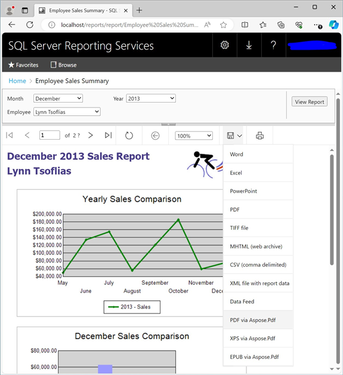

{}

MSI インストーラーを使用せずに、Aspose.PDF for Reporting Services を手動でインストールする場合にのみ、次の手順に従う必要があります。 MSI インストーラーは、必要なインストールと登録のアクションをすべて自動的に実行します。

{}

次の手順では、Microsoft SQL Server Reporting Services がインストールされているディレクトリ内のファイルをコピーして変更する必要があります。 SSRS 2016 アセンブリは、zip パッケージの \Bin\SSRS2016 ディレクトリにあります。 SSRS 2017 アセンブリは \Bin\SSRS2017 ディレクトリにあります。 SSRS 2019 アセンブリは \Bin\SSRS2019 ディレクトリにあります。 SSRS 2022 アセンブリは \Bin\SSRS2022 ディレクトリにあります。 Power BI Report Server アセンブリは \Bin\PowerBI ディレクトリにあります。

**ステップ 1.** レポート サーバーのインストール ディレクトリを見つけます。 Microsoft SQL Server のルート ディレクトリは通常、C:\Program Files\Microsoft SQL Server です。これ以降のプロセスは、Reporting Services 2016、Reporting Services 2017 以降、Power BI Report Server では若干異なります。

- Report Server 2016 は、既定で C:\Program Files\Microsoft SQL Server\MSRS13.MSSQLSERVER\Reporting Services\ReportServer ディレクトリにインストールされます。デフォルトのインスタンスではなくカスタムの名前付きインスタンスを使用している場合、デフォルトのパスは C:\Program Files\Microsoft SQL Server\MSRS13.[SSRSInstanceName]\Reporting Services\ReportServer になります。
- Report Server 2017 以降は、既定で C:\Program Files\Microsoft SQL Server Reporting Services\SSRS\ReportServer ディレクトリにインストールされます。
- Power BI Report Server は、既定で C:\Program Files\Microsoft Power BI Report Server\PBIRS\ReportServer ディレクトリにインストールされます。

以下のテキストでは、Reporting Services のインストール ディレクトリ (前述のパスの 1 つ) を `<Instance>` として参照します。

**ステップ 2.** 対応する SSRS バージョンの Aspose.Pdf.ReportingServices.dll を `<Instance>\bin` フォルダーにコピーします。

**ステップ 3.** Reporting Services の Aspose.PDF を表示拡張機能として登録します。 `<Instance>\rsreportserver.config` ファイルを開き、次の行を `<Render>` 要素に追加します。

## 例

```xml
<Render>
...
<Extension Name="APPDF" Type="Aspose.Pdf.ReportingServices.Renderer,Aspose.Pdf.ReportingServices"/>
</Render>
```

**ステップ 4.** Aspose.PDF for Reporting Services に実行権限を与えます。 `<Instance>\rssrvpolicy.config` ファイルを開き、外側の `<CodeGroup>` 要素 (`<CodeGroup class="FirstMatchCodeGroup" version="1" PermissionSetName="Execution" Description="This code group grants MyComputer code Execution permission. ">):`) の 2 番目の要素の最後の項目として次のテキストを追加します。

## 例

```xml

 <CodeGroup>
...

<CodeGroup>
...

<!--Start here.-->

<CodeGroup class="UnionCodeGroup" version="1" PermissionSetName="FullTrust"

Name="Aspose.Pdf_for_Reporting_Services" Description="This code group grants full trust to the AP4SSRS assembly.">

<IMembershipCondition class="StrongNameMembershipCondition" version="1" PublicKeyBlob="00240000048000009400000006020000002400005253413100040000010001005542e99cecd28842dad186257b2c7b6ae9b5947e51e0b17b4ac6d8cecd3e01c4d20658c5e4ea1b9a6c8f854b2d796c4fde740dac65e834167758cff283eed1be5c9a812022b015a902e0b97d4e95569eb8c0971834744e633d9cb4c4a6d8eda03c12f486e13a1a0cb1aa101ad94943236384cbbf5c679944b994de9546e493bf " />

</CodeGroup>

<!--End here. -->

</CodeGroup>

</CodeGroup>
```

**ステップ 5.** Aspose.PDF for Reporting Services が正常にインストールされたことを確認します。 Reporting Services Web ポータルを開き、レポートで使用可能なエクスポート形式のリストを確認します。 Web ブラウザを起動し、アドレス バーに Reporting Services Web ポータルの URL (デフォルトでは http://@@KEEP_0@@/reports/). です) を入力することで、Web ポータルを起動できます。Web ポータルで利用可能なレポートの 1 つを選択し、[エクスポート] ドロップダウン リストをプルします。Aspose.PDF for Reporting Services 拡張機能によって提供される形式を含むエクスポート形式のリストが表示されます。Aspose.PDF 項目で PDF を選択します。



選択した項目をクリックします。選択した形式でレポートが生成され、クライアントに送信され、Web ブラウザの設定に応じて、エクスポートされたレポートの保存場所を選択するための [ファイルの保存] ダイアログが表示されるか、ファイルがダウンロード フォルダーに自動的にダウンロードされます。

おめでとうございます。Aspose.PDF for Reporting Services が正常にインストールされ、レポートが PDF ドキュメントとしてエクスポートされました。


