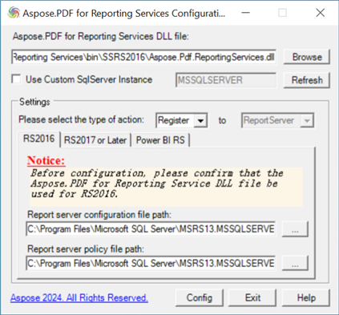

Aspose.Pdf for Reporting Services Configuring Tool は、サポートされている任意の Report Server (RS) バージョン向けに Aspose.Pdf for Reporting Services 拡張機能を構成するのに役立ちます。現在、RS2016、RS2017、RS2019、RS2022、そして Power BI Report Server をサポートしています。Configuring Tool には .NET Framework 4.8 が必要です。

拡張機能をインストールして Report Server に登録したい場合は、'Register' アクションタイプを選択してください。登録を解除し、拡張機能をアンインストールするには、'Unregister' アクションタイプを選択してください。

**以下の手順は、詳細に使用方法を説明します:**

1. Aspose.Pdf for Reporting Services 拡張機能の DLL ファイルのパスを入力するか参照してください；
1. 対応するアクションタイプを選択してください：Register または Unregister；
1. 設定したい Report Server のバージョンに対応するタブを選択してください。使用する RS バージョン用の DLL ファイルを選択したことを確認してください。要求されたバージョンの製品がマシンにインストールされていない場合、構成ツールがヒントで通知します。名前付き RS2016 インスタンス（デフォルトの 'MSSQLSERVER' ではない）用に拡張機能を構成している場合は、カスタムインスタンス名を入力し、'Refresh' ボタンを押してください。
1. 下部のテキストボックスに表示されている構成ファイルのパスと名前が正しいことを確認してください。正しくない場合は、'Refresh' ボタンを押して RS インスタンスを再検索するか、手動で確認してください。
1. 'Config' ボタンを押してください。ツールは要求された構成を実行し、構成が成功したかどうかを通知します。
 

