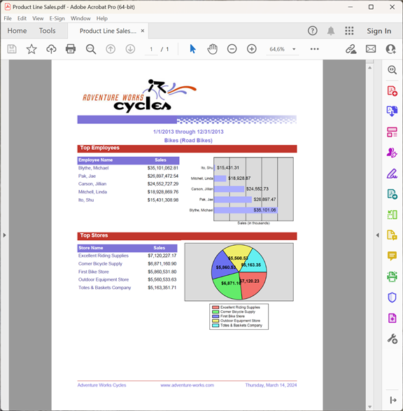

{}

このギャラリーは、Aspose.Pdf for Reporting Services によってエクスポートされた PDF レポートを示しています。

{}

ここに示されているレポートのほとんどは Adventure Works データベースから取得されています。Adventure Works は Microsoft SQL Server 用のサンプルデータベースで、Microsoft からダウンロードできます。 [ここ](http://www.microsoft.com/downloads/details.aspx?familyid=E719ECF7-9F46-4312-AF89-6AD8702E4E6E&displaylang=en).

## 会社の売上

## 従業員売上サマリー

## 製品カタログ

## 製品ライン販売

## 販売注文詳細

