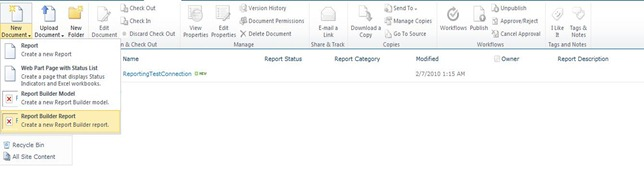

{}

SharePoint が RS サーバーにインストールおよび構成され、RS が Reporting Services 構成マネージャーを通じてセットアップおよびセットアップされたので、中央管理内の構成に進むことができます。 RS 2008 R2 では、このプロセスが大幅に簡素化されました。これを機能させるには、3 つのステップのプロセスを実行する必要がありました。あとは 1 ステップだけです。

{}

{}

Central Administrator Web サイトに移動し、次に一般的なアプリケーション設定に移動します。一番下に「Reporting Services」が表示されます。

**画像1**:- SharePoint構成ダイアログ

「Reporting Services 統合」リンクを選択します。以下の画面が表示されます。

**画像 2**:- Reporting Services 統合資格情報の指定

{}

## WebサービスURL:

**Reporting Services 構成マネージャーで見つかったレポート サーバーの URL を提供します。**

## 認証モード:

**認証モードも選択します。次の MSDN リンクでは、これらが何であるかを詳しく説明しています。
SharePoint 統合モードの Reporting Services のセキュリティの概要**

{}

** つまり、サイトでクレーム認証を使用している場合は、ここで何を選択したかに関係なく、常に信頼された認証を使用することになります。 Windows 資格情報を渡したい場合は、Windows 認証を選択します。信頼できる認証の場合、SPUser トークンを渡し、Windows 資格情報には依存しません。クラシック モード サイトを NTLM 用に構成し、RS が NTLM 用にセットアップされている場合も、信頼された認証を使用する必要があります。 Windows 認証を使用し、それをデータ ソースに渡すには、Kerberos が必要になります。**

{}

## 機能を有効にする:

{}

**これにより、すべてのサイト コレクションでレポート サービスをアクティブ化するか、どのサイト コレクションでレポート サービスをアクティブ化するかを選択することができます。これは実際には、どのサイトが Reporting Services を使用できるかを意味します。完了すると、次の結果が表示されるはずです**

**画像 3:** - Reporting Services と SharePoint 環境の統合に成功
{}

{}

ReportServer URL に戻ると、次のような内容が表示されるはずです。

**画像 4:** - Reporting Services が SharePoint 環境に正常に接続されています

**注意:** ***SharePoint サイトが SSL 用に構成されている場合、このリストには表示されません。これは既知の問題であり、問​​題があるというわけではありません。レポートは引き続き機能するはずです。***
{}

{}

両方の製品を正常に統合したので、SharePoint 2010 で Reporting Services を使用する準備が整いました。以前のバージョンと同様に、「サイト コレクション機能」に機能 (Reporting Services 統合を構成するときにアクティブ化される) があります。また、このインストールにより、サイトに 3 つのコンテンツ タイプが追加されました。画像 7 では、以下の画像 5 に示すように、そのうち 2 つのコンテンツ タイプがドキュメント ライブラリに追加され、 を使用してカスタム レポートを作成していることがわかります。

**画像 5:**- レポート ビルダー

「Reporter Builder」は ActiveX コントロールであるため、以下の画像 6 に示すように、サーバー経由でダウンロードする必要があります。

**画像 6:**- レポート ビルダーをダウンロードしてインストールします
{}

{}

ダウンロード プロセスが完了したら、「レポート ビルダー」コントロールを読み込みます。これで、以下の画像 7 に示すように、最初のレポートをデザインする準備が整いました。

**画像 7:**- レポート ビルダー – 新しいレポート生成ウィザード
{}

{}

レポートを作成した後、SharePoint 2010 にレポートを配置するために作成されたドキュメント ライブラリにレポートを保存できます。データ ソースとして共有接続を作成し、SharePoint のドキュメント ライブラリに保存するには、他のコンテンツ タイプを使用する必要があります。ドキュメント ライブラリを作成し、このコンテンツ タイプを追加した後、レポートのデータ ソースを変更するために接続を利用できるようになります。

**画像8:**- Aspose.PDF for Reporting ServicesとMS SharePointの統合に成功
{}

