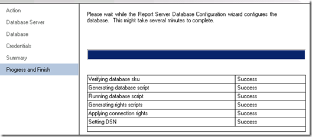

{}

Reporting Services サーバーで最初に停止するのは、Reporting Services 構成マネージャーです。

{}

## サービスアカウント:

** Reporting Services に使用しているサービス アカウントを必ず理解してください。問題が発生した場合は、使用しているサービス アカウントに関連している可能性があります。デフォルトはネットワークサービスです。新しいビルドをデプロイするときは、問題が発生する可能性が高いため、常にドメイン アカウントを使用します。このサーバーのインスタンスでは、RSService.** というドメイン アカウントを使用しました。

**画像1:- サービスアカウントの設定**

## WebサービスURL:

{}

**Web サービス URL を構成する必要があります。これは、Web サービス Reporting Services が使用する ReportServer 仮想ディレクトリ (vdir) であり、SharePoint が通信する相手となります。 vdir のプロパティ (つまり、SSL、ポート、ホスト ヘッダーなど) をカスタマイズしない限り、ここで [適用] をクリックするだけで準備完了です。**

**画像 2:- Web サービス URL の設定 Web サービス URL が設定されると、次の結果が表示されるはずです**

**画像3:- WebサービスURLのセットアップ成功**
{}

## データベース:

**Reporting Services カタログ データベースを作成する必要があります。これは、SQL 2008 または SQL 2008 R2 データベース エンジンに配置できます。 SQL11 も問題なく動作しますが、まだベータ版です。このアクションにより、デフォルトで ReportServer と ReportServerTempDB という 2 つのデータベースが作成されます。**

{}
**これに関するもう 1 つの重要な手順は、データベースの種類として SharePoint Integrated を選択していることを確認することです。この選択を行うと、変更することはできません。**

**画像 4:- レポート サーバー データベースの作成**

**画像5:- データベースサーバーと認証タイプの設定**

**画像6:- データベース名とモードの設定**
{}

**資格情報については、これがレポート サーバーが SQL Server と通信する方法です。どのアカウントを選択しても、RSExecRole を介してカタログ データベースおよびいくつかのシステム データベース内で特定の権限が与えられます。 MSDB は、SQL エージェントを使用するため、サブスクリプションで使用するデータベースの 1 つです。**

**画像 7:- レポート サーバー データベースの資格情報のセットアップ**

{}

**データベース認証情報を指定すると、以下に指定されている結果を取得できるようになります。**

**画像8:- レポート サーバー データベースの作成の進行状況**

**画像9:- レポート サーバー データベースの完成の概要**
{}

## レポートマネージャーの URL:

**レポート マネージャー URL は、SharePoint 統合モードでは使用されないため、スキップできます。 SharePoint は私たちのフロントエンドです。レポート マネージャーが機能しません。**

## 暗号化キー:

{}
**暗号化キーをバックアップし、保管場所を確認してください。データベースを移行または復元する必要がある状況に陥った場合は、これらが必要になります。**

**画像10:- レポート サーバー暗号化キーのバックアップ**
{}

{}
**おめでとうございます! Configuration Manager を使用して Reporting Services を正常に構成しました。 [Web サービス URL] タブで URL を参照すると、次のような内容が表示されるはずです。**

**画像11:- インストール後のレポート サーバーへのアクセス**

**エラーの理由: SharePoint が WFE にインストールされており、Reporting Services のセットアップが完了しました。この例では、Reporting Services と SharePoint は別のマシン上にあります。それらが同じマシン上にあった場合、このエラーは発生しなかったでしょう。技術的には、RS Box に SharePoint をインストールする必要があります。つまり、IIS も有効になります。**
{}

