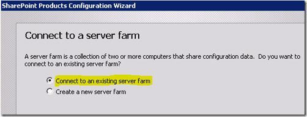

{}

SharePoint WFE で行ったのと同様の手順を実行する必要があります。まず、Prereq uisites のインストールを実行し、完了したら SharePoint のセットアップを起動します。

{}

セットアップでは、Server Farm を選択し、SharePoint Box に合わせて完全インストールを行います。SharePoint のスタンドアロンインストールは希望しません。

## SharePoint 設定

{}

**SharePoint 構成ウィザードでは、既存のファームに接続したいです。**

**Image1:- SharePoint 構成ウィザード**
{}

{}

**次に、ファームが使用している SharePoint_Config データベースを指定します。場所がわからない場合は、Central Admin の System Settings → Manager Servers からこのファームで確認できます。**

**Image2:- データベース構成設定を指定**

**Image3:- SharePoint 構成ウィザード**
{}

{}

**ウィザードが完了したら、今のところ Report Server ボックスで行う必要があることはそれだけです。ReportServer の URL に戻ると、別のエラーが表示されますが、これは Central Administrator で構成していないためです。**

**Image4:- レポートサーバーエラー**
{}

