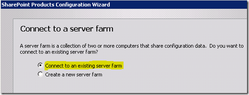

{}

現在、SharePoint WFE で行ったのと同様の手順を実行する必要があります。まず最初に Prereq uisites のインストールを実行し、完了したら SharePoint のセットアップを開始します。

{}

セットアップでは、SharePoint のスタンドアロン インストールを望まず、Server Farm を選択し、SharePoint Box に合わせた完全インストールを行います。

## SharePoint 構成

{}

**SharePoint 構成ウィザードでは、既存のファームに接続したいです。**

**Image1:- SharePoint 設定ウィザード**
{}

{}

**次に、ファームが使用している SharePoint_Config データベースを指すように設定します。場所が分からない場合は、Central Admin の System Settings -> Manager Servers でこのファーム内の場所を確認できます。**

**Image2:- データベース構成設定を指定**

**Image3:- SharePoint 設定ウィザード**
{}

{}

**ウィザードが完了したら、現時点で Report Server ボックスで行う必要があるのはそれだけです。ReportServer の URL に戻ると、別のエラーが表示されますが、これは Central Administrator で設定していないためです。**

**Image4:- レポートサーバーエラー**
{}
