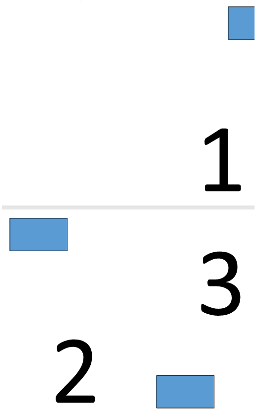

## PDF の N-Up を作成する

N-Up PDF は、複数のソースページを単一の出力ページに配置します。この例では 2 × 2 のレイアウトが使用されているため、元の 4 ページが出力ドキュメントの各ページに結合されます。

1. ソース PDF ドキュメントを開きます。
1. 指定された行数と列数の N-Up レイアウトを使用してドキュメントを保存します。

```rs

    use asposepdf::Document;

    fn main() -> Result<(), Box<dyn std::error::Error>> {
        // Open a PDF-document with filename
        let pdf = Document::open("sample.pdf")?;

        // Convert and save the previously opened PDF-document as N-Up PDF-document
        pdf.save_n_up("sample_n_up.pdf", 2, 2)?;

        Ok(())
    }
```

## PDF のブックレットを作成

Aspose.PDF for Rust via C++ は、標準的な PDF ドキュメントを冊子形式の PDF に変換する方法を説明します。
冊子形式はページを再配置し、印刷して折りたたんだときに、文書が正しい順序でページが並んだ適切な冊子になるようにします。

1. ソース PDF ドキュメントを開きます。
1. 文書を冊子 PDF として保存します。

```rs

  use asposepdf::Document;

  fn main() -> Result<(), Box<dyn std::error::Error>> {
      // Open a PDF-document with filename
      let pdf = Document::open("sample.pdf")?;

      // Convert and save the previously opened PDF-document as booklet PDF-document
      pdf.save_booklet("sample_booklet.pdf")?;

      Ok(())
  }
```

**無料トライアル ライセンスがフル機能に必要であることにご注意ください。**

4ページのブックレットを作成した結果を確認してください。


3ページのブックレットを作成した結果を確認してください。

