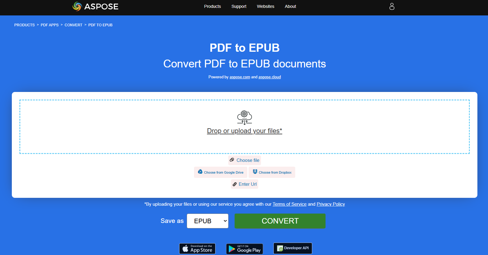

## PDF を EPUB に変換

**<abbr title="Electronic Publication">EPUB</abbr>** は International Digital Publishing Forum (IDPF) による無料かつオープンな電子書籍標準です。ファイルの拡張子は .epub です。
EPUB は再フロー可能なコンテンツ用に設計されており、EPUB リーダーは特定の表示デバイス向けにテキストを最適化できます。また、EPUB は固定レイアウトのコンテンツもサポートしています。このフォーマットは、出版社や変換ハウスが社内で使用できる単一のフォーマットであると同時に、配布や販売にも利用されることを意図しています。Open eBook 標準に取って代わります。

提供されたRustコードスニペットは、Aspose.PDFライブラリを使用してPDFドキュメントをEPUBに変換する方法を示しています。

1. PDFドキュメントを開く。
1. PDFファイルをEPUBに変換するには [save_epub](https://reference.aspose.com/pdf/rust-cpp/convert/save_epub/) 関数。

```rs

  use asposepdf::Document;

  fn main() -> Result<(), Box<dyn std::error::Error>> {
      // Open a PDF-document with filename
      let pdf = Document::open("sample.pdf")?;

      // Convert and save the previously opened PDF-document as Epub-document
      pdf.save_epub("sample.epub")?;

      Ok(())
  }
```

{}
**PDFをオンラインでEPUBに変換してみてください**

Aspose.PDF for Rust は、オンラインで無料のアプリケーションを提供します ["PDFからEPUBへ"](https://products.aspose.app/pdf/conversion/pdf-to-epub), そこで、機能と品質がどのように機能するかを調査しようとすることができます。

[](https://products.aspose.app/pdf/conversion/pdf-to-epub)
{}

## PDF を TeX に変換する

**Aspose.PDF for Rust** は PDF を TeX に変換することをサポートしています。
LaTeXファイル形式は、特殊なマークアップを備えたテキストファイル形式であり、高品質な組版のためのTeXベースの文書作成システムで使用されます。

提供されたRustコードスニペットは、Aspose.PDFライブラリを使用してPDFドキュメントをTeXに変換する方法を示しています：

1. PDFドキュメントを開く。
1. PDF ファイルを TeX に変換するには [save_tex](https://reference.aspose.com/pdf/rust-cpp/convert/save_tex/) 関数。

```rs

  use asposepdf::Document;

  fn main() -> Result<(), Box<dyn std::error::Error>> {
      // Open a PDF-document with filename
      let pdf = Document::open("sample.pdf")?;

      // Convert and save the previously opened PDF-document as TeX-document
      pdf.save_tex("sample.tex")?;

      Ok(())
  }
```

{}
**PDF を LaTeX/TeX にオンラインで変換してみてください**

Aspose.PDF for Rust は、オンラインで無料のアプリケーションを提供します ["PDF を LaTeX に変換"](https://products.aspose.app/pdf/conversion/pdf-to-tex), そこで、機能と品質がどのように機能するかを調査しようとすることができます。

[](https://products.aspose.app/pdf/conversion/pdf-to-tex)
{}

## PDF を TXT に変換

提供されたRustコードスニペットは、Aspose.PDFライブラリを使用してPDFドキュメントをTXTに変換する方法を示しています：

1. PDFドキュメントを開く。
1. PDF ファイルを TXT に変換するには [save_txt](https://reference.aspose.com/pdf/rust-cpp/convert/save_txt/) 関数。

```rs

  use asposepdf::Document;

  fn main() -> Result<(), Box<dyn std::error::Error>> {
      // Open a PDF-document with filename
      let pdf = Document::open("sample.pdf")?;

      // Convert and save the previously opened PDF-document as Txt-document
      pdf.save_txt("sample.txt")?;

      Ok(())
  }
```

{}
**オンラインで PDF をテキストに変換してみましょう**

Aspose.PDF for Rust は、オンラインで無料のアプリケーションを提供します ["PDFからテキストへ"](https://products.aspose.app/pdf/conversion/pdf-to-txt), そこで、機能と品質がどのように機能するかを調査しようとすることができます。

[](https://products.aspose.app/pdf/conversion/pdf-to-txt)
{}

## PDF を XPS に変換

XPS ファイルタイプは主に Microsoft Corporation の XML Paper Specification と関連付けられています。XML Paper Specification (XPS) は、かつてコードネーム Metro と呼ばれ、次世代印刷パス (NGPP) のマーケティングコンセプトを包括したもので、Microsoft が文書の作成と閲覧を Windows オペレーティングシステムに統合するためのイニシアチブです。

**Aspose.PDF for Rust** は PDF ファイルを変換する可能性を提供します <abbr title="XML Paper Specification">XPS</abbr> フォーマット。Rust を使用して PDF ファイルを XPS フォーマットに変換するために、提示されたコードスニペットを使用してみましょう。

提供されたRustコードスニペットは、Aspose.PDFライブラリを使用してPDF文書をXPSに変換する方法を示しています：

1. PDFドキュメントを開く。
1. PDF ファイルを XPS に変換するには [save_xps](https://reference.aspose.com/pdf/rust-cpp/convert/save_xps/) 関数。

```rs

  use asposepdf::Document;

  fn main() -> Result<(), Box<dyn std::error::Error>> {
      // Open a PDF-document with filename
      let pdf = Document::open("sample.pdf")?;

      // Convert and save the previously opened PDF-document as Xps-document
      pdf.save_xps("sample.xps")?;

      Ok(())
  }
```

{}
**PDF を XPS にオンラインで変換してみましょう**

Aspose.PDF for Rust は、オンラインで無料のアプリケーションを提供します ["PDFからXPSへ"](https://products.aspose.app/pdf/conversion/pdf-to-xps), そこで、機能と品質がどのように機能するかを調査しようとすることができます。

[](https://products.aspose.app/pdf/conversion/pdf-to-xps)
{}

## PDFをグレースケールPDFに変換する

提供されたRustコードスニペットは、Aspose.PDFライブラリを使用してPDFドキュメントの最初のページをグレースケールPDFに変換する方法を示しています：

1. PDFドキュメントを開く。
1. PDFページをグレースケールPDFに変換するには [ページ_グレースケール](https://reference.aspose.com/pdf/rust-cpp/organize/page_grayscale/) 関数。

この例は、PDFの特定のページをグレースケールに変換します：

```rs

  use asposepdf::Document;

  fn main() -> Result<(), Box<dyn std::error::Error>> {
      // Open a PDF-document from file
      let pdf = Document::open("sample.pdf")?;

      // Convert page to black and white
      pdf.page_grayscale(1)?;

      // Save the previously opened PDF-document with new filename
      pdf.save_as("sample_page1_grayscale.pdf")?;

      Ok(())
  }
```

## PDF を Markdawn に変換

提供されたRustコードスニペットは、Aspose.PDF for Rustを使用してPDFドキュメントをMarkdown（.md）ファイルに変換する方法を示しています。

1. ソースPDFファイルを開く。
1. PDF を Markdown に変換する。
1. 開いている PDF ドキュメントを Markdown ファイルとして保存します。

```rs

  use asposepdf::Document;

  fn main() -> Result<(), Box<dyn std::error::Error>> {
      // Open a PDF-document with filename
      let pdf = Document::open("sample.pdf")?;

      // Convert and save the previously opened PDF-document as Markdown-document
      pdf.save_markdown("sample.md")?;

      Ok(())
  }
```

{}
**PDF をオンラインで MD に変換してみてください**

Aspose.PDF for Rust は、オンラインで無料のアプリケーションを提供します [PDF を MD に](https://products.aspose.app/pdf/conversion/md), そこで、機能と品質がどのように機能するかを調査しようとすることができます。

[](https://products.aspose.app/pdf/conversion/md)
{}
