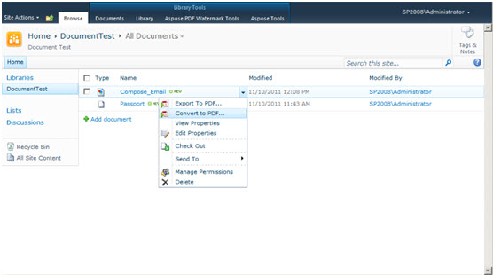

---
title: SharePoint で HTML、テキスト、画像を PDF に変換する
linktitle: PDFに変換
type: docs
weight: 30
url: /ja/sharepoint/convert-to-pdf/
lastmod: "2020-12-16"
description: PDF SharePoint API を使用すると、HTML ファイル、テキスト ファイル、画像 (JPG、PNG、GIF、TIFF、BMP) を PDF 形式に変換できます。
---

{}

Aspose.PDF for SharePoint を使用すると、HTML ファイル、テキスト ファイル、画像 (JPG、PNG、GIF、TIFF、BMP) を PDF 形式に変換できます。

{}

## ドキュメントを PDF に変換する

{}

ドキュメントを PDF に変換するには:

1. [ECB] メニューで [**PDF に変換**] をクリックします。
1. 結果の PDF ファイルをダウンロードして保存します。

ECB メニューの PDF に変換オプション

{}

## PDF作成者情報

{}

- **Application** および **Producer** フィールドに対して値を設定することはできないことに注意してください。これは、Aspose Ltd. および Aspose.PDF for SharePoint x.x.x がこれらのフィールドに対して表示されるためです。 

{}

