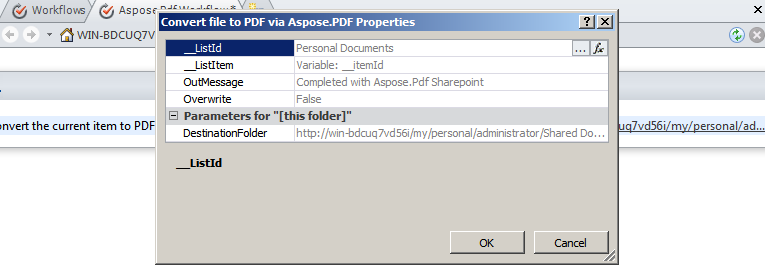

{}

ワークフローのサポートは Microsoft Office SharePoint Server の重要な機能です。ワークフローは、ビジネス ロジックに従ってドキュメントの移動を自動化し、ドキュメントの整理にかかるコストと時間を効率化します。本記事では、Aspose.PDF for SharePoint を使用して、ドキュメントを PDF に変換するワークフローの使用方法を示します。

{}

## ワークフローの設定

この例では、ドキュメント ライブラリ内の新しいアイテムを PDF 形式に変換し、別のドキュメント ライブラリに保存するワークフローを作成します。この例では、ソース ライブラリとして **Personal Documents** ライブラリを使用し、宛先ライブラリとして **Shared Documents** ライブラリ内の **Pdf** サブフォルダーを使用します。

Aspose.PDF for SharePoint は HTML、テキスト、画像ファイルの変換をサポートしています。

### SharePoint Designer を使用してワークフローを設計する

1. **SharePoint Designer** を開き、ワークフローを実装するサイトに接続します。
1. **site objects** から **Workflows** を選択し、次に **List Workflow** を開きます。
1. 新しいリスト ワークフローを作成してドキュメント ライブラリに添付するために、**Personal Documents** ライブラリを選択します。

   **メニューから Personal Documents を選択**

1. ワークフロー名と説明を入力して、**Personal Documents** ライブラリにリストワークフローを作成し、添付します。
1. **OK** をクリックしてこの手順を完了します。

   **リストワークフローの作成**

ワークフローステップエディタが表示されます。これはワークフローの条件とアクションを定義するために使用されます。次に、**Aspose Actions** から条件なしで新しいドキュメントを PDF に変換するアクションを追加します。

1. **Action** メニューから **Convert file to PDF via Aspose.PDF** アクションを選択します。

   **アクションの選択**

1. アクションパラメータを構成します：
   1. **this folder** パラメータを宛先フォルダーに設定します。
   1. 他のアクションパラメータはデフォルト値のままにするか、アクションプロパティ ウィンドウで設定してください。**Overwrite** パラメータのデフォルト値は false です。

      **ワークフロー エディタ**

**宛先ライブラリの設定**

**プロパティの設定**

1. **Workflow** メニューから **Workflow Settings** を選択します。
1. **start workflow automatically when a new item created** を選択し、**Start Options** から他のオプションをすべてクリアします。

   **開始オプションの設定**

ワークフローの設計が完了しました。

1. SharePoint サイトでワークフローを実装するために、ワークフローを保存して公開します。

### ワークフローのテスト

ワークフローをテストするには：

1. SharePoint サイトを開き、**Personal Documents** ドキュメント ライブラリに新しいドキュメントをアップロードします。
   Aspose.PDF for SharePoint は、HTML ファイル、テキスト ファイル、画像 (JPG、PNG、GIF、TIFF、BMP*) を PDF に変換することをサポートしています。ワークフローは新しいアイテムが作成されたときに自動的に開始するように構成されているため、ファイルは自動的に処理されます。
1. ブラウザを更新します。
   この場合、ワークフロー列にワークフローのステータスが表示され、**Aspose.PDF Workflow** です。

   **ソース ライブラリへのドキュメントの追加**

1. 変換されたドキュメントを表示するには、宛先ドキュメント ライブラリを開きます。この例のパスは **Shared Documents/Pdf** です。

   **宛先ライブラリ**

