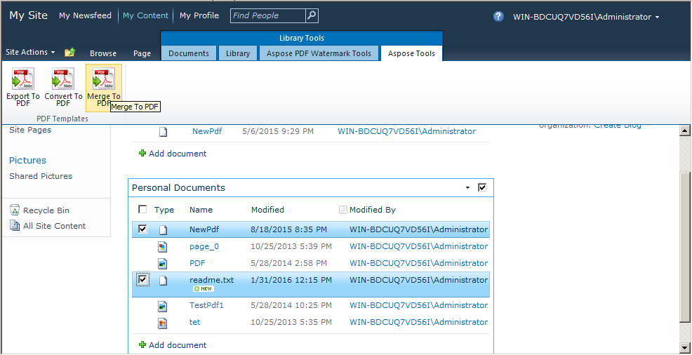

{}

複数の PDF ファイルを単一の PDF ファイルに結合/連結することは、PDF ファイル処理アプリケーションで非常に人気があり、需要の高い機能です。私たちはこの重要な機能を導入しました。 [Aspose.PDF for SharePoint 2.2.0](https://releases.aspose.com/pdf/sharepoint/new-releases/aspose.pdf-for-sharepoint-2.2.0/) バージョン。2つのファイルをマージすることは、2番目のファイルを最初のファイルの末尾に追加して単一のファイルを作成することです。

{}

## PDF ファイルを結合

SharePoint ドキュメント ライブラリから複数の PDF ファイルを単一の PDF に次のようにマージします：

1.  マージするために SharePoint ドキュメント ライブラリから PDF ファイルを選択します。

2.  Library Tools の Aspose Tools タブをクリックします。

3.  Library Tools の Merge to PDF オプションをクリックして、選択したすべての PDF ファイルを結果の PDF に結合します。

4.  適切な名前の結果 PDF ファイルをダウンロード/保存するプロンプトが表示されます。

