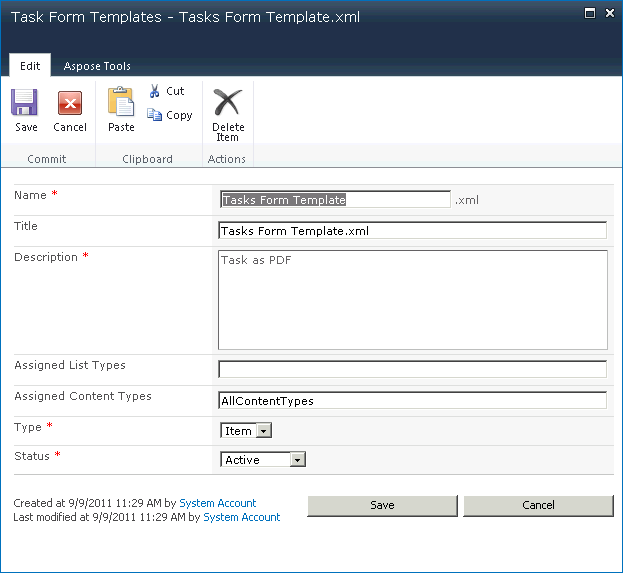
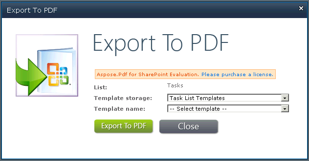

{}

この記事では、Aspose.PDF for SharePoint を使用してテンプレートを作成およびエクスポートする方法を示します。

Aspose.PDF for SharePoint 1.9.2 以降、PDF テンプレートのサポートは SharePoint サブサイトもカバーします。

{}

## テンプレートの作成とエクスポート

{}

Aspose.PDF for SharePoint のエクスポート機能を使用するには、まず「PDF Templates」を使用するリストを作成します。

PDF Templates を使用するリストの作成:

2 つのドキュメントテンプレート、Task Form Templates と Task List Templates が作成されます:

テンプレート フォームでは、次の情報を入力できます:

- **Name**: テンプレートのファイル名です。
- **Title**: テンプレートのタイトルです。（デフォルトでは、ファイル名と同じです。）
- **Description**: テンプレートの説明です。適切な説明により、テンプレートの使用が容易になります。
- **Assigned List Types**: カンマで区切ったリスト ID（テンプレートに関連付けられます。このフィールドは、値も含めることがあります
- **AllListTypes**. このフィールドは、**Type** フィールドが **List** に設定されている場合にのみ適用されます。)
- **Assigned Content Types**: テンプレートに関連するコンテンツ タイプ ID をカンマ区切りで指定します。このフィールドは **AllListTypes** に設定できる場合があります。このフィールドは **Type** フィールドが **Item** に設定されている場合にのみ適用されます。
- **Type**: リストテンプレートまたはアイテムテンプレートのいずれか。
- **Status**: オプションは active、inactive（すべてに対して非表示）、debugging（管理者にのみ表示）の3つです。

The Task List Templates form:

The Task Form Templates form:

保存すると、新しいテンプレートがテンプレート一覧に表示され、すぐに使用できるようになります：

2つのタスク リスト テンプレート:*

タスク フォーム テンプレート：

### テンプレートの開発

テンプレートは Aspose XML PDF に基づく XML ファイルです。リスト用のテンプレートを作成するには、SharePoint の対象コンテンツタイプフィールドの内部名前に関連する特別なマーカーを XML PDF ファイルに配置します。

### マーカー

- **SPListItemsCount** – リスト項目の数に置き換えられます。
- **SPListTitle** – リストのタイトルに置き換えられます。
- **SPTableIterator** – 最初の表セルに配置され、表全体の繰り返し用にマークされます。
- **SPRowIterator** – 最初の表セルに配置され、行の繰り返し用に表がマークされます。
- **SPField** – 項目フィールドの値に置き換えられます。

参考のために、ダウンロードしてください [テンプレート XML ファイル](attachments/8421394/8618082.zip).

### PDF にエクスポート

テンプレートが完全に設定されたら、リストや項目を PDF ファイルにエクスポートする準備が整います。

タスクリストテンプレートを使用してリストを PDF にエクスポートする方法:

{}
