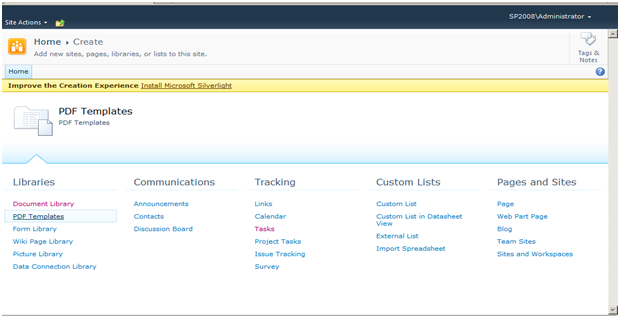
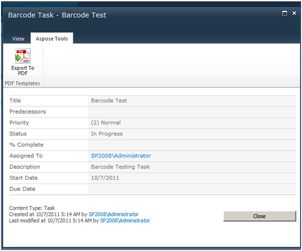

{}

この記事では、Aspose.PDF for SharePoint を使用して、バーコード付きでタスクリストをPDFにエクスポートする方法と設定手順を示します。

{}

テンプレートエンジンを使用してバーコード付きでタスクリストをPDFにエクスポートするには、次の手順を実行してください。

1. テンプレートを作成してアップロードします。
1. テンプレートのフィールドを入力し、テンプレートを保存します。
1. 新しいタスクを作成して保存します。
1. ドキュメントを PDF にエクスポートします。

手順は以下に詳しく示されています。

## タスクリストを PDF にエクスポート

{}

1. PDFテンプレートリストを作成する。

2. テンプレートを作成したら、リスト内の **Add New Item** をクリックし、XMLファイルをアップロードします。

3. アップロードが完了したら、**OK** をクリックしてください。
4. フォームフィールドに入力してください。
5. テンプレートを保存します。

テンプレートが構成されました。

6. **Tasks** リストに移動して新しいタスクを作成します。
7. タスクを保存します。

8. **Aspose Tools** タブで、**Export To PDF** をクリックします。

9. 設定されたテンプレートを選択し、**Export** をクリックします。

エクスポートされた PDF：

{}
