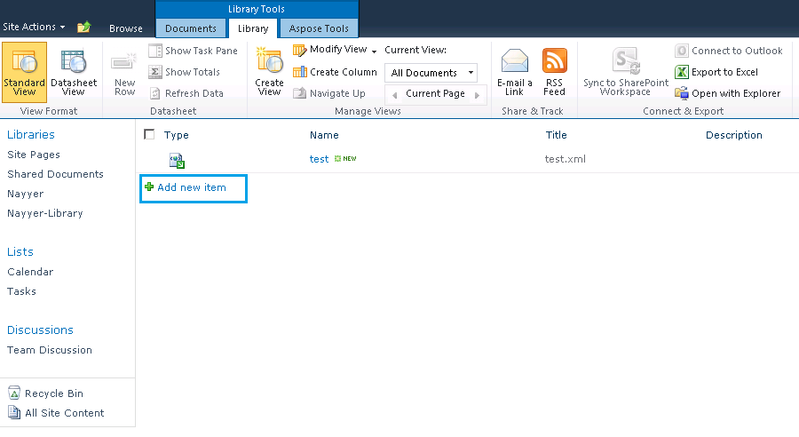

---
title: XML ファイルを作成して PDF に変換する方法
linktitle: XML ファイルを作成して PDF に変換する方法
type: docs
weight: 30
url: /ja/sharepoint/how-to-create-and-convert-an-xml-file-to-pdf/
lastmod: "2020-12-16"
description: PDF SharePoint API は、XML ファイルを作成し、PDF 形式に変換できます。
---

{}

Aspose.PDF for SharePoint は、受賞歴のある Aspose.PDF for .NET コンポーネントをベースに構築されています。 Aspose.PDF for .NET は、PDF ドキュメントの最初からの作成から既存の PDF ファイルの操作まで、優れた機能を提供します。これらの機能の中でも、XML から PDF への変換は、この製品がサポートする優れた機能の 1 つです。したがって、Aspose.PDF for SharePoint も XML ファイルを PDF 形式に変換できると考えられます。

{}

## XML ファイルの作成と PDF への変換

{}

Step by step, this article walks you through the process of creating and XML file and converting it to PDF:

1. [XML ファイルを作成](/pdf/ja/sharepoint/how-to-create-and-convert-an-xml-file-to-pdf/#step-1-create-xml-file)。
2. [PDF テンプレートを作成](/pdf/ja/sharepoint/how-to-create-and-convert-an-xml-file-to-pdf/#step-2-create-pdf-template)。
3. [Load the XML template](/pdf/ja/sharepoint/how-to-create-and-convert-an-xml-file-to-pdf/#step-3-load-xml-template).
4. [ソースパスへのパスを指定](/pdf/ja/sharepoint/how-to-create-and-convert-an-xml-file-to-pdf/#step-4-specify-source-file-path)。
5. [ファイルのプロパティを指定](/pdf/ja/sharepoint/how-to-create-and-convert-an-xml-file-to-pdf/#step-5-specify-file-properties)。
6. [ファイルを PDF にエクスポート](/pdf/ja/sharepoint/how-to-create-and-convert-an-xml-file-to-pdf/#step-6-export-to-pdf)。
7. [PDFファイルを保存](/pdf/ja/sharepoint/how-to-create-and-convert-an-xml-file-to-pdf/#step-7-save-pdf-document)

### ステップ 1: XML ファイルを作成する

まず、Aspose.PDF for .NET ドキュメント オブジェクト モデルに基づいて XML ファイルを作成します。

Aspose.PDF for .NET DOM によると、PDF ドキュメントには Section オブジェクトのコレクションが含まれ、Section には 1 つ以上の Paragraph 要素が含まれます。テキストは段落レベルのオブジェクトであり、1 つ以上のセグメントを含む場合があります。以下では、サンプルのテキスト文字列が Segment オブジェクトに追加され、Text オブジェクトに追加されます。最後に、Text 要素が Section オブジェクトの段落コレクションに追加されます。

```xml

<?xml version="1.0" encoding="utf-8" ?>

  <Pdf xmlns="Aspose.PDF">

   <Section>

    <Text>

            <Segment>Hello World</Segment>

    </Text>

   </Section>

  </Pdf>

```

### ステップ 2: PDF テンプレートを作成する

続行する前に、変換が行われるシステムに SharePoint Foundation サーバー 2010 が正しくインストールされ、構成されていることを確認してください。

1. SharePoint サイトにログインします。
1. [**サイト アクション**] と [**すべてのアイテム**] を選択します。
1. [**作成**] オプションを選択し、リストから [**PDF テンプレート**] を選択します。
1. テンプレート名を入力します。
1. [**作成**] をクリックします。


### ステップ 3: XML テンプレートをロードする

テンプレートが作成されたら、[XML ファイル](/pdf/ja/sharepoint/how-to-create-and-convert-an-xml-file-to-pdf/) をロードします。

1. PDF テンプレート ページで、**新しいアイテムの追加** を選択します。



### ステップ 4: ソース ファイルのパスを指定する

ドキュメントのアップロードダイアログで:

1. **参照** をクリックし、システム上の XML ファイルを見つけます。チェックボックスを有効にして、既存のファイルを上書きするオプションを有効にすることができます。
1. **OK** ボタンを押します。


### ステップ 5: ファイルのプロパティを指定する

ファイルがロードされたら、必須フィールド (赤いアスタリスク: * でマーク) に情報を追加します。

この例では、サンプルの説明が追加され、次のフィールドが入力されました。

1. ドキュメントの簡単な説明。
1. [**割り当てられたリスト タイプ**] フィールドに「**AllListTypes**」と入力します。
1. **タイプ** メニューから **リスト** を選択します。
   ステータスが **アクティブ** のままであることを確認してください。
1. [**保存**] をクリックしてプロパティを保存します。


### ステップ 6: PDF にエクスポートする

XML ファイルが PDF テンプレートに追加されると、次のようになります。
どちらか：

1. test.xml ファイルを右クリックします。
1. メニューから [**PDF にエクスポート**] を選択します。

または：

1. **ライブラリ ツール**から**Aspose Tools**を選択します。
1. [**エクスポート**] をクリックします。


### ステップ 7: PDF ドキュメントを保存する

1. [PDF にエクスポート] ダイアログで、**テンプレート ストレージ** (ソース ファイルが保存される場所) を選択します。
1. **テンプレート名**メニューからエクスポートするファイルを選択します。
1. [**PDF にエクスポート**] をクリックして、最終的な PDF ドキュメントを保存します。


## PDFを開く

PDF ドキュメントが保存され、開くことができます。下の画像では、XML のセグメント タグに含まれているフレーズ「Hello World」に注目してください。また、PDF プロデューサーは Aspose.PDF for SharePoint であることにも注意してください。


{}

