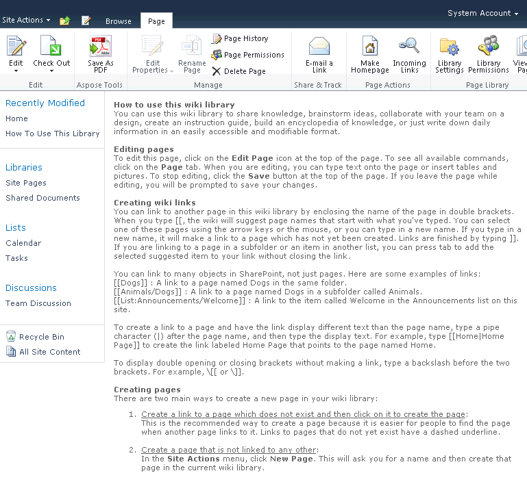

{}

## SharePoint Wiki PDF エクスポート

この記事では、Aspose.PDF for SharePoint を使用して SharePoint Wiki ページを PDF にエクスポートする方法を示します。

{}

## Wiki ページの保存

{}

Wiki ページを PDF に保存するには、**Page** タブの **Save as PDF** をクリックします。以下のスクリーンショットは、Wiki ページ上のテキストセクションがどのように見えるか、および PDF にエクスポートされた様子を示しています。

**PDF ファイルにエクスポートされようとしている Wiki ページ。**（**Page** タブの **Save as PDF** ボタンに注目してください。）

エクスポートされた Wiki ページを示す PDF。

{}

