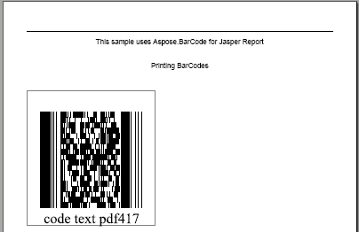

The only limitation to the evaluation version of Aspose.BarCode for JasperReports is that it puts a label that reads **Aspose.Demo** on the generated barcode image. An example is shown below.

**Barcode created with the demo version of Aspose.BarCode** 

The licensed version of Aspose.BarCode for JasperReports doesn't inject such a label on barcode images. The screenshot below shows a barcode created with a licensed version of the software.

**Barcode created with a licensed version of Aspose.BarCode** 

