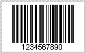
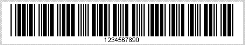
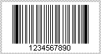
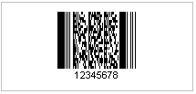
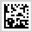
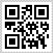
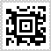

{} 

Fully alphanumeric symbologies contain barcodes that encode character sets, including numerals 0 through 9, the 26 alphabet characters of the English language and ASCII characters, etc.

{} 
### **Alphanumeric Symbologies**
#### **Code128**
This one-dimensional barcode is very effective high density code. It is used extensively in different applications world-wide. It permits the encoding of alphanumeric data. Code128 has three types of code sets:

- Code Set A includes all the standard upper case U.S. alphanumeric keyboard characters and punctuation characters together with the control characters (ASCII values from 0 to 95 inclusive), and some special characters (ASCII values from 96 to 105 inclusive).
- Code Set B includes all the standard alphanumeric keyboard characters (uppercase and lowercase) and punctuation characters.
- Code Set C includes a set of 100 digit pairs from 00 to 99 inclusive, encoding two numeric digits into one symbol character.

#### **Code39 Standard**
This one-dimensional barcode is used by U.S. Government and military in [DoD](http://www.aspose.com/Wiki/wikiedit.aspx?topic=Aspose.BarCode.DoD&return=Aspose.BarCode.SymbologyBackground) applications. It contains the following characters:

- Numbers: 0 to 9
- Upper case letters: A to Z
- Special character: - . SPACE $ / + % *

#### **Code39 Extended**
This one-dimensional barcode is the extended version of standard Code39. It can encode 128 ASCII characters.

#### **Code93 Standard**
This one-dimensional barcode is the compressed form of Code39 standard.

#### **Code93 Extended**
This one-dimensional barcode is the compressed form of Code39 extended.

#### **Pdf417**
Pdf417 is a two dimensional barcode. Large amount of data can be stored, securely and inexpensively using [Pdf417](http://www.aspose.com/Wiki/default.aspx/Aspose.BarCode/PDF417.html) symbology. This symbology uses Solomon's error correction from level 0 to level 8.

#### **MacroPdf417**
MacroPdf417 is similar to Pdf417, but large data can be encoded in it as compared to Pdf417. It contains Macro Pdf417 Control Block for additional control information. Large data files are split into small data segments and then encoded into individual symbols. While recognizing the barcode, we can use the information contained within the Control Block zone to reconstruct the file correctly.

#### **Datamatrix**
This two-dimensional barcode symbology is derived from [ECC200](http://www.aspose.com/Wiki/wikiedit.aspx?topic=Aspose.BarCode.ECC200&return=Aspose.BarCode.SymbologyBackground). It also uses Solomon error correction. It contains full text or 8 bit binary values.

#### **QR**
This two-dimensional barcode symbology contains numeric or alphabetic characters, Chinese characters, Japanese characters, binary data and control codes.

#### **Aztec**
This two-dimensional symbology is a high density 2 dimensional matrix style barcode. It can encode more than 3000 characters from the entire 256 byte ASCII character set.

