{} 

Numeric barcode symbologies only encode digits from 0-9. Below is a list of numeric symbologies. 

{} 
### **Numeric Barcode Symbologies**
#### **UPCA**
This one-dimensional barcode contains 12 numbers plus a checksum. It is used for consumer products in U.S.

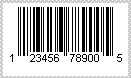
#### **EAN13**
This one-dimensional barcode is used for consumer products internationally. It contains 13 numbers and is the superset of UPCA.

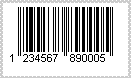
#### **EAN8**
This one-dimensional barcode contains 8 numbers and is the short version of [EAN13](http://www.aspose.com/Wiki/wikiedit.aspx?topic=Aspose.BarCode.EAN13&return=Aspose.BarCode.SymbologyBackground).

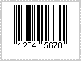
#### **BooklandEAN**
This one-dimensional barcode is the variation version of [EAN13](http://www.aspose.com/Wiki/wikiedit.aspx?topic=Aspose.BarCode.EAN13&return=Aspose.BarCode.SymbologyBackground). It is used exclusively with books. The encoded number starts with 978 and is known as ISBN Barcode.

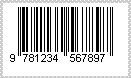
#### **Standard 2 of 5**
This one-dimensional barcode is low density numeric symbology. It is used in the photofinishing and warehouse sorting industries. It is also used for numbering airline tickets sequentially. This symbology is called "2 of 5" due to the fact that digits are encoded with 5 bars, 2 of which are always wide (and the remaining three are narrow).

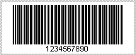
#### **Interleaved 2 of 5**
This one-dimensional barcode is a higher-density numeric symbology. It is based upon the “Standard 2 of 5” symbology. It is used primarily in the distribution and warehouse industries.

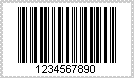
#### **ITF 14**
ITF 14 is a UPC shipping container symbology. It is used to mark cartons, cases or pallets. It contains UPC or EAN product identification numbers, and it consists of 14 numbers in total.

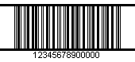
#### **PostNet**
[PostNet](http://www.aspose.com/Wiki/wikiedit.aspx?topic=Aspose.BarCode.PostNet&return=Aspose.BarCode.SymbologyBackground) is also one dimensional symbology that was developed by the United States Postal Service (USPS) to allow faster sorting and routing of mail. The barcode itself can encode standard 5-digit Zip codes, Zip+4 codes or full 11-point delivery point codes.

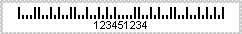
#### **Planet**
This one-dimensional symbology contains 12 or 14 numbers, similar in structure to Postnet. It is used by mail processing equipment to sort the mails.

#### **USPS OneCode**
This barcode is used in United States Postal Service.

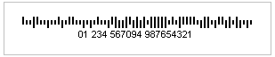
#### **AustraliaPost**
This is Australian 4-stare postal barcode, which is used by Australia Postal Service.

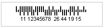
#### **MSI**
This one dimensional barcode was developed by the MSI Data Corporation. It is based on original Plessey Code. It is used primarily to mark retail shelves for inventory control.

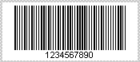
#### **EAN128**
This one-dimensional symbology is also called UCC/EAN128. It is derived from Code128 symbology. It is used to provide a worldwide format and standard for exchanging common data between companies. While other barcodes simply encode data with no respect for what the data represents, UCC/EAN-128 encodes data and what that data represents. This is done by using application identifiers (AI). For example, AI=11 denotes production date. The following label shows that production date is Jan 2nd, 2007:

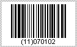
#### **EAN14**
This one-dimensional symbology is also known as [SSCC14](http://www.aspose.com/Wiki/wikiedit.aspx?topic=Aspose.BarCode.SSCC14&return=Aspose.BarCode.SymbologyBackground). [SSCC14](http://www.aspose.com/Wiki/wikiedit.aspx?topic=Aspose.BarCode.SSCC14&return=Aspose.BarCode.SymbologyBackground) is a UCC/EAN128 barcode that contains 14 digits of shipping container code with application identifier (AI) = 01.

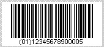
#### **SSCC18**
This one-dimensional barcode is a UCC/EAN128 barcode that contains 18 digits of shipping container code with the application identifier (AI) = 00.

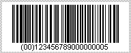
