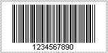
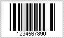

{} 

Partially alphanumeric symbologies contain barcodes that encode numbers and some certain character sets. 

{} 
### **List of Partially Alphanumeric Symbologies**
#### **Codabar**
This one-dimensional barcode is used by blood banks, photo labs and libraries. The Codabar symbology is self-checking and no checksum digit is needed. Codabar can encode the following characters:

- Characters: - $ : / . +
- Numbers: 0 1 2 3 4 5 6 7 8 9
- Start symbols and end symbols: A B C D

#### **Code11**
This one-dimensional barcode symbology is used to identify telecommunication equipment. It contains digits from 0 to 9 and dash (--) symbol.

