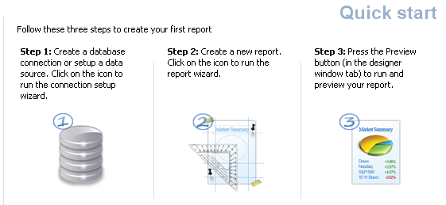
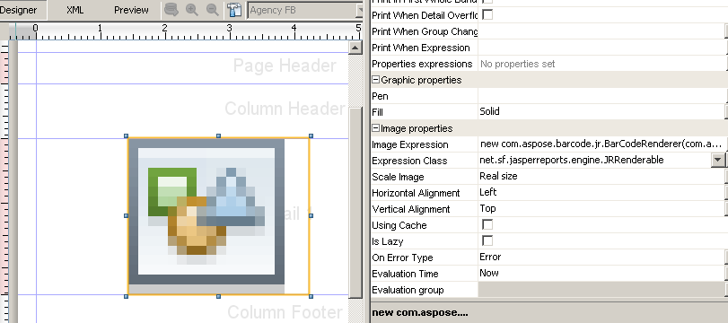

{} 

In this article, we sohw how to use iReport to design reports. iReport is a plug-in for Netbeans which can be used to design reports for JasperReports visually. The JasperReports .jrxml file is generated by the iReport designer. 

To download and install iReport, please go to the iReport plug-in site: <http://sourceforge.net/projects/ireport/>. 

{} 
### **Working with iReport**
After iReport has been installed as a Netbeans plug-in:

1. Open Netbeans.
1. Select Window à Welcome to iReport from the menu. 

   **The iReport QuickStart window** 

1. Click **Step 1** and create an empty datasource connection, if it's not already there in the list on top.
1. Click **Step-2** to create a new report.
1. Select **Blank A4** from the page layout list.
1. Click **Launch Report Wizard**.
1. Name the report report1.
1. Select an empty datasource connection in the next step and proceed to complete the wizard. 

   After the report is created in the specified location, it opens in the iReport designer within Netbeans. 
1. Click the **Palette** window and drag an image from the **Palette** to the report. 
   We will use this image to render a barcode using Aspose.BarCode for JasperReports. 

   **The Palette window** 

1. Set the image properties as follows: 
   1. Image expression: new com.aspose.barcode.jr.BarCodeRenderer(com.aspose.barcode.jr.BarCodeAttributesFactory.Create("test","DataMatrix",java.awt.Color.RED))
   1. Expression class: net.sf.jasperreports.engine.JRRenderable
1. Go to the report's XML tab. It contains the the following XML for the image tag: 

**<image scaleImage="RealSize">**



 	<reportElement x="103" y="0" width="201" height="174"/>

	<imageExpression class="net.sf.jasperreports.engine.JRRenderable"><![CDATA[new com.aspose.barcode.jr.BarCodeRenderer(com.aspose.barcode.jr.BarCodeAttributesFactory.Create("test","DataMatrix",java.awt.Color.RED))]]></imageExpression>

</image>



This is similar to the samples that we created in the [Programmer’s Guide](/pages/createpage.action?spaceKey=barcodejasperreports&title=Programmer%E2%80%99s+Guide&linkCreation=true&fromPageId=14221341). However, here we used iReport tool to design the report visually. 

The report is saved as a .jrxml file. 

To compile and generate the report, get more information from the [Programmer’s Guide](/pages/createpage.action?spaceKey=barcodejasperreports&title=Programmer%E2%80%99s+Guide&linkCreation=true&fromPageId=14221341). 
