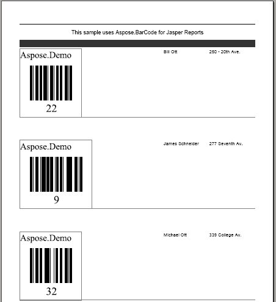

{} 

This topic demonstrates how to render barcodes in a report that uses a data source. [Print Barcodes in Report](/barcode/jasperreports/print-barcodes-in-report-html/) showed how to add barcodes to an empty report. It is also possible to use a data source to display records in the report and render barcodes for one of the columns. 

{} 
### **Printing Barcodes in a Report that uses an External Data Source**
To print records from a data source, we need to pass an instance of type JRDataSource to the JasperFillManager.fillReport() method. In [ the empty report example|Print Barcode in Report], JREmptyDataSource, which represents an empty data source, was passed. This time, create a new data source inherited from the net.sf.jasperreports.engine.JRDataSource class.

Below is the complete Java source code for our data source class.

**Java**



 package barcode1;

import net.sf.jasperreports.engine.JRDataSource;

import net.sf.jasperreports.engine.JRException;

import net.sf.jasperreports.engine.JRField;

import com.aspose.barcode.jr.BarCodeAttributes;

// Data source class

public class WebappDataSource implements JRDataSource

{

	private int index = -1;

	private String Symbology = "";

	// 2d array for creating data source

    // the inner array have 3 members (id, name and address)

    private Object[][] data =

	{

		{ new Integer(22), "Bill Ott", "250 - 20th Ave."},

		{ new Integer(9), "James Schneider", "277 Seventh Av."},

		{ new Integer(32), "Michael Ott", "339 College Av."},

		{ new Integer(23), "Julia Heiniger", "358 College Av."},

		{ new Integer(39), "Mary Karsen", "202 College Av."},

		{ new Integer(35), "George Karsen", "412 College Av."},

		{ new Integer(11), "Julia White", "412 Upland Pl."},

		{ new Integer(47), "Janet Fuller", "445 Upland Pl."},

		{ new Integer(43), "Susanne Smith", "2 Upland Pl."},

		{ new Integer(40), "Susanne Miller", "440 - 20th Ave."},

		{ new Integer(36), "John Steel", "276 Upland Pl."},

		{ new Integer(37), "Michael Clancy", "19 Seventh Av."},

		{ new Integer(19), "Susanne Heiniger", "86 - 20th Ave."},

		{ new Integer(10), "Anne Fuller", "135 Upland Pl."},

		{ new Integer(4), "Sylvia Ringer", "365 College Av."},

		{ new Integer(0), "Laura Steel", "429 Seventh Av."},

		{ new Integer(38), "Andrew Heiniger", "347 College Av."},

		{ new Integer(28), "Susanne White", "74 - 20th Ave."},

		{ new Integer(17), "Laura Ott", "443 Seventh Av."},

		{ new Integer(2), "Anne Miller", "20 Upland Pl."},

		{ new Integer(46), "Andrew May", "172 Seventh Av."},

		{ new Integer(44), "Sylvia Ott", "361 College Av."},

		{ new Integer(41), "Bill King", "546 College Av."},

		{ new Integer(45), "Janet May", "396 Seventh Av."},

		{ new Integer(42), "Robert Ott", "503 Seventh Av."},

		{ new Integer(25), "Sylvia Steel", "269 College Av."},

		{ new Integer(18), "Sylvia Fuller", "158 - 20th Ave."},

		{ new Integer(5), "Laura Miller", "294 Seventh Av."},

		{ new Integer(48), "Robert White", "549 Seventh Av."},

		{ new Integer(7), "James Peterson", "231 Upland Pl."}

	};

	// Constructor

    public WebappDataSource()

	{

		// Set symbology

               Symbology = "code128";

	}

	// The next record

	public boolean next() throws JRException

	{

		index++;

		return (index < data.length);

	}

	// Get the value of the data fields

	public Object getFieldValue(JRField field) throws JRException

	{

		Object value = null;

		String fieldName = field.getName().toLowerCase();

		// Display barcode image for ID column

    		// ID will be set as codetext for barcode generation

    		if ("id".toLowerCase().equalsIgnoreCase(fieldName))

		{

			// return instance of type BarCodeAttributes to render barcode image

            		value = new BarCodeAttributes("" + data[index][0],Symbology);

		}

		// Name field

        else if ("name".toLowerCase().equalsIgnoreCase(fieldName))

		{

			value = data[index][1];

		}

		// Address field

        else if ("address".toLowerCase().equalsIgnoreCase(fieldName))

		{

			value = data[index][2];

		}

		return value;

	}

}



The above class has a 2D array of type Object. Each inner array has three members (ID, name and address). It contains the method getFieldValue(fieldName) which accepts a field name as an argument and returns its value. For example, if you pass “name”, the method returns the name of the person in the record.
#### **Create a JRXML File**
Next, create the .jrxml file that will display the records from the data source. Below is the complete source of the **BarCodeReportDataSource.jrxml** file.

**Java**



 <?xml version="1.0" encoding="UTF-8"?>

<jasperReport

		xmlns="http://jasperreports.sourceforge.net/jasperreports"

		xmlns:xsi="http://www.w3.org/2001/XMLSchema-instance"

		xsi:schemaLocation="http://jasperreports.sourceforge.net/jasperreports http://jasperreports.sourceforge.net/xsd/jasperreport.xsd"

		name="BarcodeReport2" pageWidth="595" pageHeight="842" columnWidth="515" leftMargin="40" rightMargin="40" topMargin="50" bottomMargin="50">

	<style name="Sans_Bold" isDefault="false" fontName="DejaVu Sans" fontSize="12" isBold="true" isItalic="false" isUnderline="false" isStrikeThrough="false"/>

	<style name="pageHeader" isDefault="false" style="Sans_Bold" forecolor="#FFFFFF" backcolor="#333333"/>

	<field name="id" class="com.aspose.barcode.jr.BarCodeAttributes"/>

	<field name="name" class="java.lang.String"/>

	<field name="address" class="java.lang.String"/>

	<title>

		<band height="30">

			<line>

				<reportElement x="0" y="0" width="515" height="1"/>

				<graphicElement/>

			</line>

			<textField>

				<reportElement x="0" y="10" width="515" height="20"/>

				<textElement textAlignment="Center">

					

				</textElement>

				<textFieldExpression class="java.lang.String"><![CDATA["This sample uses Aspose.BarCode for Jasper Reports\n" + ""]]></textFieldExpression>

			</textField>

		</band>

	</title>

	<pageHeader>

		<band height="20">

			<textField>

				<reportElement style="pageHeader" mode="Opaque" x="0" y="5" width="315" height="15"/>

				<textElement textAlignment="Center">

					

				</textElement>

				<textFieldExpression class="java.lang.String"><![CDATA["ID\n" + ""]]></textFieldExpression>

			</textField>

			<textField>

				<reportElement style="pageHeader" mode="Opaque" x="315" y="5" width="100" height="15"/>

				<textElement textAlignment="Center">

					

				</textElement>

				<textFieldExpression class="java.lang.String"><![CDATA["Name\n" + ""]]></textFieldExpression>

			</textField>

			<textField>

				<reportElement style="pageHeader" mode="Opaque" x="415" y="5" width="100" height="15"/>

				<textElement textAlignment="Center">

					

				</textElement>

				<textFieldExpression class="java.lang.String"><![CDATA["Address\n" + ""]]></textFieldExpression>

			</textField>

		</band>

	</pageHeader>

	<detail>

		<band height="200">

			<componentElement>

				<reportElement x="0" y="4" width="315" height="150"/>

				<bc:asposebarcode

						xmlns:bc="http://jasperreports.sourceforge.net/jasperreports/asposebarcode"

						xsi:schemaLocation="http://jasperreports.sourceforge.net/jasperreports/asposebarcode

							http://jasperreports.sourceforge.net/xsd/barcode.xsd">

					<bc:barCodeAttributesExpression>$F{id}</bc:barCodeAttributesExpression>

				</bc:asposebarcode>

			</componentElement>

			<textField isStretchWithOverflow="true">

				<reportElement positionType="Float" x="315" y="4" width="100" height="150"/>

				<textElement/>

				<textFieldExpression class="java.lang.String"><![CDATA[$F{name}]]></textFieldExpression>

			</textField>

			<textField isStretchWithOverflow="true">

				<reportElement positionType="Float" x="415" y="4" width="100" height="150"/>

				<textElement/>

				<textFieldExpression class="java.lang.String"><![CDATA[$F{address}]]></textFieldExpression>

			</textField>

			<line>

				<reportElement positionType="Float" x="0" y="153" width="515" height="1" forecolor="#808080"/>

			</line>

		</band>

	</detail>

</jasperReport>



The report contains the header and detail XML tags:

- The <header> tag contains the headings, for example “Id”, “Name” and “Address”.
- The <detail> tag displays the data from the data source.

For the “Id” column, we used the <bc:asposebarcode> tag to render the barcode.

Next, write the .java file to compile the above .jrxml file and generate the report in PDF format.

Below is the complete source of the **Main.java** file. 

**Java**



 package barcode1;

import com.aspose.barcode.jr.License;

import java.io.File;

import net.sf.jasperreports.engine.JREmptyDataSource;

import net.sf.jasperreports.engine.JRExporterParameter;

import net.sf.jasperreports.engine.JasperCompileManager;

import net.sf.jasperreports.engine.JasperFillManager;

import net.sf.jasperreports.engine.JasperPrint;

import net.sf.jasperreports.engine.export.JRPdfExporter;

public class Main

{

    public static void main(String[] args)

    {

       // path of the folder where .jrxml file is present

        final String PATH = "C:\\jasperreports-3.5.2\\demo\\samples\\barcode1\\";

        String jrxmlFileName = PATH + "BarcodeReportDataSource.jrxml";

       String fillFileName =PATH + "BarcodeReportDataSource.jasper";

       try

        {

        // compile the file

       JasperCompileManager.compileReportToFile(jrxmlFileName,fillFileName);

	System.out.println(jrxmlFileName + " compiled successfully!");

       File reportFile = new File(fillFileName);

        // pass data source to fillReport() method

        JasperPrint jasperPrint =

		JasperFillManager.fillReport(

			fillFileName,

			null,

			new WebappDataSource()

			);

		// export the report in pdf format

       JRPdfExporter exporter = new JRPdfExporter();

       File destFile = new File(reportFile.getParent(), jasperPrint.getName() + ".pdf");

       exporter.setParameter(JRExporterParameter.JASPER_PRINT, jasperPrint);

       exporter.setParameter(JRExporterParameter.OUTPUT_FILE_NAME, destFile.toString());

       exporter.exportReport();

       System.out.println("Report exported to " + destFile.getAbsolutePath() );

       System.out.println("Finished.");

       }

       catch(Exception e)

       {

       e.printStackTrace();

       }

    }

}


#### **Compile and Create the Report**
Please make sure that you follow the instructions for [including required JAR files](/barcode/jasperreports/basic-usage-of-aspose-barcode-for-jasperreports-html/) and add the required JARs. 
Then, compile and run the .java file using your favorite IDE or Java command compiler. 
#### **Output**
Below is a screenshot that shows the report generated by JasperReports using a data source to print the barcodes and values of the other data columns. Note that the reports created using the [evaluation version](/barcode/jasperreports/evaluation-version-limitations-html/) of Aspose.BarCode.

**A JasperReport based on a data source that incorporates barcodes** 

