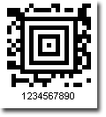

{} 

Aztec is a square grid high-density two-dimensional barcode symbology that can encode up to 3,000 alphanumeric characters. 

{} 
### **Creating Aztec Barcodes**
To create an Aztec barcode:

1. Instantiate [BarCodeAttributes](/pages/createpage.action?spaceKey=barcodejasperreports&title=BarCodeAttributes&linkCreation=true&fromPageId=14221330).
1. Call the setSymbologyType() method and pass AZTEC.
1. Call the setCodeText() method to set the data you want to encode.

**Aztec barcode sample** 

**Java**



 public class MyAttributes

{

    public static BarCodeAttributes Create(String text, String symbology)

    {

        BarCodeAttributes b = new BarCodeAttributes();

        b.setCodeText(text);

        b.setSymbology(symbology);

        return b;

    }

}



**JRXML**



 <image hAlign="Center">

<reportElement x="0" y="600"  width="500" height="250" />

<imageExpression class="net.sf.jasperreports.engine.JRRenderable">

   <![CDATA[new com.aspose.barcode.jr.BarCodeRenderer(MyAttributes.Create(

      "1234567890", "AZTEC")

   )]]>

</imageExpression>

</image>


#### **Error Correction**
Aztec barcode allows code recovery when the barcode image is partly damaged; error correction levels range from 10% to 90%.

**Aztec barcode samples with different error correction levels** 

**Java**



 public class MyAttributes

{

    public static BarCodeAttributes Create(String text, String symbology)

    {

        BarCodeAttributes b = new BarCodeAttributes();

        b.setCodeText(text);

        b.setSymbology(symbology);

        b.setAztecErrorLevel(AztecErrorLevel.MEDIUM);

        return b;

    }

}



**JRXML**



 <image hAlign="Center">

<reportElement x="0" y="600"  width="500" height="250" />

<imageExpression class="net.sf.jasperreports.engine.JRRenderable">

   <![CDATA[new com.aspose.barcode.jr.BarCodeRenderer(MyAttributes.Create(

      "1234567890", "AZTEC")

   )]]>

</imageExpression>

</image>


