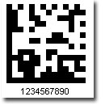
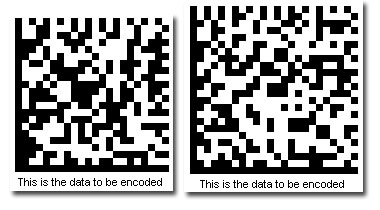

{} 

DataMatrix is used to encode product and serial number information on electrical rating plates, to mark surgical instruments in Japan, and to identify lenses, circuit boards, and other items during manufacturing. DataMatrix barcodes can store up to 2000 characters. Aspose.BarCode provides the most convenient way of producing DataMatrix type two-dimentional barcodes. 

{} 
### **How to Create a DataMatrix Barcode**
To create a DataMatrix barcode:

1. Instantiate [BarCodeAttributes](/pages/createpage.action?spaceKey=barcodejasperreports&title=BarCodeAttributes&linkCreation=true&fromPageId=14221332).
1. Call the setSymbologyType() method and pass DATAMATRIX.
1. Call the setCodeText() method to set the data you want to encode.

**DataMatrix sample picture** 

**Java**



 public class MyAttributes

{

    public static BarCodeAttributes Create(String text, String symbology)

    {

        BarCodeAttributes b = new BarCodeAttributes();

        b.setCodeText(text);

        b.setSymbology(symbology);

        return b;

    }

}



**JRXML**



 <image hAlign="Center">

<reportElement x="0" y="600"  width="500" height="250" />                

<imageExpression class="net.sf.jasperreports.engine.JRRenderable">

   <![CDATA[new com.aspose.barcode.jr.BarCodeRenderer(MyAttributes.Create(

      "12345678", "DATAMATRIX")

   )]]>

</imageExpression>

</image>


#### **Encoding Mode**
Aspose.BarCode supports several types of encoding mode for DataMatrix. It defaults to Auto, indicating that the encoder will choose the best encoding mode. 

How do you determine the best encoding mode? The best encode mode is likely to produce the smallest picture, all other settings being the same. The encoder tryies to encode two characters into one single byte. 

The left barcode uses the Auto encode mode. The right barcode uses the ASCII encode mode 

**DataMatrix barcodes using different encoding modes** 

**Java**



 public class MyAttributes

{

    public static BarCodeAttributes Create(String text, String symbology)

    {

        BarCodeAttributes b = new BarCodeAttributes();

        b.setCodeText(text);

        b.setSymbology(symbology);

        b.setDataMatrixMode(DataMatrixMode.ASCII);

        return b;

    }

}



**JRXML**



 <image hAlign="Center">

<reportElement x="0" y="600"  width="500" height="250" />                

<imageExpression class="net.sf.jasperreports.engine.JRRenderable">

   <![CDATA[new com.aspose.barcode.jr.BarCodeRenderer(MyAttributes.Create(

      "This is the data to be encoded", "DATAMATRIX")

   )]]>

</imageExpression>

</image>


