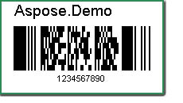
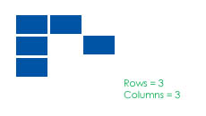
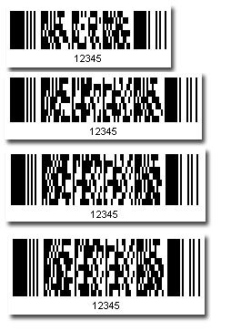
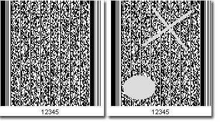
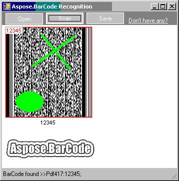
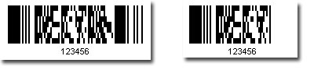
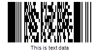
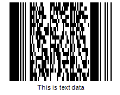

{} 

Data File 417 is a two-dimensional stacked barcode symbology capable of encoding over a kilobyte of data per label. It was developed by Symbol Technologies (1989-1992) and is currently maintained by ANSI/AIM USA. 

{} 
### **PDF417 Error Correction Level**
PDF417 uses Reed Solomon error correction instead of check digits. This error correction allows the symbol to withstand some damage without causing loss of data. AIM standards recommend a minimum error correction level of 2. This article includes a [code sample that illustrates error correction](/barcode/jasperreports/creating-pdf417-barcodes-html/) in use. 
### **Truncated PDF417**
Aspose.BarCode supports the truncated PDF417 version which omits the right-hand side quiet zone to save space. In this article, you'll find a [code sample that creates a truncated barcode](/barcode/jasperreports/creating-pdf417-barcodes-html/). 
### **Creating a PDF417 Barcode**
To create a PDF417 barcode:

1. Instantiate [BarCodeAttributes](/pages/createpage.action?spaceKey=barcodejasperreports&title=BarCodeAttributes&linkCreation=true&fromPageId=14221335).
1. Call the setSymbologyType() method and pass Pdf417.
1. Call the setCodeText() method to set the data you want to encode.

**Sample PDF417 output barcode** 

**Java**



 public class MyAttributes

{

    public static BarCodeAttributes Create(String text, String symbology)

    {

        BarCodeAttributes b = new BarCodeAttributes();

        b.setCodeText(text);

        b.setSymbology(symbology);

        return b;

    }

}



**JRXML**



 <image hAlign="Center">

<reportElement x="0" y="600"  width="500" height="250" />                

<imageExpression class="net.sf.jasperreports.engine.JRRenderable">

   <![CDATA[new com.aspose.barcode.jr.BarCodeRenderer(MyAttributes.Create(

      "12345678", "Pdf417")

   )]]>

</imageExpression>

</image>


#### **Rows and Columns**
The row and column settings aiming at general two-dimensional barcodes, appliable to PDF417. A PDF417 barcode consists of black and white rectangular modules. 

**Rows and columns** 

If the settings for rows and columns are illegal, the encoder simply ignores them. Setting rows and columns to zero means no rows and columns settings. The following sample pictures show PDF417 barcodes with the same codetext but of different row and Column setting.

**Different settings for rows and columns** 

#### **Working with PDF417 Error Correction Level**
A PDF417 barcode with error correction can withstand certain kinds of damage. An instance of BarCodeAttributes with a higher error correction level produces a bigger image. The example creates a barcode with the maximum error correction levels. 

The screenshots below show the output barcode and some kind of damage.

**Original barcode and damaged barcode** 

The barcode at the right side is totally decodable due to its high error correction level. The following picture is a snapshot of the barcode being decoded with Aspose's BarCodeReader.

**PDF417 withstands damage** 

**Java**



 public class MyAttributes

{

    public static BarCodeAttributes Create(String text, String symbology)

    {

        BarCodeAttributes b = new BarCodeAttributes();

        b.setCodeText(text);

        b.setSymbology(symbology);

        b.setPDF417ErrorLevel(PDDF17ErrorLevel.LEVEL8);

        return b;

    }

}



**JRXML**



 <image hAlign="Center">

<reportElement x="0" y="600"  width="500" height="250" />                

<imageExpression class="net.sf.jasperreports.engine.JRRenderable">

   <![CDATA[new com.aspose.barcode.jr.BarCodeRenderer(MyAttributes.Create(

      "12345678", "Pdf417")

   )]]>

</imageExpression>

</image>


#### **Truncated PDF417**
Setting the PDF417Truncate property to true leads to a comparatively smaller image as the quiet zone is removed.

**Normal PDF417 and truncated PDF417** 

#### **PDF417 Compaction Mode**
The PDF417 compaction mode (PDF417CompactMode) determines how a baroce is compacted. The modes that can be set with Aspose.BarCode for Java are: 

- Auto: Automatically detect which compaction mode to use.
- Text: Text compaction, suitable for text data.
- Numeric: Numeric compaction mode, suitable for numeric data.
- Binary: Binary compaction mode, suitable for binary data.

The barcode below was generated using the code sample below.

**PDF417 barcode with text compaction** 

Set the compaction mode to Binary, and the same code generates a different barcode.

**PDF417 barcode with binary compaction** 

Please note that the barcode size is bigger because binary compaction was used to encode text data. Set the compaction mode to Auto to choose the best possible compaction mode or choose carefully based on the type of codetext value. 

Below code snippet generates a PDF417 barcode using the Text compaction mode: 

**Java**



 public class MyAttributes

{

    public static BarCodeAttributes Create(String text, String symbology)

    {

        BarCodeAttributes b = new BarCodeAttributes();

        b.setCodeText(text);

        b.setSymbology(symbology);

        // Set PDF417 Compaction Mode to Text

        b.setPDF417CompactMode(PDF417CompactMode.TEXT);

        return b;

    }

}



**JRXML**



 <image hAlign="Center">

<reportElement x="0" y="600"  width="500" height="250" />                

<imageExpression class="net.sf.jasperreports.engine.JRRenderable">

   <![CDATA[new com.aspose.barcode.jr.BarCodeRenderer(MyAttributes.Create(

      "This is text data", "Pdf417")

   )]]>

</imageExpression>

</image>


