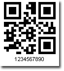
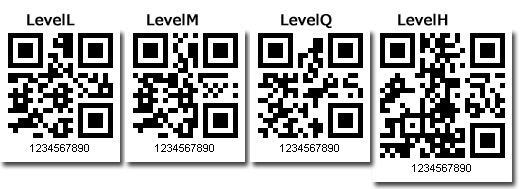
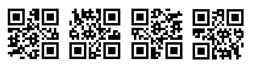

{} 

QR barcodes are a two-dimensional barcode symbology developed in Japan. QR barcodes have the following features:

- High capacity encoding of data, up to 7000 numeric digits or 4000 alphanumeric data.
- Dirt and damage resistant, a maximum 30% of codewords can be restored.
- Readable from all directions.

{} 
### **Producing a QR Barcode**
To create a QR barcode with Aspose.BarCode:

1. Instantiate [BarCodeAttributes](/pages/createpage.action?spaceKey=barcodejasperreports&title=BarCodeAttributes&linkCreation=true&fromPageId=14221333).
1. Call the setSymbologyType() method and pass QR.
1. Call the setCodeText() method to set the data you want to encode.

**QR barcode sample** 

**Java**



 public class MyAttributes

{

    public static BarCodeAttributes Create(String text, String symbology)

    {

        BarCodeAttributes b = new BarCodeAttributes();

        b.setCodeText(text);

        b.setSymbology(symbology);

        return b;

    }

}



**JRXML**



 <image hAlign="Center">

<reportElement x="0" y="600"  width="500" height="250" />

<imageExpression class="net.sf.jasperreports.engine.JRRenderable">

   <![CDATA[new com.aspose.barcode.jr.BarCodeRenderer(MyAttributes.Create(

      "1234567890", "QR")

   )]]>

</imageExpression>

</image>


#### **Error Correction**
A QR barcode can withstand certain damage and still be decoded normally. This is decided by the QR barcode's error correction level during encoding. There are four levels of error correction, from low to high:

- LevelL. Allows recovery of 7% of the code text.
- LevelM. Allows recovery of 15% of the code text.
- LevelQ. Allows recovery of 25% of the code text.
- LevelH. Allows recovery of 30% of the code text.

**QR barcode sample with different error correction levels** 

**Java**



 public class MyAttributes

{

    public static BarCodeAttributes Create(String text, String symbology)

    {

        BarCodeAttributes b = new BarCodeAttributes();

        b.setCodeText(text);

        b.setSymbology(symbology);

        b.setQRErrorLevel(QRErrorLevel.LEVEL_H);

        return b;

    }

}



**JRXML**



 <image hAlign="Center">

<reportElement x="0" y="600"  width="500" height="250" />

<imageExpression class="net.sf.jasperreports.engine.JRRenderable">

   <![CDATA[new com.aspose.barcode.jr.BarCodeRenderer(MyAttributes.Create(

      "1234567890", "QR")

   )]]>

</imageExpression>

</image>


#### **Rotation**
A QR barcode can be read from any direction. The images below show valid QR barcodes with different rotation angles.

**QR barcode sample with different rotation angles** 

**Java**



 public class MyAttributes

{

    public static BarCodeAttributes Create(String text, String symbology)

    {

        BarCodeAttributes b = new BarCodeAttributes();

        b.setCodeText(text);

        b.setSymbology(symbology);

        b.setRotationAngle(90f);

        return b;

    }

}



**JRXML**



 <image hAlign="Center">

<reportElement x="0" y="600"  width="500" height="250" />

<imageExpression class="net.sf.jasperreports.engine.JRRenderable">

   <![CDATA[new com.aspose.barcode.jr.BarCodeRenderer(MyAttributes.Create(

      "1234567890", "QR")

   )]]>

</imageExpression>

</image>


