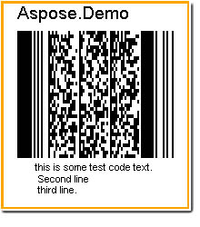
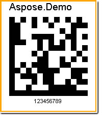

{} 

Two-dimensional barcode can contain more data per label than a one-dimensional one, up to thousands of characters. Large amounts of text and data can be stored securely and inexpensively, encoded into two-dimensional barcodes. Aspose.BarCode supports both barcode types in one simple interface. 

{} 
### **Creating a Two-dimentional Barcode**
The [BarCodeAttributes](/pages/createpage.action?spaceKey=barcodejasperreports&title=BarCodeAttributes&linkCreation=true&fromPageId=14221334) class supports both one-dimensional and two-dimensional barcodes. Creating two-dimensional barcodes is just the same as creating one-dimensional barcodes.
#### **Creating a Pdf417 Barcode**
This is a quick example. Read more about [creating PDF417 barcodes](/barcode/jasperreports/creating-pdf417-barcodes-html/).

**Sample PDF417 barcode** 

**Java**



 public class MyAttributes

{

    public static BarCodeAttributes Create(String text, String symbology)

    {

        BarCodeAttributes b = new BarCodeAttributes();

        b.setCodeText(text);

        b.setSymbology(symbology);

        // width of each module

        b.setYDimension(0.6f);

        // height of each module

        b.setYDimension(1.2f);

        return b;

    }

}



**JRXML**



 <image hAlign="Center">

<reportElement x="0" y="600"  width="500" height="250" />

<imageExpression class="net.sf.jasperreports.engine.JRRenderable">

   <![CDATA[new com.aspose.barcode.jr.BarCodeRenderer(MyAttributes.Create(

      "this is some test code text. \n Second line \n third line.", "Pdf417")

   )]]>

</imageExpression>

</image>


#### **Creating a DataMatrix Barcode**
This is a quick example. Read more about [creating DataMatrix barcodes](/barcode/jasperreports/creating-datamatrix-barcodes-html/).

**Sample DataMatrix barcode** 

**Java**



 public class MyAttributes

{

    public static BarCodeAttributes Create(String text, String symbology)

    {

        BarCodeAttributes b = new BarCodeAttributes();

        b.setCodeText(text);

        b.setSymbology(symbology);

        // width of each module

        b.setXDimension(0.6f);

        return b;

    }

}



**JRXML**



 <image hAlign="Center">

<reportElement x="0" y="600"  width="500" height="250" />

<imageExpression class="net.sf.jasperreports.engine.JRRenderable">

   <![CDATA[new com.aspose.barcode.jr.BarCodeRenderer(MyAttributes.Create(

      "12345678", "DATAMATRIX")

   )]]>

</imageExpression>

</image>


