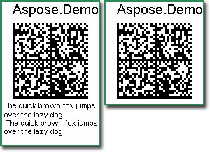
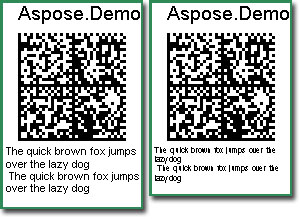

{} 

Unlike one-dimensional barcodes, two-dimensional barcodes often contain a huge amount of data, which is exactly why they exist. Sometimes, we print out the human readable codetext along with the barcode. The codetext has nothing to do with machine scanning. In the case of two-dimensional barcodes, the codetext is simply too long to display. When this is the case, hide the codetext.

{} 
### **Programming Sample**
The following example shows how to hide the barcode codetext. 

**A barcode with hidden codetext** 

**Java**



 public class MyAttributes

{

    public static BarCodeAttributes Create(String text, String symbology)

    {

        BarCodeAttributes b = new BarCodeAttributes();

        b.setCodeText(text);

        b.setSymbology(symbology);

        b.setCodeTextVisible(false);

        return b;

    }

}



**JRXML**



 <image hAlign="Center">

<reportElement x="0" y="600"  width="500" height="250" />

<imageExpression class="net.sf.jasperreports.engine.JRRenderable">

   <![CDATA[new com.aspose.barcode.jr.BarCodeRenderer(MyAttributes.Create(

      "The quick brown fox jumps over the lazy dog\n The quick brown fox jumps over the lazy dog\n", "DATAMATRIX")

   )]]>

</imageExpression>

</image>



The following example shows how to reduce the codetext's font size to save space.

**A barcode with smaller codetext** 

**Java**



 public class MyAttributes

{

    public static BarCodeAttributes Create(String text, String symbology)

    {

        BarCodeAttributes b = new BarCodeAttributes();

        b.setCodeText(text);

        b.setSymbology(symbology);

        b.setCodeTextVisible(false);

        b.setCodeTextFont(new Font("Serif", Font.BOLD + Font.ITALIC, 20));

        return b;

    }

}



**JRXML**



 <image hAlign="Center">

<reportElement x="0" y="600"  width="500" height="250" />

<imageExpression class="net.sf.jasperreports.engine.JRRenderable">

   <![CDATA[new com.aspose.barcode.jr.BarCodeRenderer(MyAttributes.Create(

      "The quick brown fox jumps over the lazy dog\n The quick brown fox jumps over the lazy dog\n", "DATAMATRIX")

   )]]>

</imageExpression>

</image>


