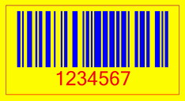
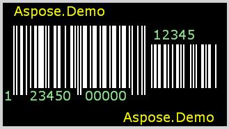
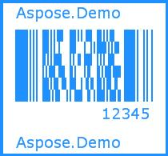
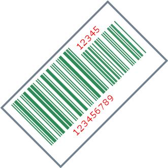

{} 

Normally, barcodes are generated and printed in black and white. What if a colored barcode is required? 
Aspose.BarCode for JasperReports gives developers free hand to change the colors of: 

- the barcode,
- code text,
- barcode background,
- barcode border, and
- the caption.

{} 
### **Adding Color to Barcodes**
The [BarCodeAttributes](/pages/createpage.action?spaceKey=barcodejasperreports&title=BarCodeAttributes&linkCreation=true&fromPageId=14221378) class has the following methods for coloring different parts of a barcode:

- The setForeColor() method assigns any color to the barcode.
- The setCodeTextColor() method assigns any color to the barcode's code.
- The setBackColor() method sets the barcode's background color.
- The setBorderColor() method sets the barcode's border color.

Developers can select the color using Java.awt.Color (part of Java) and then pass the selected color to the methods listed above. 

The barcode below was generated with the code samples in this article.

**Yellow and blue barcode, as generated by the sample code** 

The samples below show other colorful variations.

|
**White barcode on black background,  with colored caption and codetext** 

|
**All blue barcode on white background** 

|
| :- | :- |
|
**Green barcode and red text on white background** 

| |
#### **Programming Sample**
**Java**



 public class MyAttributes

{

  public static BarCodeAttributes Create(String text, String symbology)

  {

    BarCodeAttributes b = new BarCodeAttributes();

    b.setCodeText(text);

    b.setSymbology(symbology);

    //Set the background color of the barcode

    b.setBackColor(Color.YELLOW);

    //Set the foreground color of the barcode

    b.setForeColor(Color.BLUE);

    //Set border color

    b.setBorderColor(Color.RED);

    //Set the code text's color

    b.setCodeTextColor(Color.RED);

    //Caption's color

    b.getCaptionAbove().setColor(Color.darkGray);

    b.getCaptionBelow().setColor(Color.CYAN);

    return b;

  }

}



**JRXML**



 <image hAlign="Center">

<reportElement x="0" y="600" width="500" height="250" />        

<imageExpression class="net.sf.jasperreports.engine.JRRenderable">

  <![CDATA[new com.aspose.barcode.jr.BarCodeRenderer(MyAttributes.Create(

   "12345678", "Code128")

  )]]>

</imageExpression>

</image>


