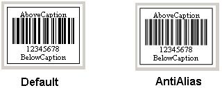
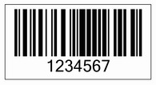

{} 

Anti-aliasing aims to give better image results by removing the distortion known as {aliasing|http://en.wikipedia.org/wiki/Aliasing]. Aspose.BarCode for JasperReports can render barcode images that provide much better quality due to anti-aliasing. The quality of anti-aliased barcode images is more obvious when the barcode is generated with high resolution.

{} 
### **Controlling Image Quality**
All you have to do is to call the [BarCodeAttributes](/pages/createpage.action?spaceKey=barcodejasperreports&title=BarCodeAttributes&linkCreation=true&fromPageId=14221380) class' setImageQuality() method to one of the pre-defined image quality mode stored in the [ImageQuality](/pages/createpage.action?spaceKey=barcodejasperreports&title=ImageQuality&linkCreation=true&fromPageId=14221380) class. The pre-defined image quality modes in the ImageQuality class are listed below.

|**Image Quality Modes** |**Description** |
| :- | :- |
|Default |Specifies simple image rendering. |
|AntiAlias |Specifies anti-aliased image rendering. This option gives better quality but at a higher performance cost. |
**Comparison between the default and anti-alias image quality modes** 

The code sample in this article outputs a barcode with anti-aliasing on.

**The barcode output from the code sample below** 

#### **Programming Sample**
**Java**



 public class MyAttributes

{

  public static BarCodeAttributes Create(String text, String symbology)

  {

    BarCodeAttributes b = new BarCodeAttributes();

    b.setCodeText(text);

    b.setSymbology(symbology);

    //Set the graphics drawing hint to be Anti Alias

    b.setImageQuality(ImageQuality.ANTI_ALIAS);

    return b;

  }

}



**JRXML**



 <image hAlign="Center">

<reportElement x="0" y="600" width="500" height="250" />

<imageExpression class="net.sf.jasperreports.engine.JRRenderable">

  <![CDATA[new com.aspose.barcode.jr.BarCodeRenderer(MyAttributes.Create(

   "12345678", "Code128")

  )]]>

</imageExpression>

</image>


