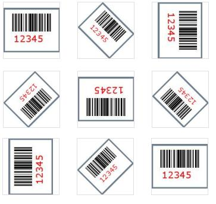
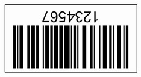

{} 

[Aspose.BarCode for JasperReports](http://www.aspose.com/documentation/jasperreports-exporters/aspose.barcode-for-jasperreports/index.html) allows developers to rotate the barcode image by calling the setRotationAngle() method of the BarCodeAttributes class. 
The effects of some rotation angles are demonstrated in the figure below: 
**Figure: Demonstration of common rotation angles** 

{} 
### **Rotating Barcodes**
The barcode below is rotated 180 degrees. It is the output of the sample code shown below. 

**A barcode rotated 180 degrees** 

#### **Programming Sample**
**Java**



 public class MyAttributes

{

    public static BarCodeAttributes Create(String text, String symbology)

    {

        BarCodeAttributes b = new BarCodeAttributes();

        b.setCodeText(text);

        b.setSymbology(symbology);

        //Roate clockwise for 180 degree (upside down)

        b.setRotationAngle(180);

        return b;

    }

}



**JRXML**



 <image hAlign="Center">

<reportElement x="0" y="600"  width="500" height="250" />                

<imageExpression class="net.sf.jasperreports.engine.JRRenderable">

   <![CDATA[new com.aspose.barcode.jr.BarCodeRenderer(MyAttributes.Create(

      "12345678", "Code128")

   )]]>

</imageExpression>

</image>


