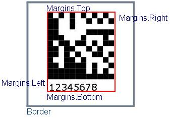

{} 

[Aspose.BarCode for JasperReports](http://www.aspose.com/documentation/jasperreports-exporters/aspose.barcode-for-jasperreports/index.html) allows its users to handle image borders, which include margins and its width. Let's experience these features one by one. 

{} 
### **Margins**
The margin is the area between the border and the area inhabited by the barcode bars and codetext. Developers can set the border margins of the barcode image by calling the [BarCodeAttributes](/pages/createpage.action?spaceKey=barcodejasperreports&title=BarCodeAttributes&linkCreation=true&fromPageId=14221379) class' setMargins() method. The Aspose.BarCode.setMargins() method takes an instance of the [Margins](/pages/createpage.action?spaceKey=barcodejasperreports&title=Margins&linkCreation=true&fromPageId=14221379) class that provides the setLeft(), setRight(), setTop() and setBottom() methods for setting the border margins.

All border margins concepts can be visualized from the figure below.

**Graphical demonstration of margins** 

**Java**



 public class MyAttributes

{

    public static BarCodeAttributes Create(String text, String symbology)

    {

        BarCodeAttributes b = new BarCodeAttributes();

        b.setCodeText(text);

        b.setSymbology(symbology);

        b.setGraphicsUnit(GraphicsUnit.MILIMETER);

        Margins margins = new Margins();

        margins.setLeft(2f);

        margins.setRight(2f);

        margins.setTop(2f);

        margins.setBottom(2f);

        return b;

    }

}



**JRXML**



 <image hAlign="Center">

<reportElement x="0" y="600"  width="500" height="250" />

<imageExpression class="net.sf.jasperreports.engine.JRRenderable">

   <![CDATA[new com.aspose.barcode.jr.BarCodeRenderer(MyAttributes.Create(

      "12345678", "Code128")

   )]]>

</imageExpression>

</image>



The default settings for border margins are left=2, right=2, top=1 and bottom=1. 
### **Border Width**
A very simple but handy feature is to set the border width of the barcode image. The border can be made thick or thin by calling the [BarCodeAttributes](/pages/createpage.action?spaceKey=barcodejasperreports&title=BarCodeAttributes&linkCreation=true&fromPageId=14221379) class' setBorderWidth() method.

**Java**



 public class MyAttributes

{

    public static BarCodeAttributes Create(String text, String symbology)

    {

        BarCodeAttributes b = new BarCodeAttributes();

        b.setCodeText(text);

        b.setSymbology(symbology);

        b.setGraphicsUnit(GraphicsUnit.MILIMETER);

        b.setBorderWidth(0.5f);

        return b;

    }

}



**JRXML**



 <image hAlign="Center">

<reportElement x="0" y="600"  width="500" height="250" />

<imageExpression class="net.sf.jasperreports.engine.JRRenderable">

   <![CDATA[new com.aspose.barcode.jr.BarCodeRenderer(MyAttributes.Create(

      "12345678", "Code128")

   )]]>

</imageExpression>

</image>


### **Enable Image Border**
Developers may also decide whether to show or hide an image border by passing true to the [BarCodeAttributes](/pages/createpage.action?spaceKey=barcodejasperreports&title=BarCodeAttributes&linkCreation=true&fromPageId=14221379) class' setBorderVisible() method.

**Java**



 public class MyAttributes

{

    public static BarCodeAttributes Create(String text, String symbology)

    {

        BarCodeAttributes b = new BarCodeAttributes();

        b.setCodeText(text);

        b.setSymbology(symbology);

        b.setGraphicsUnit(GraphicsUnit.MILIMETER);

        b.setBorderVisible(true);

        return b;

    }

}



**JRXML**



 <image hAlign="Center">

<reportElement x="0" y="600"  width="500" height="250" />

<imageExpression class="net.sf.jasperreports.engine.JRRenderable">

   <![CDATA[new com.aspose.barcode.jr.BarCodeRenderer(MyAttributes.Create(

      "12345678", "Code128")

   )]]>

</imageExpression>

</image>


### **Combining Margins and Borders**
A complete example to handle borders of the barcode image is given below for having a better understanding. 

The output barcode generated after executing the code is shown below.

**Resulting barcode image generated after example code execution** 

**Java**



 public class MyAttributes

{

    public static BarCodeAttributes Create(String text, String symbology)

    {

        BarCodeAttributes b = new BarCodeAttributes();

        b.setCodeText(text);

        b.setSymbology(symbology);

        //Measurement will be milimeter

        b.setGraphicsUnit(GraphicsUnit.MILIMETER);

        //Border will be visible

        b.setBorderVisible(true);

        //Set the border's color to red

        b.setBorderColor(java.awt.Color.RED);

        return b;

    }

}



**JRXML**



 <image hAlign="Center">

<reportElement x="0" y="600"  width="500" height="250" />

<imageExpression class="net.sf.jasperreports.engine.JRRenderable">

   <![CDATA[new com.aspose.barcode.jr.BarCodeRenderer(MyAttributes.Create(

      "12345678", "Code128")

   )]]>

</imageExpression>

</image>


