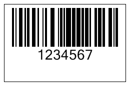

{} 

Whith Aspose.BarCode for JasperReports, you can set a custom resolution for barcode images. The component provides the [Resolution](/pages/createpage.action?spaceKey=barcodejasperreports&title=Resolution&linkCreation=true&fromPageId=14221374) class which let you customize the resolution of barcode images.

{} 
### **Customizing Resolution**
The [Resolution](/pages/createpage.action?spaceKey=barcodejasperreports&title=Resolution&linkCreation=true&fromPageId=14221374) class has three major properties: 

- The setDpiX() method is used to set a barcode image's horizontal resolution dots per inches (DPI). Float.
- The setDpiY() method is used to set a barcode image's vertical resolution in dots per inches (DPI). Float.
- The Dpi() method sets the output image's resolution (DPI).

DPI is a measure of image resolution that specifies the number of dots that a printer or device (like a monitor) can display per linear inch. The higher the DPI, the higher the resolution. 

The screenshot below shows the barcode output by the code sample in this article. 

**A barcode image with custom resolution** 

#### **Programming Sample**
**Java**



 public class MyAttributes

{

  public static BarCodeAttributes Create(String text, String symbology)

  {

    BarCodeAttributes b = new BarCodeAttributes();

    b.setCodeText(text);

    b.setSymbology(symbology);

    //Measurement is millimeter

    b.setGraphicsUnit(GraphicsUnit.MILIMETER);

    //Create an instance of resolution

    b.setResolution(new Resolution(200, 400));

    return b;

  }

}



**JRXML**



 <image hAlign="Center">

<reportElement x="0" y="600" width="500" height="250" />        

<imageExpression class="net.sf.jasperreports.engine.JRRenderable">

  <![CDATA[new com.aspose.barcode.jr.BarCodeRenderer(MyAttributes.Create(

   "12345678", "Code128")

  )]]>

</imageExpression>

</image>


