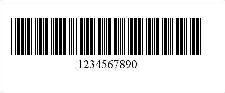

{} 

Aspose.BarCode for Java automatically adjusts the image size (width and height) according to a generated barcode’s size. But you can also control the image size by specifying the height and width manually.

{} 
### **Programming Sample**
Using the BarCodeAttributes.setHeight() and setWidth() methods to set the image height and width. To customize the image size, BarCodeAttributes.setAutoSize() should be set to false. The below example, generates a Code39Standard barcode with customized height and width. 

Below is the image that is generated by the sample code: 

**Custom-size barcode image** 

**Java**



 public class MyAttributes

{

    public static BarCodeAttributes Create(String text, String symbology)

    {

        BarCodeAttributes b = new BarCodeAttributes();

        b.setCodeText(text);

        b.setSymbology(symbology);

        // Set auto size false

        b.setAutoSize(false);

        // Set Graphics unit to milimeter

        b.setGraphicsUnit(GraphicsUnit.MILIMETER);

        // Set height

        b.setHeight(50);

        // Set width

        b.setWidth(120);

        return b;

    }

}



**JRXML**



 <image hAlign="Center">

<reportElement x="0" y="600"  width="500" height="250" />                

<imageExpression class="net.sf.jasperreports.engine.JRRenderable">

   <![CDATA[new com.aspose.barcode.jr.BarCodeRenderer(MyAttributes.Create(

      "12345678", "Code128")

   )]]>

</imageExpression>

</image>


