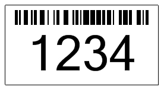

{} 

To change a barcode image's measuring unit, use the [BarCodeAttributes](/pages/createpage.action?spaceKey=barcodejasperreports&title=BarCodeAttributes&linkCreation=true&fromPageId=14221377) setGraphicsUnit() method. The setGraphicsUnit() method accepts any value defined in the [GraphicsUnit](/pages/createpage.action?spaceKey=barcodejasperreports&title=GraphicsUnit&linkCreation=true&fromPageId=14221377) class.

{} 
### **Setting Image Size**
The measuring units defined in the GraphicsUnit enumeration are as follows.

|**Measuring Units** |**Description** |
| :- | :- |
|Display |Specifies 1/75 inch as the unit of measure. |
|Document |Specifies the document unit (1/300 inch) as the unit of measure. |
|Inch |Specifies the inch as the unit of measure. |
|Millimeter |Specifies the millimeter as the unit of measure. |
|Pixel |Supported by the .NET Compact Framework. Specifies a device pixel as the unit of measure. |
|Point |Specifies a printer's point (1/72 inch) as the unit of measure. |
The default size measurement unit is millimeter. 

The output barcode image generated by the code sample in this article is shown below.

**Barcode with customized bar height in points** 

#### **Programming Sample**
The example below changes the bar height of the barcode; the measuring unit used for the bar height is point. 

**Java**



 public class MyAttributes

{

  public static BarCodeAttributes Create(String text, String symbology)

  {

    BarCodeAttributes b = new BarCodeAttributes();

    b.setCodeText(text);

    b.setSymbology(symbology);

    //Measurement is Milimeter

    b.setGraphicsUnit(GraphicsUnit.POINT);

    return b;

  }

}



**JRXML**



 <image hAlign="Center">

<reportElement x="0" y="600" width="500" height="250" />

<imageExpression class="net.sf.jasperreports.engine.JRRenderable">

  <![CDATA[new com.aspose.barcode.jr.BarCodeRenderer(MyAttributes.Create(

   "12345678", "Code128")

  )]]>

</imageExpression>

</image>


