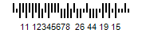
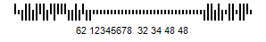
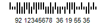
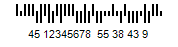
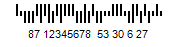

{} 

AustraliaPost barcode can be generated using following format control code options:

1. Standard
1. ReplyPaid
1. Customer2
1. Customer3
1. Routing
1. Redirection

These control code can be applied using the BarCodeAttributes.setAustraliaPostFormatControlCode() method. 

{} 
### **Programming Sample**
The following code snippet generates a AustraliaPost barcode with standard format control code.

**Java**



 public class MyAttributes

{

    public static BarCodeAttributes Create(String text, String symbology)

    {

        BarCodeAttributes b = new BarCodeAttributes();

        b.setCodeText(text);

        b.setSymbology(symbology);

        b.setAustraliaPostFormatControlCode(AustraliaPostFormatControlCode.Standard);

        return b;

    }

}



**JRXML**



 <image hAlign="Center">

<reportElement x="0" y="600"  width="500" height="250" />

<imageExpression class="net.sf.jasperreports.engine.JRRenderable">

   <![CDATA[new com.aspose.barcode.jr.BarCodeRenderer(MyAttributes.Create(

      "12345678", "AustraliaPost")

   )]]>

</imageExpression>

</image>



The above code generates the following image using the standard format control code.

Image samples using the other format control codes are shown below.

**Customer2** 

**Customer3** 

**Redirection** 

**ReplyPaid** 

**Routing** 

