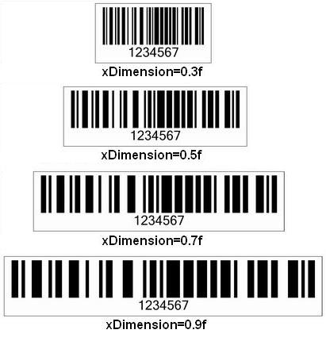
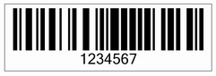
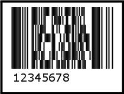
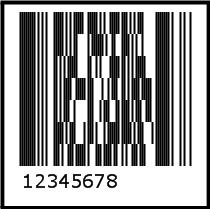
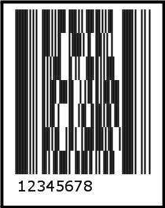
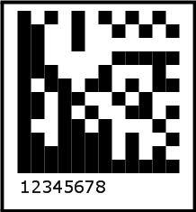

### **What is the X Dimension?**
All barcode symbologies have their own unique attributes but there are some that are common to all. The X dimension is one of those. 

All barcodes have an X-Dimension. This is the narrowest bar or space in the barcode. Barcode symbologies usually specify a minimum X dimension value to ensure compatibility between reading and printing equipment used in an open system, to ensure, for example, that a barcode label you print can be read by scanners outside your company.

The X dimension determines a barcode's density. Density refers to the amount of information that can be stored within a specific amount of space. When the X dimension is small, the area required for each character is smaller than when the X dimension is large so the barcode can hold more information per linear inch than when the X dimension is larger. It is said to be of higher density. Similarly, increasing the width of the narrowest element (increasing the X dimension) increases the space required for each character and reduces the number of characters per inch. Because the resulting code is often quite large, very low density codes are often used in environments where the barcode has to be read at a distance, like 3 to 30 feet, for example warehouses.

The same barcode with different X dimensions is shown below.

**Different views of a barcode with different X dimensions** 

The X dimension is specified in mils (one thousand of an inch), but it can also be specified in inches and millimeters. For conversion purposes, use the following ratios:

|**1 mil** |**=** |**0.001 inches** |
| :- | :- | :- |
|1 inch |= |25.4 millimeters |
Some sample X dimension values are listed below in mils, inches and millimeters.

|**Mils** |**Inches** |**Millimeters** |
| :- | :- | :- |
|4 |0.004 |0.1016 |
|6 |0.006 |0.1524 |
|8 |0.008 |0.2032 |
|10 |0.01 |0.254 |
|20 |0.02 |0.508 |
|40 |0.04 |1.016 |
|80 |0.08 |2.032 |
|160 |0.16 |4.064 |
A barcode's other elements are expressed as multiples of the X dimension. For instance, to ensure accurate scanning, most bar codes have a 'quiet zone' (the blank margin on either side of a barcode used to show the barcode reader where a barcode starts and stops) of 10X, that is, ten times the barcode's X dimension. In general, the greater the X dimension, the easier a barcode can be scanned.
#### **Aspose.BarCode and X dimension**
Aspose.BarCode for JasperReports provides set and get methods in the BarCodeAttributes class that allows developers to set the X dimension of the bars in a barcode. Normally, the X dimension is configured in mils but to make your life easier, Aspose.BarCode for JasperReports uses millimeters as the default measuring unit. Of course, it is possible to modify the measuring unit using the setGraphicsUnit() method of the BarCodeAttributes class.

The barcode below was created using the code in this example.

**Barcode created using Aspose.BarCode for JasperReports** 

**Java**



 public class MyAttributes

{

    public static BarCodeAttributes Create(String text, String symbology, Color foreColor,

            String xDimension)

    {

        BarCodeAttributes b = new BarCodeAttributes();

        b.setCodeText(text);

        b.setSymbology(symbology);

        b.setForeColor(foreColor);

        b.setGraphicsUnit(GraphicsUnit.MILIMETER);

        b.setXDimension(Float.parseFloat(xDimension));

        b.setCodeTextVisible(false);

        b.setAutoSize(true);

        return b;

    }

}



**JRXML**



 <image hAlign="Center">

  <reportElement x="0" y="600"  width="500" height="250" />

  <imageExpression class="net.sf.jasperreports.engine.JRRenderable">

    <![CDATA[new com.aspose.barcode.jr.BarCodeRenderer(MyAttributes.Create(

      "12345678", "Code128", java.awt.Color.BLACK, "0.5f")

   )]]>

  </imageExpression>

</image>


### **What is the Y Dimension?**
The Y dimension is to 2D barcodes what the X dimension is for linear barcodes.

**Java**



 public class MyAttributes

{

    public static BarCodeAttributes Create(String text, String symbology, Color foreColor, String yDimension)

    {

        BarCodeAttributes b = new BarCodeAttributes();

        b.setCodeText(text);

        b.setSymbology(symbology);

        b.setForeColor(foreColor);

        b.setGraphicsUnit(GraphicsUnit.MILIMETER);

        b.setYDimension(Float.parseFloat(yDimension));

        b.setCodeTextVisible(false);

        b.setAutoSize(true);

        return b;

    }

}



The output barcode generated by setting yDimension to 4, 6, 8 is:

**Barcode with the Y dimension set to 4** 

**yDimension = 6** 

**yDimension = 8** 

Some 2D symbologies have a rectangular module, such as Datamatrix. When this is the case, the Y dimension is ignored and the module width and height depends on the X dimension.

**Rectangular 2D barcodes use the X dimension only** 

