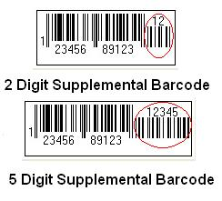
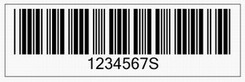
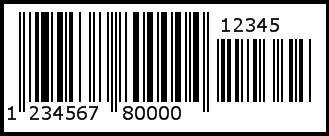
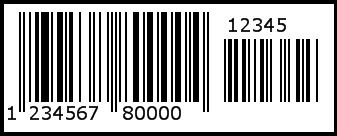
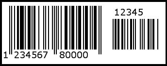

### **What is a Checksum?**
A checksum is an error detection scheme in which some additional characters are added to a barcode to protect the integrity of the barcode data. Checksums are not required for all types of barcodes. For example, Code128 and Code39 are self-checking and checksums for such symbologies are not necessary. On the other hand, another symbology like Interleaved2Of5, which can only represent numeric data, has very little spaces between its bars and is prone to substitution errors. For such symbologies, checksums are necessary. There are also some symbologies, such as UPC (Universal Product Code), that require a checksum.
#### **Checksum and Different Symbologies**
Once the EnableChecksum property is set to true, the checksum is shown on the barcode image. The following symbologies support checksums:

- Code11
- Code39Extended
- Code39Standard
- Code93Extended
- Code93Standard
- Interleaved2of5
- Standard2of5

The following symbologies always include a checksum:

- EAN13
- EAN8
- BooklandEAN
### **What is a Supplemental Barcode?**
UPCA, UPCE, EAN13 and EAN8 symbologies may all include an additional barcode to the right of the main barcode. This second barcode, usually not as tall as the main barcode, is called a supplemental barcode and is used to encode additional information for newspapers, books and other periodicals.

The supplemental barcode may either encode 2 or 5 digits of information as shown below.

**The difference between 2 and 5 digit supplemental barcodes** 

{} 

The above barcodes were generated using EAN13.

{} 
#### **2-digit Supplemental Barcodes**
2-digit supplemental barcodes are mostly used for magazines, newspapers and other periodicals. The 2-digit supplement represents the issue number of the magazine, used to track which issue of the magazine is being sold, for sales analysis or restocking purposes. 
#### **5-digit Supplemental Barcodes**
5-digit supplemental barcodes are used on books to indicate a suggested retail price. The first digit of the supplement indicates the currency in which the price is expressed. A "0" represents a price expressed in British Pounds; a "5" represents a price expressed in US Dollars. The remaining 4 digits indicate the price.
#### **Supplemental Barcodes and Symbologies**
The following barcode symbologies support supplemental barcodes:

- UPCA
- UPCE
- EAN13
- EAN8
- BooklandEAN
- Interleaved2of5
- Standard2of5
### **Aspose.BarCode & Checksum**
Using [Aspose.BarCode for JasperReports](http://www.aspose.com/documentation/jasperreports-exporters/aspose.barcode-for-jasperreports/index.html), developers can enable checksums for a barcode by passing the value true to the [BarCodeAttributes](/pages/createpage.action?spaceKey=barcodejasperreports&title=BarCodeAttributes+Class&linkCreation=true&fromPageId=14221370) class' setEnableChecksum() method. The checksum can be made visible or hidden by passing true or false to the setEnableChecksum() method.

The output barcode image that the sample code generates is shown below. The "S" appended to the end of the code text (1234567) is the checksum.

**A barcode showing a checksum** 

**Java**



 public class MyAttributes

{

    public static BarCodeAttributes Create(String text, String symbology)

    {

        BarCodeAttributes b = new BarCodeAttributes();

        b.setCodeText(text);

        b.setSymbology(symbology);

        b.setEnableChecksum(true);

        return b;

    }

}



**JRXML**



 <image hAlign="Center">

  <reportElement x="0" y="600"  width="500" height="250" />

  <imageExpression class="net.sf.jasperreports.engine.JRRenderable">

    <![CDATA[new com.aspose.barcode.jr.BarCodeRenderer(MyAttributes.Create(

      "12345678", "Code128")

   )]]>

  </imageExpression>

</image>


### **Aspose.BarCode & Supplement Data**
It is possible to encode 2- or 5-digit supplement data in the barcode using the [BarCodeAttributes](/pages/createpage.action?spaceKey=barcodejasperreports&title=BarCodeAttributes+Class&linkCreation=true&fromPageId=14221370) class' setSupplementText() method. The space between the main barcode and supplemental barcode can be customized using the setSupplementSpace() method.

The barcode generated by the sample code is shown in below.

**A barcode showing supplementary data** 

**Java**



 public class MyAttributes

{

    public static BarCodeAttributes Create(String text, String symbology, String supplementText, String supplementSpace)

    {

        BarCodeAttributes b = new BarCodeAttributes();

        b.setCodeText(text);

        b.setSymbology(symbology);

        b.setEnableChecksum(true);

        b.setSupplementText(supplementText);

        b.setSupplementSpace(Float.parseFloat(supplementSpace));

        return b;

    }

}



**JRXML**



 <image hAlign="Center">

<reportElement x="0" y="600"  width="500" height="250" />

<imageExpression class="net.sf.jasperreports.engine.JRRenderable">

   <![CDATA[new com.aspose.barcode.jr.BarCodeRenderer(MyAttributes.Create(

      "12345678", "EAN13", "1234", "2.0f")

   )]]>

</imageExpression>

</image>


#### **Supplement Space**
The SupplementSpace is the space between main barcode and the supplement data. This setting generally does affect the scan result. The following images shows different SupplementSpace settings.

**SupplementSpace = 2** 

**SupplementSpace = 4** 

**SupplementSpace = 6** 

