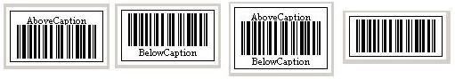

{} 

Sometimes, developers might be interested in displaying some extra information on the barcode image that is called Caption. Using Aspose.BarCode for JasperReports, developers can display captions on above, below or both positions of the barcode image.
**Figure: All possible positions where captions can be placed.
**

How to Manage Caption of the Barcode 

{} 
##### **Manage Caption of the Barcode It is also possible to customize the text, alignment, font, color and space of the caption. Aspose.BarCode for JasperReports provides Caption class to serve this purpose. BarCodeAttributes class has two methods, setCaptionAbove() and setCaptionBelow() that take an instance of Caption class. So, developers can create an object of Caption class and then pass that object to the two methods to set the captions of the barcode. Java public class MyAttributes { public static BarCodeAttributes Create(String text, String symbology, Color foreColor, String captionAbove, String captionBelow) { BarCodeAttributes b = new BarCodeAttributes(); b.setCodeText(text); b.setSymbology(symbology); b.setForeColor(foreColor); b.setCaptionAbove(new Caption(captionAbove)); b.setCaptionBelow(new Caption(captionBelow)); b.setCodeTextVisible(false); b.setAutoSize(true); return b; } } JRXML <image hAlign="Center"> <reportElement x="0" y="600" width="500" height="250" /> <imageExpression class="net.sf.jasperreports.engine.JRRenderable"> <![CDATA[new com.aspose.barcode.jr.BarCodeRenderer(MyAttributes.Create( "hello", "pdf417", java.awt.Color.BLUE, "above caption", "below caption") )]]> </imageExpression> </image> The output generated barcode by the above code is shown below in the figure: Figure: Resulting barcode image generated after example code execution **
